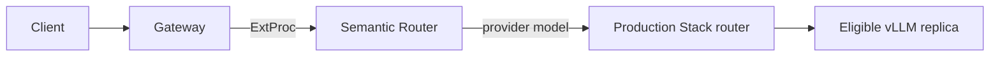

> **状态：** 提案 · **创建日期：** 2025-10-13

## 问题 {#problem}

vLLM Production Stack 管理模型服务、服务发现、副本调度和推理生命周期。这些能力不决定哪个模型池最符合入站请求的含义或策略要求。

Semantic Router 可以做出该逻辑模型选择，但不应重复 Production Stack 的副本调度或基础设施控制面。

## 提案 {#proposal}

在 Production Stack 请求路由器之前运行 Semantic Router：

Semantic Router 从配方中选择提供商模型。随后 Production Stack 选择服务该模型的副本。

## 职责 {#responsibilities}

| 组件 | 拥有 |
| --- | --- |
| Semantic Router | 入口点、信号、决策、逻辑模型选择，以及配方范围的插件。 |
| vLLM Production Stack | 模型部署、服务发现、副本调度和推理生命周期。 |
| Gateway | 客户端流量、ExtProc 挂接，以及转发到所选后端。 |

这种分离使语义策略独立于变化的副本拓扑。

## 集成契约 {#integration-contract}

每个可选择的提供商模型必须映射到稳定的 OpenAI 兼容 Production Stack 端点和已服务模型标识符。Kubernetes DNS 名称、凭证和提供商特定标识符属于提供商绑定。决策应引用逻辑模型名称，而不是集群地址。

端到端路径仅在以下情况下就绪：

1. 每个后端都可以直接工作；
2. 完整 Semantic Router 配置通过校验；
3. 网关在后端选择之前调用 ExtProc；
4. 所选逻辑模型映射到预期的 Production Stack 池；以及
5. 日志或轨迹显示最终执行请求的副本。

## 缓存与调度边界 {#cache-and-scheduling-boundary}

语义响应缓存和推理调度解决不同问题。响应缓存可能在请求到达 Production Stack 之前完成它。前缀感知或 KV 感知调度只影响继续进入推理的请求。它们的命中率和延迟效应应分开测量。

语义信号可以缩小合格模型池，但不应直接选择副本。在线队列深度、前缀局部性和副本健康仍是 Production Stack 关注点。

## 安全与失败行为 {#security-and-failure-behavior}

检测不是执行。PII、越狱或其他信号仅在决策或插件应用动作时才影响流量。

网关必须声明 ExtProc 失败行为。失败即开放保留通往后端的路径，但可能绕过语义和安全策略。失败即关闭以可用性为代价保护策略。正确选择是路由特定的，并应经过测试。

密钥、租户身份和数据保留设置必须在网关、Semantic Router、Production Stack 和任何外部存储之间保持一致。

## 范围 {#scope}

本提案定义分层和模型绑定契约。它不：

- 替代 Production Stack 部署或调度 API；
- 规定特定副本路由算法；
- 做质量、成本或延迟主张；
- 把 Semantic Router 发布与 Production Stack 发布耦合；或
- 要求两个系统之间共享缓存状态。

## 验证 {#validation}

使用一组已知预期模型池的小请求集。独立确认语义选择和物理副本。在发布任何性能比较之前，记录配置版本、已服务模型标识符、缓存状态和流量形态。

## 待决问题 {#open-questions}

- 部署应暴露一个多模型端点，还是每个模型池一个端点？
- 哪个请求标识符应关联网关、语义和副本轨迹？
- Semantic Router 不可用时，哪些路由必须失败即关闭？
- 如何在不中断进行中请求的情况下推出模型别名？

## 参考资料 {#references}

- [当前 Production Stack 集成指南](../installation/k8s/production-stack)
- [vLLM Production Stack 文档](https://docs.vllm.ai/projects/production-stack/en/latest/)
- [Production Stack 语义路由用例](https://docs.vllm.ai/projects/production-stack/en/latest/use_cases/semantic-router-integration.html)
- [Semantic Router 系统概览](../overview/semantic-router-overview)
