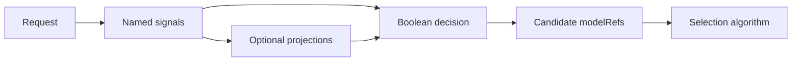

> **状态：** 提案 · **创建日期：** 2025-10-08

## 问题 {#problem}

没有单一分类器适合每一种路由条件。运营方有时需要对产品名称或合规模式的精确规则、对改写的语义匹配，以及对宽泛领域的已学习分类器。把这些需求都编码进一个模型，会使确定性策略难以检查和更新。

## 提案 {#proposal}

把每个检测器表示为独立的命名信号，并在决策中组合结果：

| 信号 | 最适合 | 主要限制 |
| --- | --- | --- |
| Keyword | 精确词项和运营方自有词汇。 | 会漏掉改写，并需要归一化规则。 |
| Regex | 结构化标识符和有界语法模式。 | 不安全的模式可能消耗过多 CPU 或匹配过宽。 |
| Embedding | 以不同语言出现的概念。 | 阈值取决于模型和评估集。 |
| Learned classifier | 宽泛意图、领域、安全或偏好标签。 | 需要模型产物和已校准置信度。 |

该提案是加法的。路由可以使用一个信号或组合多个；确定性规则不需要已学习分类器。

## 路由模型 {#routing-model}

信号描述观察。投影组合或转换观察。决策表达策略。选择算法只从已匹配决策声明的候选模型中选择。

## 配置边界 {#configuration-boundary}

原先提案为关键词、正则、嵌入和融合配置使用单独的顶层块。那些示例不再是规范配置形态。

当前配置属于 `routing.signals`、`routing.projections` 和 `routing.decisions`。每种信号类型拥有其检测器特定字段，决策引用信号名称和条件。请使用当前信号教程和参考配置，不要复制历史提案 YAML。

## 组合规则 {#composition-rules}

- 确定性规则应保持确定；不要把精确策略藏进加权分数。
- 不同检测器的置信度值不能自动比较。
- 布尔决策应足以表达允许、拒绝和必需路由策略。
- 加权或派生协调属于带有文档化归一化的命名投影。
- 默认决策应处理没有专用规则匹配的请求。

## 安全与失败行为 {#safety-and-failure-behavior}

正则评估需要输入大小限制、安全编译，以及对病态表达式的保护。外部或模型支持的信号需要超时和显式错误行为。检测器失败不得与否定匹配混淆。

检查敏感内容的信号应暴露有界标签和分数，而不是把原始请求文本复制到日志或头中。

## 范围与非目标 {#scope-and-non-goals}

本提案定义异构提示词检测器如何参与路由。它不：

- 选择物理后端副本；
- 默认使信号置信度全局校准；
- 允许信号扩大决策声明的模型池；
- 替代授权或内容安全动作；或
- 保留已退役的顶层配置示例。

## 评估 {#evaluation}

在评估组合决策之前，先独立评估每个信号。报告错误匹配、遗漏匹配、检测器延迟、模型或产物版本，以及所选阈值的影响。然后在留出请求集上评估最终路由。

除非数据集、标签、配置和评估脚本可用，否则避免合成百分比主张。

## 待决问题 {#open-questions}

- 正则应成为一等信号，还是保持为运营方扩展？
- 哪些投影需要跨信号族的置信度校准？
- 决策应如何区分检测器失败与普通不匹配？
- 哪些信号产物可以安全热重载？

## 参考资料 {#references}

- [信号、决策与模型选择](../overview/signal-driven-decisions)
- [信号概览](../tutorials/signal/overview)
- [关键词信号](../tutorials/signal/heuristic/keyword)
- [嵌入信号](../tutorials/signal/learned/embedding)
- [分类器信号](../tutorials/signal/learned/classifier)
- [相关议题 #313](https://github.com/vllm-project/semantic-router/issues/313)
