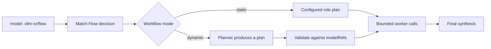

> **状态：** 已实现 · **创建日期：** 2026-06-30

## 问题 {#problem}

多步模型工作流通常需要独立的编排服务和客户端特定 API。这使模型池、路由策略、轨迹和失败行为更难与普通推理一起管理。

Router Flow 通过与其他路由相同的 OpenAI 兼容网关和配方策略暴露有界编排。

## 已实现设计 {#implemented-design}

Router Flow 有三个公开概念：

| 概念 | 表面 | 用途 |
| --- | --- | --- |
| Flow model | `vllm-sr/flow` | 选择具备 Flow 能力的决策的请求模型名。 |
| Workflow algorithm | `algorithm.type: workflows` | 决策本地的编排策略。 |
| Worker pool | `modelRefs` | 工作流步骤可以调用的唯一模型。 |

规划器创建计划；worker 模型执行任务步骤。规划器不能添加不在 `modelRefs` 中的模型。

## 静态工作流 {#static-workflows}

静态模式使用运营方编写的角色计划。当步骤、模型、依赖和综合行为应确定且可审阅时适用。

当计划声明步骤之间没有依赖时，独立步骤可以并发运行。依赖步骤只接收工作流声明的有界输出。

## 动态工作流 {#dynamic-workflows}

动态模式请配置的规划器模型给出结构化计划。路由器在任何 worker 调用之前解析并验证该计划：

- 步骤标识符必须唯一；
- 依赖必须形成无环图；
- 角色和模型必须由决策允许；
- 工具循环、步骤、调用和输出大小有界；以及
- 无效计划通过配置的错误策略失败。

规划器输出是不受信任的数据，不是可执行配置。

## 函数调用边界 {#function-calling-boundary}

每个工作流步骤有自己的消息和工具调用状态。工具结果只返回给请求它们的步骤。路由器强制每步和整个工作流的限制，使规划器不能创建无界智能体循环。

工具仍需要语义相关性之外的授权。只有当路由和调用方都被允许使用某工具时，工作流才可以选择它。

## 失败与可观测性 {#failure-and-observability}

工作流轨迹应区分规划、验证、worker 执行、工具调用和最终综合。部分 worker 失败遵循决策策略；它不得从轨迹中悄悄消失。

超时同时适用于单次调用和完整工作流。取消会传播到未完成的 worker 调用。

## 范围与非目标 {#scope-and-non-goals}

已实现边界支持网关内带有界 worker 的静态和动态工作流。它不：

- 训练协调器；
- 提供通用智能体框架；
- 允许任意代码执行；
- 扩大决策的 worker 池；
- 承诺工作流优于其最佳 worker；或
- 把工作流成本隐藏在单模型响应之后。

## 评估 {#evaluation}

在同一任务集上比较 Flow 与最佳单个 worker 以及其他 looper 算法。报告任务成功、必要时的评判标准、延迟、token、上游调用、计划验证失败、工具循环失败和轨迹完整性。

## 待决问题 {#open-questions}

- 哪些工作负载值得用动态规划而不是静态计划？
- 最终综合应使用规划器还是 worker？
- 哪些轨迹字段对面向用户的响应是安全的？
- 什么证据能证明训练或蒸馏协调器是合理的？

## 参考资料 {#references}

- [当前工作流指南](../tutorials/algorithm/looper/workflows)
- [算法概览](../tutorials/algorithm/overview)
- [Fusion](../tutorials/algorithm/looper/fusion)
