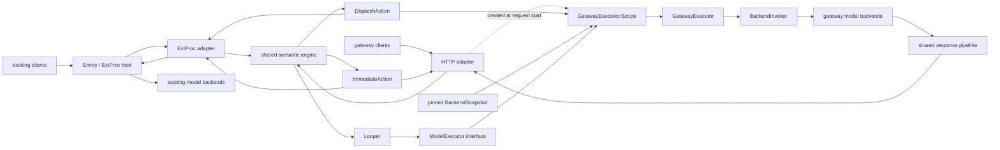

> **状态：** 提案 - **创建日期：** 2026-08-31 - **修订：** 2026-09-01

## 摘要 {#summary}

添加一个单独的、实验性 Go 推理网关，并且**不要添加第二套语义编排**。

第一步是把与 Envoy 无关的请求和响应编排从 `pkg/extproc` 提取到传输中立的 `semanticruntime.Engine`。现有 ExtProc 服务和新的 HTTP 网关都成为该单一引擎的适配器：

- ExtProc 适配器继续处理 Envoy protobuf、流阶段和改写响应；
- HTTP 适配器处理公开 HTTP、SSE、客户端取消和 HTTP 错误映射；
- 共享引擎处理访问、配额、插件、信号、投影、决策、算法、逻辑模型选择、Looper 和响应语义；
- `GatewayExecutor` 只拥有独立路径的物理后端执行；
- 现有 Envoy + ExtProc 部署、端口、协议、默认值和外部行为保持不变。

独立网关作为自己的二进制、进程、镜像、引导和选择加入部署发布。它不调用 ExtProc gRPC，也不构造 Envoy 消息。

这不是现有二进制中的 `--gateway` 模式，不是对本地 ExtProc 的 HTTP 调用，也不是 ExtProc 编排的副本。

## 问题 {#problem}

Semantic Router 目前通过 Envoy ExtProc 承接公开推理流量。该部署正确地将语义模型选择与上游传输分开，但若天真地把它扩展成独立网关，会带来两个问题：

1. 复用 `pkg/extproc` 会把 Envoy protobuf、改写响应和流回调拖进公开 HTTP 服务器——传输特定类型会变成共享 API。
2. 新的 HTTP 监听器调用本地 ExtProc 会保留不必要的进程协议，重复请求生命周期状态，并迫使网关重建 Envoy 的改写/流行为。

第三个问题决定架构：语义阶段顺序仍集中在 `pkg/extproc` 的 `req_filter_*`、`processor_*` 和 `RequestContext` 中。若干叶子包（`protocolcodec`、`llmprotocol`、`looper`）已经传输中立，随着相关进行中工作落地，更多请求路径也会中立——但今天没有完整的传输中立编排边界。只重新组装叶子包的独立网关会创建第二套编排。测试可以检测两个实现之间的漂移；它们不能消除重复。因此提取共享引擎是网关的前提，而不是后续工作。

今天还存在两条响应路径，必须在网关内统一：ExtProc 路径为插件、缓存、记忆、回放、指标和结算重建响应语义，而 `pkg/looper/client.go` 为 Looper 调用执行提供商响应处理。两者今天都不是完整的传输中立解码器；同时运行两者会双重解码，只运行其一可能绕过响应侧语义策略。共享响应流水线解决这个问题：提供商字节恰好解码一次，语义策略在中立对象上运行，客户端编码最后发生。专用 `pkg/backendinvoker`——尝试、凭证和终端证据的唯一权威——是从这些现有路径显式提取/创建的 P0 目标，而不是现有组件。

最后，放在网关前的 Service 可以负载均衡网关副本，但不能为逻辑模型已经选定的请求挑选物理后端。即使作为实验，网关也必须拥有显式物理流量层——它不能把一切转发到一个共享上游，并声称流量契约已验证。

## 目标 {#goals}

- 在一个 Go 进程中服务公开推理，无需 Envoy 或 ExtProc gRPC。
- 提取一个由 ExtProc 和 HTTP 适配器共享的传输中立 Semantic Engine。
- 复用当前分类器、算法、插件、协议编解码器和 Looper 实现；把访问、配额、凭证、出口和结算当作共享引擎上定义的 P1 目标契约，而不是现有组件。
- 严格分离语义逻辑模型选择与物理后端选择。
- 保持当前 Envoy + ExtProc 部署、生成配置、默认值、拓扑和可观测行为不变；允许内部委托给共享引擎。
- 通过同一中立协议契约支持 OpenAI Chat Completions、OpenAI Responses 和 Anthropic Messages。
- 定义正确的缓冲、流式、取消、重试、回退和终端结算行为。
- 在不宣称生产就绪的前提下，验证生产级流量控制、治理、可观测性和安全契约。
- 通过当前请求生命周期内的类型化执行器在进程内运行 Looper 模型调用，从不针对网关自己的监听器。
- 先证明 Docker 部署，再添加单独的 Kubernetes 实验。
- 保持控制面可替换，并位于同步请求路径之外。

## 非目标 {#non-goals}

- 不替代 vLLM、vLLM Production Stack、Kubernetes，或任何服务平台的副本生命周期。
- 不把产品 CRUD、PostgreSQL 期望状态、仪表盘或智能体状态移入网关。
- 不使网关成为持久 worker 注册表或第二套路由事实来源。
- 不为网关重复请求/响应语义编排。
- 不复制另一网关的端点名称、状态复制、CLI 标志表面或扩展 ABI。
- 没有已知为零的传输证据时，不做 HTTP 状态码重试或跨模型回退。
- 不把公开网关监听器嵌入现有 ExtProc 二进制。
- 引擎提取不得改变当前 ExtProc Looper 传输、部署拓扑或公开行为。
- 在 G0 显式决定支持级别和默认值之前，不要把网关描述为生产就绪。
- 在基准隔离出有界 Go 瓶颈之前，不要用 Rust 重写数据面。

## 架构决策 {#architecture-decisions}

1. **实验隔离。** 网关拥有自己的二进制、监听器、就绪、生命周期、镜像、引导 schema 和选择加入部署。当前默认值不变；ExtProc 从不依赖实验网关。
2. **一个共享引擎。** `semanticruntime` 拥有传输中立编排；两个适配器都调用它。引擎不导入 `extproc`、Envoy 或 HTTP writer。
3. **两级路由。** 语义运行时选择逻辑模型修订；随后网关流量层为该模型选择物理后端。
4. **每个请求一个组合范围。** 语义发布、BackendSnapshot、CredentialPublication、身份、截止时间、配额租约和结算从 `Begin` 到终端状态保持固定。
5. **一次中立编解码。** 提供商字节解码一次为中立响应/事件；语义响应策略在该对象上运行；客户端线编码最后发生。
6. **基于证据的执行。** 重试、回退、用量和成本使用持久尝试证据；缺失证据意味着未知，从不意味着零。
7. **显式能力失败。** 当配方需要端点、编解码器、插件、流、重试或执行器能力而不可用时，发布失败——行为从不因适配器不同而悄悄跳过。
8. **没有重复的语义权威。** 语义发布、访问和配额身份保持其当前所有者和数据流；唯一的新控制循环管理物理 BackendSnapshot。
9. **先 Docker 后 Kubernetes。** P0 在 Docker 中构建其证据；P1 添加 Kubernetes 发现/部署。
10. **完成不是支持。** 只有 G0 可以更改默认值或网关的生产支持状态。

## 目标架构 {#target-architecture}



### 部署形态 {#deployment-shapes}

| 形态 | 状态 | 公开传输 | 语义执行 | 物理后端流量 |
| --- | --- | --- | --- | --- |
| Envoy + ExtProc | 当前默认，外部不变 | Envoy | 共享引擎 + ExtProc 适配器 | Envoy 或当前安装的传输适配器 |
| 独立网关 | 选择加入实验 | `vllm-sr-gateway` HTTP 服务器 | 同一共享引擎 + HTTP 适配器 | GatewayExecutor + BackendInvoker |
| 外部网关 | 可能的未来 | 外部网关 | 共享引擎的类型化适配器 | 外部网关，必须声明能力 |

### 组件所有权 {#component-ownership}

| 组件 | 唯一职责 | 不负责 |
| --- | --- | --- |
| `semanticruntime.Engine` | 中立请求阶段、语义决策、逻辑模型、Looper、响应阶段、终端状态 | Envoy protobuf、HTTP writer、后端地址、连接 |
| ExtProc 适配器 | 将 Envoy 消息映射到中立输入/动作，保持当前阶段和改写契约 | 第二套语义编排、网关传输、物理后端选择 |
| HTTP 适配器 | 公开端点、可信入站元数据、HTTP 状态/头/体、SSE 刷新、客户端断开 | 语义选择、凭证查找、重试决策 |
| Dispatch 编译器 | 有序逻辑模型修订、超时/重试/回退权威、语义修订/请求身份 | 物理地址、在线健康、明文凭证 |
| `GatewayExecutor` / ExecutionScope | 在请求开始时固定后端/凭证/截止时间、准入、物理计划组装、调用 BackendInvoker | 语义模型选择、尝试生命周期、产品期望状态 |
| 后端目录 | 一个不可变 BackendSnapshot 修订：能力、权重、健康覆盖 | 语义发布、持久产品 CRUD |
| `BackendInvoker` | 后端选择器、每后端许可、凭证固定、物理尝试、安全重试/回退、协议翻译、尝试日志、上游取消 | 入口点/决策计算、重新读取活动修订指针 |
| `ModelExecutor` | 带固定范围的 Looper 子调用、每调用准入/证据、中立结果 | 公开监听器重入、调用方重新认证、第二次语义决策 |
| 响应流水线 | 中立响应/事件策略、缓存、记忆、回放、用量、终端结算 | 重新解析公开字节、控制后端选择 |

`GatewayExecutor` 是物理执行的唯一入口。没有与 `BackendInvoker` 重叠的第二个“流量管理器”：准入、队列、健康和选择器可以是小组件，但尝试生命周期、重试、回退、凭证和响应终端权威留在 `BackendInvoker`。

## 推荐技术栈 {#recommended-technology-stack}

| 关注点 | 选择 | 原因 |
| --- | --- | --- |
| 语言 | 仓库当前 Go 模块 | 直接复用协议、语义、访问、配额、凭证、出口、尝试和结算契约；无 FFI，无第二实现 |
| 入站服务器 | 带显式 `http.Server` 限制的标准 `net/http`；启用 TLS 时使用 HTTP/2 | 成熟的取消、流式、连接生命周期、pprof；在证据要求之前没有其他代理引擎 |
| 流式 | 中立事件解码器/编码器 + 带有界缓冲/反压的 SSE writer | 事件策略和客户端线输出在一个生命周期中 |
| 出站传输 | 通过按后端安全域守卫的 `net/http.Transport` 池的后端调用器 | 保留已知为零、凭证固定、TLS/mTLS、SSRF 和取消契约 |
| 配置 | `yaml.v3` 严格解码、规范校验、脱敏有效配置、不可变编译结构 | 未知字段在监听器启动前失败；匹配现有配置习惯 |
| 并发 | `context`、`errgroup`、组件监督器、类型化租约、用于不可变快照的 `atomic.Pointer` | 显式取消、失败策略、排空和修订交换 |
| CLI | 小型标准库 `flag.FlagSet` 子命令，可由 Python 产品 CLI 包装 | 小型实验表面，没有新 CLI 框架 |
| 指标 | 现有 Prometheus 客户端 | 复用注册表和命名约定 |
| 追踪 | 现有 OpenTelemetry SDK + W3C 传播 | 跨适配器、语义、Looper 和上游的跨度 |
| 日志 | 现有带强制脱敏的结构化 Zap 门面 | 一条隐私规则，没有新日志栈 |
| 测试 | Go 单元/竞态/模糊、假时钟/RNG、`httptest`、Docker E2E，然后 Kubernetes E2E | 从纯契约到取消、流、抖动和部署行为 |

核心网关不导入 Traefik，也不继承提供商依赖表面。Kubernetes 客户端依赖仅在 P1 到达，并隔离在候选源适配器内。

## 共享 Semantic Engine {#shared-semantic-engine}

### 引擎与会话 {#engine-and-session}

引擎暴露请求范围会话，并且不导入或暴露 ExtProc processor 方法。两个适配器都调用该 API；具体 Go 类型可能演进，但形态保持：

```go
type Engine interface {
    Begin(context.Context, Ingress) (*Session, error)
}

type Session interface {
    Prepare(context.Context) (Action, error)
    ResponseProcessor() responsepipeline.Processor
    Abort(context.Context, error) error
    Close() error
}
```

`Ingress` 只携带有界可信传输元数据、源线格式、不透明已认证身份（原始凭证在适配器、`Begin` 之前消费）、请求字节或已解码中立请求，以及适配器绑定的请求范围 `ModelExecutor` 能力。它从不携带 Envoy 类型、HTTP writer、后端地址或提供商密钥。

`Action` 是封闭联合：

- `ImmediateAction` — 认证拒绝、配额拒绝、缓存命中、快速响应、协议错误或已完成编排；
- `DispatchAction` — 已改写中立请求、源信封和已校验逻辑 `DispatchPlan`。

Looper 不是第三种适配器动作。引擎通过会话绑定的 `ModelExecutor` 执行有界多次调用，然后返回普通动作，因此阶段顺序从不沉入适配器。

会话拥有当前混入 `RequestContext` 的请求范围状态，在内部拆成协议状态、语义状态、访问/分派状态和响应状态。适配器只看到动作、元数据和终端方法。

### 配置生成解析 {#configuration-generation-resolution}

每个请求按此顺序固定其组合执行范围：

1. 适配器消费调用方凭证，并产生不透明已认证身份。
2. 独立 HTTP 组合创建 `GatewayExecutionScope`，固定 BackendSnapshot、CredentialPublication、绝对截止时间和请求身份；ExtProc 适配器改为绑定现有受控 HTTP ModelExecutor。
3. `Engine.Begin` 校验活动语义发布身份。
4. 捕获精确命名空间、配额分区、发布世代/修订和路由摘要。
5. 会话只携带不透明认证结果、不可变语义范围和中立 ModelExecutor 句柄。
6. 每个范围租约保持到终端结算和响应体关闭。

基于文件的路由通过同一会话 API 固定启动发布。语义发布或 BackendSnapshot 热重载只影响新请求——从不影响进行中会话、重试、回退或 Looper 子调用。

### 逻辑计划与物理计划 {#logical-and-physical-plans}

传输中立的 `dispatchplan` 包定义包含以下内容的逻辑计划：

- 语义发布和请求身份；
- 所选决策身份；
- 有序逻辑模型修订和路由键；
- 源/后端线格式；
- 一个整请求/流超时；
- 有界同模型重试权威；
- 有界优先级回退权威；
- 所需尝试/终端证据。

逻辑计划从不包含后端地址、提供商密钥、集群名称或在线健康值。

`gatewaycontract` 仅在真实适配器边界处理逻辑计划的序列化/签名/回放保护。实验期间现有 ExtProc 编码不变；独立网关在内存中传递已校验计划——从不把自己的计划 Base64 编码进头、再移除并再次解码。

独立 `GatewayExecutor` 将逻辑计划与固定的 BackendSnapshot 和 CredentialPublication 组合成物理计划链，从不跟随更新的活动指针。
准入、健康和选择器只缩小候选集；它们不能在发布之外添加模型或后端。`BackendInvoker` 仍是尝试、重试、回退、凭证和终端证据的唯一权威。

### 响应流水线 {#response-pipeline}

两个适配器使用一条中立响应流水线：

```text
provider bytes
  -> provider codec decoder
  -> neutral Response / Event
  -> semantic response processor
  -> client codec encoder
  -> public bytes
```

会话实现缓冲、事件、终端和中止钩子。ExtProc 适配器将 Envoy 响应阶段映射到这些钩子；独立路径从 BackendInvoker 直接调用它们。缓冲改写在客户端编码前完成；流式事件改写在每个事件编码前运行；终端结算消费同一编解码引擎的终端，从不重新解析公开字节。

响应能力显式分类：

| 类别 | 含义 |
| --- | --- |
| `request_safe` | 在分派前运行；独立于响应交付 |
| `stream_event_safe` | 在客户端可见之前观察或改写一个中立事件 |
| `terminal_observer` | 完成后的账务、缓存、记忆、回放或遥测；不能收回已发送字节 |
| `buffer_required` | 必须看到完整响应；流式配方必须拒绝发布，或显式选择缓冲交付 |

仅缓冲的幻觉/越狱改写不得描述为流式保护，除非存在已审阅的事件安全实现。

## 包布局与依赖规则 {#package-layout-and-dependency-rules}

下面的布局是目标设计。尚不存在的包由需要它们的 P0 任务创建；此处没有在 `pkg/extproc` 逐步委托之外重命名或移动现有包。

| 包 | 职责方向 |
| --- | --- |
| `pkg/semanticruntime` | 引擎、会话、中立请求阶段、语义响应阶段、每世代运行时隔离 |
| `pkg/dispatchplan` | 逻辑计划类型、校验、请求摘要、编译器、适配器能力要求 |
| `pkg/gatewaycontract` | 跨进程编码、签名、回放保护、头/过滤器状态限制 |
| `pkg/responsepipeline` | 语义运行时和 BackendInvoker 共享的最小中立响应/事件契约 |
| `pkg/gatewayserver` | 公开/管理 `net/http` 监听器、端点适配器、SSE writer、就绪、排空 |
| `pkg/gatewayexecutor` | 独立准入、固定执行范围、物理计划组装、BackendInvoker 调用 |
| `pkg/backenddirectory` | 不可变 BackendSnapshot、BackendSource、能力索引、健康覆盖 |
| `pkg/trafficcontrol` | 可组合准入、队列、选择器、主动/被动健康、熔断、负载反馈；不拥有尝试 |
| `pkg/backendinvoker` | 尝试生命周期、凭证固定、安全重试/回退、编解码、日志、取消（作为 P0 的一部分从当前调用路径提取） |
| `pkg/backendegress` | 允许列表、DNS 固定、SSRF 保护、TLS 传输、重定向策略（与调用器一并提取） |
| `pkg/looper` | 出站端口支持注入的 HTTP 或进程内 `ModelExecutor`；算法保持中立 |
| `pkg/extproc` | 保持 Envoy 适配器和改写契约；语义编排逐步委托给 `semanticruntime` |
| `cmd/gateway` | 仅实验进程的组件组装和启动 |

依赖规则：

- `semanticruntime` 不导入 `extproc`、`gatewayserver`、Envoy 或后端传输。
- `gatewayserver` 可以导入 `semanticruntime`；反向禁止。
- `extproc` 可以导入 `semanticruntime` 和 `responsepipeline`；从不导入 `gatewayserver`、`gatewayexecutor` 或 `trafficcontrol`。
- 网关包不导入 `extproc` 或 Envoy。
- `dispatchplan` 不导入适配器或后端实现。
- BackendInvoker 只消费中立响应钩子；它从不接收 ExtProc 会话。
- 公开适配器不解析 ProviderCredential，也不构造后端地址。
- `gatewayexecutor` 组装物理计划，但将尝试生命周期委托给 BackendInvoker。
- 进程组装留在 `cmd/gateway`；共享工厂保持传输中立。

这些规则由依赖测试强制，而不是审阅警惕。

## 配置与 BackendSnapshot 控制循环 {#configuration-and-the-backendsnapshot-control-loop}

### 静态与动态配置 {#static-and-dynamic-configuration}

引导拥有进程级内容：监听器、TLS、BackendSource、流量安全上限、可观测性导出器、管理策略和关闭超时。现有运行时发布继续拥有租户、入口点、配方、模型、凭证引用、配额和语义策略。CLI 只覆盖少数运营参数。

```go
type BackendSnapshotCandidate struct {
    Source     string
    Revision   string
    ObservedAt time.Time
    Backends   []BackendDefinition
}

type BackendSource interface {
    Run(context.Context, chan<- BackendSnapshotCandidate) error
}
```

BackendSources 发送完整快照；不允许对活动映射做增量改写。P0 支持严格文件/静态源和受守卫 DNS；Kubernetes 在 P1 到达。控制循环保留每个源的最新候选，执行有界最新获胜合并，并记录丢弃、过期和重连。

### 编译、预热与激活 {#compile-warm-up-and-activation}

每个 BackendSnapshot 候选按顺序通过：

1. schema 校验和规范归一化；
2. 确定性后端身份、引用解析、冲突检测；
3. 能力、路由键、凭证绑定、安全域和协议兼容性检查；
4. 编译后端目录、选择器输入和流量安全策略；
5. DNS 固定和必要连接预热；
6. 规范摘要计算（相同候选被跳过）；
7. 构造不可变 `BackendSnapshot`；
8. 原子切换活动指针并记录期望/已应用状态；
9. 旧快照的请求租约排空到零后关闭它。

失败的必需后端从不激活部分快照；保留带结构化原因的 last-known-good。源丢失不会清空活动快照；就绪按过期策略降级，同时已验证快照继续服务。

语义发布复制、激活和状态保持其当前所有者和数据流。新控制循环从不编译配方、信号、插件或租户策略。

### 组件监督器 {#component-supervisor}

每个长生命周期组件声明失败策略：

- `fatal`：监听器、语义发布副本、BackendSnapshot 控制器——进程按顺序退出；
- `restartable`：退避/抖动重启，预算耗尽时升级到降级/致命；
- `degraded`：安全服务继续，带显式就绪/诊断原因。

恐慌恢复从不只记录日志。每个 goroutine 都有所有者、上下文和关闭顺序。

## 请求生命周期 {#request-lifecycle}

### 缓冲请求与响应 {#buffered-request-and-response}

1. HTTP 适配器建立请求 ID、截止时间和取消，并校验方法、内容类型和头/体限制。
2. 认证器消费调用方凭证并产生不透明身份；原始 bearer 从不进入会话。
3. HTTP 组合创建 `GatewayExecutionScope`，固定 BackendSnapshot、CredentialPublication 和绝对截止时间。
4. `Engine.Begin` 固定语义发布；中立编解码器恰好解码请求一次。
5. 引擎运行请求插件、信号、投影、决策、算法、访问/配额和逻辑模型选择。
6. 缓存命中、策略拒绝和快速响应产生 `ImmediateAction`，由 HTTP 适配器直接映射。
7. `DispatchAction` 进入同一 `GatewayExecutionScope`；GatewayExecutor 取得请求级准入/队列租约，并将逻辑计划与固定快照组合成物理 `PlanChain`。
8. BackendInvoker 通过 PlanChain 选择器挑选后端，取得每后端尝试租约，解析凭证/安全域，并拥有物理尝试、安全重试/回退和日志/证据。
9. 提供商响应恰好解码一次，经过会话的中立响应流水线，并编码成客户端格式。
10. 一条终端路径完成用量/成本/配额/回放/缓存/记忆/指标结算，并释放每个租约。

ExtProc 路径运行相同的步骤 4–6，将动作映射回现有 Envoy 改写契约；Envoy 继续拥有上游传输。它不创建 `GatewayExecutionScope`，也不导入网关包。

### 流式响应 {#streaming-response}

1. 仅在上游成功且客户端状态确认后才提交头。
2. 每个提供商事件先成为中立事件，运行 `stream_event_safe` 策略，然后编码并刷新。
3. SSE writer 使用有界缓冲，并尊重下游反压和客户端取消。
4. 一旦发送响应头或客户端可见字节，禁止可能双重计费的重试。
5. `[DONE]`、提供商终端事件、EOF、协议错误、超时和断开都映射到一个终端。
6. `terminal_observer` 插件在交付结果已知后运行；无法证明的用量记录为未知，并保持配额围栏。
7. `buffer_required` 配方在激活后从不悄悄把流式切换为缓冲。

### Looper 多模型调用 {#looper-multi-model-calls}

网关 Looper 从不自调用，也从不重入公开或管理监听器：

```text
parent session
  -> Looper algorithm
  -> GatewayModelExecutor
  -> pinned GatewayExecutionScope
  -> GatewayExecutor
  -> BackendInvoker
  -> neutral child result
  -> Looper algorithm
  -> parent response processor
```

`GatewayModelExecutor` 继承父请求的语义发布、BackendSnapshot、CredentialPublication、身份、允许模型集、截止时间、取消、配额分区和账务范围。每个子调用有自己的分派/尝试 ID、准入和证据。外层请求插件运行一次；声明为 `per_model_call` 的插件每调用运行；最终响应插件运行一次。

必须配置最大调用次数、并行度、递归深度、token、成本和时间预算；耗尽任一预算则失败即关闭。P0 只支持有界缓冲子调用；需要不支持的流式编排的配方在激活时失败。ExtProc 组合保持现有受控 HTTP 执行器；网关组合绑定 `GatewayModelExecutor`。两者使用同一引擎阶段顺序；ExtProc 的外部 Looper 行为不变。

### 中止与终端状态 {#abort-and-terminal-state}

客户端断开、队列超时、上游超时、插件拒绝、恐慌、排空和进程关闭都调用一条幂等终端路径。终端释放语义发布、BackendSnapshot、配额、队列、后端、凭证、体和流租约；记录尝试/用量证据；并保证恰好一次结算。

## 重试与回退不变量 {#retry-and-fallback-invariants}

- 每个请求一个绝对截止时间；重试/回退从不刷新预算。
- 只有 `known-zero` 证据——证明请求从未被后端接受或计费——才授权重试。
- 请求体写入、收到响应头或发送客户端可见字节之后，默认禁止重试。
- 同模型重试只在同一模型的合格后端中选择，并在逻辑计划的权威和重试预算内。
- 跨模型回退只沿发布中固定的优先级层前进；候选集从不动态增长。
- 超时和连接重置默认是未知结果；它们从不被假定为零用量。
- 每次尝试有唯一 ID、开始/结束时间、所选后端、证据和终端分类。
- 结算对成功、失败、取消、部分流和未知用量恰好执行一次。

## 流量控制 {#traffic-control}

### 后端目录 {#backend-directory}

目录是一个 BackendSnapshot 修订的不可变后端集。每个后端携带逻辑模型绑定、协议能力、地址引用、安全域、凭证引用、权重、区域和静态元数据。在线健康/负载/熔断状态是单独的原子覆盖，只能把候选标记为不合格——它从不修改语义发布或快照。

### 后端选择器 {#backend-pickers}

- P0：随机、轮询、加权轮询、确定性亲和，以及二选一（对活跃请求 + EWMA 延迟/负载的 P2C，每个信号带新鲜度和回退）。
- P1：一致性/前缀/有界负载哈希、可信粘性键、缓存感知调度、异常剔除、自适应并发。
- 每项策略都按能力门控；拓扑变更、空候选集、过期信号和极端权重有确定性测试。

### 准入与队列 {#admission-and-queues}

准入层：进程、租户、入口点/模型、提供商、后端。全局租户配额和跨副本准入是 P1，定义在 P0 之后落地的发布/配额/结算契约上；进程本地队列是瞬时容量保护，从不是持久配额真相。P0 在存在时复用 `pkg/authz`、`pkg/ratelimit` 和 `pkg/admission` 中的当前本地网关。

队列有界、公平、感知截止时间且取消安全。许可是类型化租约；等待者取消、交接失败和恐慌都会归还它们。过载返回稳定、可观测的公开错误，不泄漏内部容量。

### 健康、熔断与异常 {#health-circuit-breaking-and-outliers}

- 主动健康使用有界超时和抖动；它从不向公开模型路径发送可计费请求。
- 被动健康只消费已分类传输/协议结果；策略拒绝从不计为后端失败。
- 熔断使用滚动窗口、最少样本、打开间隔和有界半开探测。
- P1 异常需要统计阈值、剔除预算、TTL 和最少可用后端保护。
- 健康、熔断和异常状态只缩小；它们从不绕过语义计划或凭证绑定。

## 服务治理 {#service-governance}

### 事实来源与重载 {#sources-of-truth-and-reload}

控制面/数据库拥有期望状态；网关只消费不可变发布。管理 API 可以排空、隔离和检查——它们不能添加模型、修改租户策略，或成为 worker CRUD 事实来源。

语义配置保持其当前复制和激活所有者。物理后端配置流经 BackendSnapshot 控制器（完整快照、确定性编译、预热、原子激活、请求固定、last-known-good）。两个控制循环都发出修订、摘要、源修订、编译延迟、警告和失败原因；两者都不编译对方的数据。回滚重新激活先前已验证修订——它从不反向改写活动对象。

### 就绪与排空 {#readiness-and-drain}

存活只证明进程事件循环活着。就绪要求监听器、活动语义发布、活动 BackendSnapshot、所需凭证/存储、后端资格和源新鲜度策略。公开 `/ready` 只返回粗粒度状态；详细原因留在已认证管理/指标表面上。

排空顺序：停止准入，拒绝新的长任务，等待队列和进行中请求，关闭空闲连接，在预算内取消剩余上游/流，运行未知安全结算，释放语义/后端范围，然后关闭导出器和监听器。

### 多副本 {#multi-replica}

网关副本共享不可变语义发布、BackendSnapshot 源、凭证权威、配额/用量权威和控制面状态。健康/负载/熔断状态可以保持为进程本地缩小状态。本地状态分歧必须可观测，并且从不能成为跨副本策略真相。P1 验证发布、中断、自动扩缩、过期监视、后端抖动和长流。

## 可观测性 {#observability}

从 P0 起，每条链携带：`request_id`、`semantic_revision`、`backend_snapshot_revision`、`namespace`、`entrypoint_id`、`decision_id`、`logical_model_revision`、`dispatch_id`、`attempt_id`，以及 Looper `parent_request_id`/`call_id`。高基数租户/模型/后端标识符进入有界标签、轨迹属性或脱敏日志——从不进入无界指标标签。

### 指标 {#metrics}

- HTTP 请求、响应、进行中、持续时间、体/流结果；
- 语义信号/决策/选择延迟和原因；
- 队列等待/深度/拒绝/取消和许可泄漏保护；
- 后端资格、活跃请求、选择器决策、健康、熔断、异常状态；
- 尝试、重试、回退、known-zero 与未知分类；
- 流 TTFT、TPOT、事件计数、断开、不完整终端；
- 用量 token、成本、配额准入/结算；
- 语义发布和 BackendSnapshot 源/编译/激活/过期/last-known-good 遥测；
- Looper 调用、深度、扇出、预算、部分失败。

### 追踪 {#tracing}

W3C 轨迹上下文。跨度层级：入站、语义、决策、Looper、分派、队列、尝试、编解码、响应策略、结算。向提供商传播轨迹头受提供商头策略管辖，从不泄漏调用方凭证或内部计划。

### 日志与隐私 {#logs-and-privacy}

日志结构化并带原因码。提示词、响应、bearer 令牌、提供商密钥、可逆凭证 ID 和完整后端 URL 默认从不记录。内容诊断需要带采样、脱敏和审计的显式隐私策略。

## 安全 {#security}

### 入站、身份与授权 {#ingress-identity-and-authorization}

- P0 对照现有 `pkg/authz` 链认证；发布定义的访问运行时（每租户入口点授权和令牌身份）是 P1，不是现有组件。
- JWT/OIDC 只是映射到同一租户/授权/配额模型的额外认证器——从不是第二套授权引擎。
- 授权在语义执行前按入口点或具体模型运行；入口点授权只授权其不可变动作。
- 调用方凭证在分派前消费，从不作为提供商凭证使用。
- 公开、指标和管理监听器有分开的暴露/认证策略；管理默认私有且已认证。

### 传输、凭证与出口 {#transport-credentials-and-egress}

- 数据监听器支持 TLS 1.2+；显式配置可以将终止委托给平台。
- 每个后端有自己的 CA、SNI、可选 mTLS 身份和连接池；安全域从不跨后端泄漏。
- ProviderCredentials 固定到与计划相同的发布/后端绑定；明文只在构造尝试时存在，在日志/错误中脱敏，并在可能时清零。
- 出口校验 scheme/host/port/CIDR，在拨号前解析并固定 DNS；回环、元数据端点、私有重绑定和重定向逃逸默认失败即关闭。
- 请求/响应头使用允许列表；逐跳、身份、cookie、内部路由、凭证和提供商密钥头被剥离。

### 限制与扩展 {#limits-and-extension}

头数量/字节、请求体、缓冲响应、SSE 帧/事件、诊断、队列、超时和连接限制都有上限。除非显式允许源，否则 CORS 保持关闭。

扩展模型是构建时类型化 Go 插件。运行时加载的 WASM 超出范围；未来需求需要自己的用例、威胁模型、签名/摘要、能力、资源和密钥访问策略。

## 公开端点 {#public-endpoints}

| 端点 | 优先级 | 契约 |
| --- | --- | --- |
| `POST /v1/chat/completions` | P0 | OpenAI Chat 中立编解码器，缓冲和 SSE |
| `POST /v1/responses` | P0 | OpenAI Responses 中立编解码器，缓冲和流式创建 |
| `POST /v1/messages` | P0 | Anthropic Messages 中立编解码器，缓冲和流式 |
| `GET /v1/models` | P0 | 访问范围的逻辑模型/入口点发现 |
| `GET /health`、`GET /ready` | P0 | 存活和粗粒度就绪，不含敏感诊断 |
| `POST /v1/completions` | P1 | 仅在中立编解码器和一致性矩阵存在后的遗留端点 |
| Embeddings、rerank、classify | P1 | 显式中立操作，不是借用的聊天通道 |
| Tokenize/detokenize/parser | P1 | 有界类型化工具；公开暴露需要单独授权 |
| 有状态 responses/conversations | 可选 P1 | 复用 Response API/控制面存储；网关不添加存储 |

指标、诊断、排空、后端状态、有效配置和性能分析从不位于公开监听器上。

## 配置 {#configuration}

实验二进制使用独立 YAML 优先引导；不向当前 `semantic-router` 配置添加 `gateway` 模式。运行时发布管理租户语义/模型策略；引导管理监听器、发现、可观测性和本地保护；CLI 只覆盖狭窄运营值。

```yaml
api_version: vllm.ai/v1alpha1
kind: ExperimentalGateway
experimental: true
semantic_config: /etc/vllm-sr/config.yaml
gateway:
  data_listener:
    address: 0.0.0.0:8080
    tls: null
  admin_listener:
    address: 127.0.0.1:8081
  traffic:
    policy: power_of_two
    max_concurrency: 1024
    queue:
      capacity: 512
      timeout: 30s
    circuit_breaker:
      minimum_samples: 20
      failure_ratio: "0.50"
      open_interval: 30s
      half_open_probes: 1
  discovery:
    static: true
    dns: true
    kubernetes: false
  observability:
    metrics_address: 127.0.0.1:9090
  security:
    ingress_authentication: native
    backend_egress_policy: /etc/vllm-sr/backend-egress-policy.yaml
```

密钥只引用文件、环境或投影的加密来源——从不是明文 CLI 标志，从不是有效配置输出。默认值、文件、批准的环境变量和狭窄 CLI 覆盖有一份文档化优先级。未知字段或缺失 `experimental: true` 会使启动失败。

## CLI {#cli}

```bash
vllm-sr-gateway serve --config /etc/vllm-sr-gateway/gateway.yaml
vllm-sr-gateway config validate --config /etc/vllm-sr-gateway/gateway.yaml
vllm-sr-gateway config print-effective --config /etc/vllm-sr-gateway/gateway.yaml --redact
vllm-sr-gateway status --admin-address http://127.0.0.1:8081
vllm-sr-gateway backends list --admin-address http://127.0.0.1:8081
vllm-sr-gateway routes list --admin-address http://127.0.0.1:8081
vllm-sr-gateway drain --admin-address http://127.0.0.1:8081 --timeout 2m
vllm-sr-gateway version
```

Python 产品 CLI 可以添加显式实验包装（例如 `vllm-sr experimental-gateway serve`）来启动独立二进制。它不改变 `vllm-sr serve`，也不把当前 `semantic-router` 命令变成多模式服务器。

## 部署演进 {#deployment-evolution}

### P0：Docker 实验 {#p0-docker-experiment}

- 发布单独的实验镜像和选择加入 Compose 配置文件。
- 没有该配置文件时，当前本地栈、镜像、服务名称、端口和启动命令不变。
- 语义配置只读挂载；网关使用自己的引导。
- 先使用静态/控制面发布和 DNS 后端发现。
- 在 P0-C 通过之前，直接流量只在开发或显式隔离环境中接受。

### P1：Kubernetes 实验 {#p1-kubernetes-experiment}

- 在 Docker 生命周期接受之后：单独的 Deployment、Service、ServiceAccount、NetworkPolicy 和默认关闭的 Helm values。
- 带最小权限 RBAC 的命名空间范围 informer/EndpointSlice，或 operator 投影的快照。
- 发现事件从不进入请求路径；一切流经 BackendSnapshot 控制器的编译和原子激活。
- 验证多副本排空、中断、发布、过期监视、API 丢失和 last-known-good。
- 在引导/运行时契约稳定之前，没有公开 CRD。

### G0：毕业门 {#g0-graduation-gate}

完成 P0/P1 并不使网关生产就绪。维护者审阅语义对等、故障注入、安全、Docker/Kubernetes 运营、负载/长流行为、迁移/回滚和所有权。共享引擎已在 P0-A 收敛；G0 只决定是否支持网关、默认值是否变更，以及支持级别。

## 能力与优先级矩阵 {#capability-and-priority-matrix}

优先级：P0-A 契约/隔离，P0-B Docker 垂直切片，P0-C 加固，P1 Kubernetes 和一般扩展，G0 单独决策，P2 工作负载特定。推迟意味着尚无承诺。

### API 与运行时 {#api-and-runtime}

| 能力 | 目标行为与所有者 | 优先级 |
| --- | --- | --- |
| 多模型 HTTP 网关 | 网关解析入口点和逻辑模型，然后选择物理后端 | P0 |
| Chat、Responses、Messages、Models | 网关上三个内置中立编解码器 | P0 |
| 远程提供商兼容后端 | BackendInvoker 固定编解码器、凭证、出口、安全域 | P0 |
| Looper 多模型调用 | 进程内 GatewayModelExecutor；不对自身做 HTTP | P0 |
| 遗留 Completions、embeddings、rerank、classify | 新的中立操作契约 | P1 |
| Tokenize/detokenize/reasoning/tool parsers | 共享类型化工具；暴露需要授权和限制 | P1 |
| 有状态 responses/conversations | 可选门面；存储权威留在 Response API/控制面 | 可选 P1 |
| 模型/后端生命周期 | 可替换控制面发布不可变修订 | P1 |
| Kubernetes 发现 | 适配器将数据调和成不可变后端快照 | P1 |
| 后端 gRPC | 仅在确认原生 worker 协议和真实消费者后 | 推迟 |
| 本地栈/worker 共启动 | Python CLI 编排独立进程 | P1 |
| Agent/MCP 循环 | 可选智能体服务通过公开推理和控制面契约集成 | P1 |
| Prefill/decode | 带稳定传输和计费契约的服务适配器 | P2 |
| 运行时原生 tokenizer/parser | 仅在后端协议真正需要时的有界优化 | P2 |

### 流量控制 {#traffic-control-1}

| 能力 | 目标行为 | 优先级 |
| --- | --- | --- |
| 缓冲/SSE 推理 | 三个 P0 协议、取消、反压 | P0 |
| 随机/轮询/加权 | 后端选择策略 | P0 |
| 二选一负载策略 | 活跃请求 + EWMA 负载 | P0 |
| 本地并发和队列 | 带有界公平队列的进程/模型/提供商/后端限制 | P0 |
| 全局租户配额 | 发布定义的请求/token/成本/并发准入和结算（P1 契约） | P1 |
| 安全重试 | 仅 known-zero、单一截止时间、持久尝试证据 | P0 |
| 跨模型回退 | 已发布优先级层，仅 known-zero 转换 | P0 |
| 熔断 | 滚动窗口、有界半开探测、被动反馈 | P0 |
| 主动/被动健康 | 主动探测加已分类结果 | P0 |
| 粘性/手动路由 | 带确定性亲和的可信键 | P1 |
| 一致性/前缀/有界负载哈希 | 按能力门控，带拓扑变更测试 | P1 |
| 缓存感知调度 | 显式缓存状态、有界索引、负载逃逸 | P1 |
| 异常剔除 / 自适应并发 | 统计剔除、重试预算、自适应限制 | P1 |
| Canary / 影子流量 | 带隐私安全影子的已发布推出 | P2 |
| Prefill/decode 流量 | 服务适配器能力 | P2 |
| Hedging | 仅在证明提供商幂等和计费正确后 | 推迟 |

### 服务治理 {#service-governance-1}

| 能力 | 目标行为 | 优先级 |
| --- | --- | --- |
| 不可变模型/后端目录 | 发布固定定义，带原子健康覆盖 | P0 |
| 静态/DNS 发现 | 带受守卫解析的已校验快照 | P0 |
| 重载/回滚 | 预热、校验、原子激活、进行中世代固定 | P0 |
| 存活/就绪/降级 | 公开安全健康状态加特权诊断 | P0 |
| 优雅排空 | 停止准入、等待、有界取消、未知安全结算 | P0 |
| 配置校验 / 脱敏有效配置 | 离线校验和密钥安全检查 | P0 |
| Kubernetes 发现 | 监视/调和成不可变快照 | P1 |
| 运营隔离 | 已审计、TTL 有界、仅缩小候选 | P1 |
| Canary 发布 | 带回滚的发布定义流量子集 | P1 |
| xDS/operator 集成 | 适配器特定投影 | P2 |
| Gateway CRDT 权威 | 从不为策略、配额、凭证或发布真相 | 不计划 |

### 可观测性 {#observability-1}

| 能力 | 目标行为 | 优先级 |
| --- | --- | --- |
| 结构化访问/组件日志 | 内容脱敏、原因码、关联链 | P0 |
| Prometheus | HTTP、语义、队列、流量、健康、尝试、流、用量、成本 | P0 |
| OpenTelemetry | W3C 加语义/分派/尝试跨度 | P0 |
| TTFT/TPOT/流结果 | 为每个支持的流式编解码器计算 | P0 |
| 尝试/回退可见性 | 分派/尝试 ID、known-zero 与未知、后端 | P0 |
| 语义/后端修订和就绪遥测 | 两个激活循环、过期、源/依赖原因 | P0 |
| 基数治理 | 有界标签；无界 ID 只在日志/轨迹中 | P0 |
| Exemplars/SLO 消费率 | 已审阅记录规则和仪表盘 | P1 |
| 特权路由解释 | 脱敏语义和流量证据 | P1 |

### 安全 {#security-1}

| 能力 | 目标行为 | 优先级 |
| --- | --- | --- |
| 原生 API 密钥 / 委托认证 | 对照现有 `pkg/authz` 链认证；发布定义的访问运行时是 P1 | P0 |
| 入口点/模型授权 | 两个适配器上同一不可变授权/租户契约 | P0 |
| 请求/token/成本/并发配额 | 复用 `pkg/authz`/`pkg/ratelimit`/`pkg/admission` 的进程本地准入；共享持久结算是 P1 | P0 |
| 入站 TLS | TLS 1.2+，可显式委托给平台终止 | P0 |
| 每后端 TLS/mTLS | 分开的 CA、SNI、客户端身份、连接池 | P0 |
| ProviderCredential 隔离 | 发布固定绑定、校验、轮换，无调用方透传 | P0 |
| 出口/SSRF | 允许列表、DNS 固定、私有/元数据拒绝、重定向阻断 | P0 |
| 头剥离 | 入站和提供商边界上的允许列表 | P0 |
| 管理隔离/审计 | 单独监听器、认证、带原因码的审计 | P0 |
| 体/头/时间/队列限制 | 有界、已校验、公开安全错误 | P0 |
| JWT/OIDC 联邦 | 映射到同一租户/授权运行时 | P1 |
| Vault/KMS | 凭证投影加 KEK 生命周期适配器 | P1 |
| WAF/PII/DLP | 带脱敏遥测的显式分派前策略 | P1 |

## 兼容性与迁移顺序 {#compatibility-and-migration-order}

1. 冻结当前行为：ExtProc 决策、改写、立即响应、Looper、缓冲/流式、回放和结算的黄金夹具，加上外部产物快照（二进制、配置、镜像、端口、生成文件）。
2. 定义中立契约——`Engine`、`Session`、`Action`、`ResponsePipeline`、请求范围 `ModelExecutor`——不导入 ExtProc/Envoy/HTTP/后端传输。
3. 从 `req_filter_*`、`processor_*` 和 `RequestContext` 按阶段提取请求编排；ExtProc 适配器在每一步委托，并立即运行黄金对等门。
4. 提取中立响应、终端、中止和结算编排；ExtProc 响应阶段委托给同一流水线，同时保持 Envoy 改写契约。
5. 使 Looper 只依赖注入的 ModelExecutor；ExtProc 组合绑定现有受控 HTTP 实现，外部行为不变。
6. 关闭依赖、对等、恐慌/取消和当前路径 E2E 门。在此之前没有公开监听器。
7. 添加 BackendSnapshot 控制器、GatewayExecutor 和 `GatewayModelExecutor`，复用 BackendInvoker 作为唯一物理尝试权威。
8. 添加独立 HTTP 适配器、严格引导、单独二进制/镜像，以及仅 Docker 的选择加入部署。
9. 完成 Docker 流量/失败/可观测性/安全加固，然后是 Kubernetes 实验；G0 最后决定支持级别和默认值。

迁移从不改变 Envoy 配置、ExtProc gRPC/线行为、`semantic-router` 命令、默认 Docker 栈、默认 Helm values 或 ExtProc Looper 传输。独立监听器始终保持自己的二进制、镜像、配置、服务名称和端口。

## 落地计划 {#landing-plan}

提案按阶段验证；每一阶段必须在下一阶段开始前完全证明。没有任何阶段单独引入公开监听器、默认值变更或生产行为变更。

### 阶段框架 {#phase-framing}

| 阶段 | 用途 | 公开监听器 | 退出 |
| --- | --- | --- | --- |
| P0-A | 提取一个共享引擎，保护当前路径 | 无 | ExtProc 委托给共享引擎并证明等价；不存在第二套编排 |
| P0-B | 独立 Docker 垂直切片 | 仅显式实验 | gatewayserver/HTTP、Looper 和 BackendInvoker 在 Docker 中端到端工作 |
| P0-C | 生产所需的数据面保护 | 仅隔离环境 | 流量、失败、安全和可观测性证据完成 |
| P1 | Kubernetes 和一般扩展 | 默认关闭 | 多副本和生命周期已验证 |
| G0 | 支持决策 | 按审阅 | 拒绝、保持实验，或显式支持级别 |

P0-A（共享引擎提取）是关键路径和主要进度驱动；网关的独立价值仅在 P0-B 落地。若 P0-A 的收敛成本失控，P0-B 不开始。

- 引擎优先顺序是提案的核心承诺，不是实现细节。

### P0-A — 共享引擎与当前路径等价 {#p0-a--shared-engine-and-current-path-equivalence}

首先用传输中立黄金夹具刻画当前行为（认证、入口点、信号/投影、决策、算法、逻辑模型、改写、立即响应、缓存/回放、缓冲/流式、Looper、中止、恐慌、结算），并快照外部产物（CLI 帮助、生成的 Envoy 配置、入口点、端口、默认值）。然后定义最小中立契约（`Engine`、`Session`、`Ingress`、封闭 `Action` 联合、响应流水线、请求范围 `ModelExecutor`、终端原因/证据），并从 `req_filter_*`/`processor_*`/`RequestContext` 以小步提取请求和响应编排，ExtProc 适配器在每一步委托且没有兼容副本。规模上：该编排跨越约 77 个实现文件（15,150 行）的 `req_filter_*`/`processor_*`，加上拆成协议、语义、访问/分派和响应状态的 171 字段 `RequestContext`；提取以小型串行 PR 进行，因为它们共享一个 ExtProc 热点。Looper 变为只依赖注入的 `ModelExecutor`。退出：ExtProc 适配器真正委托，黄金夹具稳定重放，当前外部行为不变。否则 P0-B 不开始。

黄金夹具固定确定性假推理输出，因此对等门证明编排等价（阶段顺序、改写、结算）并在平台间保持位稳定；真实分类器产物留在现有分类器套件和非门控 nightly 中，从不门控提取 PR。夹具还冻结当前流式行为：今天仅缓冲的响应侧过滤器在终结时运行，并分类为 `terminal_observer`；激活时拒绝只应用于需要 `buffer_required` 体改写的配方，目前不存在此类配方。

### P0-B — 独立 Docker 垂直切片 {#p0-b--standalone-docker-vertical-slice}

构建 BackendSnapshot 控制循环（严格静态/文件 P0 源、原子激活、last-known-good）。构建 `GatewayExecutionScope` + `GatewayExecutor`（固定快照、凭证、截止时间、请求身份；准入；物理计划；调用 BackendInvoker）。构建进程内网关 Looper（`GatewayModelExecutor`）、带三个 P0 协议和 SSE 生命周期的 HTTP 适配器，以及独立配置/CLI/二进制/镜像（严格 YAML、脱敏有效配置、单独 `vllm-sr-gateway` 二进制、选择加入实验镜像）。退出：网关通过选择加入 Compose 配置文件在没有 Envoy/ExtProc gRPC 的情况下完成端到端推理；关闭配置文件时，本地栈匹配 P0-A 快照。

### P0-C — 流量与运行时加固 {#p0-c--traffic-and-runtime-hardening}

准入和有界队列；选择器、健康和熔断器；基于证据的重试/回退与恰好一次结算；安全边界（入站 TLS、管理隔离、每后端 mTLS/CA、出口允许列表、DNS 固定、SSRF/重定向保护、限制）；可观测性（脱敏日志、Prometheus、OTel、TTFT/TPOT、尝试/快照遥测）；以及 P0 证据包（故障注入、负面安全、抖动、1,000 个模型、10,000 个凭证、并发负载、竞态/模糊、性能基线）。退出：正确且隔离，仍标注为实验；没有证据的能力不标记为受支持。

### P1、G0 及之后 {#p1-g0-and-beyond}

P1 添加默认关闭的 Kubernetes 部署和监视/operator BackendSource、多副本校验，以及按能力门控的扩展。G0 证据审阅汇总 P0/P1 结果；维护者选择拒绝、继续实验或显式支持级别。共享引擎不是 G0 选项——它在 P0-A 已收敛。P2 评估 prefill/decode、xDS 和基准证明的隔离 Rust 热点；后端 gRPC 在稳定原生 worker 协议存在之前保持推迟。

### 执行说明 {#execution-notes}

- P0-A 触及共享 ExtProc 热点，并以小型串行步骤推进；在 P0-B 中，一旦执行范围契约稳定，Looper 和 HTTP 适配器可以并行推进；P0-C 安全和可观测性并行推进。
- 每个 PR 保持单一主要职责，使树可构建且 lint 干净，并通过相关夹具；每一步提取都自洽且可发布——没有合并的“半提取”状态，仅当无法在没有可观测行为变更的情况下提取时才回退阶段（记录为显式技术债）。提取 PR 优先提取小组件，而不是增长原先热点文件。
- 分布式配额和成本结算是 P1，定义在 P0 之后落地的发布/结算契约上，并可选由 Valkey 支持；P0 将结算保持在进程本地，而不是再交付第二套分歧的结算实现。
- 紧接着的下一步是刻画夹具和外部不变量门——不是监听器、Docker、Kubernetes 或新流量算法。

## 不变量 {#invariants}

- 语义选择产生逻辑模型，从不是套接字。
- GatewayExecutor 只在已发布逻辑计划内解析并缩小后端候选。
- 一个请求恰好一次固定其语义发布和 BackendSnapshot。
- 提供商响应恰好解码一次；响应语义从不重新解析公开字节。
- 没有 known-zero 证据时，没有重试或回退。
- Looper 从不重复外层认证或顶层语义选择。
- 同步请求路径中没有 PostgreSQL 或其他持久存储。
- 完成 P0/P1 不改变生产默认值；只有 G0 决定支持状态。

## 与现有提案的关系 {#relationship-to-existing-proposals}

- [Production Stack 集成](./production-stack-integration)：边界成立——网关进程拥有传输和物理后端流量；引擎拥有入口点、信号、决策、逻辑模型选择和配方范围插件。共享引擎使该拆分具体化：语义选择是传输中立的；只有网关组合拥有套接字。
- [多协议适配器架构](./multi-protocol-adaptor)：两个适配器消费同一中立编解码器；没有第二套协议层。

## 验收标准 {#acceptance-criteria}

### 隔离 {#isolation}

- `semanticruntime`、`dispatchplan` 和 `responsepipeline` 不导入 ExtProc、Envoy、HTTP writer 或物理后端。
- ExtProc 适配器只依赖共享引擎/响应流水线——从不依赖 `gatewayserver`、`gatewayexecutor`、`backenddirectory` 或 `trafficcontrol`；网关包不导入 `pkg/extproc`/Envoy。
- 当前 CLI 帮助、生成的 Envoy 配置、容器图、端口、镜像入口点、Helm 默认值和夹具不变。
- 没有显式选择加入时，普通构建和启动不构建、启动、暴露或配置实验进程。
- 在共享引擎对等门通过之前，没有公开网关监听器；当前 ExtProc 单元/E2E/兼容门在每一步提取中继续通过。

### 语义一致性 {#semantic-consistency}

- 同一中立夹具在两个适配器上产生相同的决策、逻辑模型、改写请求、立即响应、警告、缓存行为、回放和结算。
- 每个客户端/后端编解码器对通过缓冲/流式矩阵。
- 缺少所需适配器/插件能力时，配方激活失败。
- 两个适配器使用一个引擎阶段顺序；请求/响应/结算编排从不重复。

### Looper {#looper}

- `GatewayModelExecutor` 从不请求数据/管理监听器，也从不使用内部路由头。
- 网关子调用固定父语义发布、BackendSnapshot、CredentialPublication、身份和截止时间，并带唯一分派/尝试日志。
- 每调用准入、用量、成本、取消、部分失败和最终结算是精确的。
- 调用/并行/深度/token/成本/时间限制失败即关闭；不支持的 Looper 流式激活失败。
- 当前 ExtProc Looper 测试和 HTTP 行为不变。

### 生命周期与失败 {#lifecycle-and-failure}

- 客户端断开取消队列等待和上游，并关闭每个租约。
- 请求写入、响应头或客户端可见字节之后没有重试。
- 重试/回退在副本丢失/恢复时保持一个截止时间和精确证据。
- 缺失或冲突用量为未知，并保持配额围栏。
- 缓存命中、快速响应、后端错误、插件拒绝、恐慌、排空超时和不完整流都恰好结算一次。

### 流量、规模与部署 {#traffic-scale-and-deployment}

- LB 分布、健康阈值、熔断转换、半开并发、队列公平性和过载行为通过确定性测试。
- P0 负载覆盖 1,000 个模型、10,000 个凭证、高并发缓冲流量、长 SSE、后端抖动和副本重启。
- 指标/轨迹在高基数 ID 下保持标签有界。
- Docker 配置文件启用/禁用、重启、健康、配置失败、抖动和排空先通过。
- 随后 P1 验证 Kubernetes 过期、重连、RBAC 拒绝、发布、中断、多副本排空和 last-known-good。

### 安全 {#security-2}

- 调用方/内部/提供商凭证从不跨越边界，也从不出现在日志、轨迹、指标、错误或客户端响应中。
- 跨命名空间访问、过期语义/后端修订、凭证绑定违规、DNS 重绑定、重定向、私有出口、头走私、过大输入和未授权管理访问都失败即关闭。
- 每后端 TLS/mTLS 域从不复用另一提供商的凭证或信任配置。

### 能力诚实 {#capability-honesty}

- 能力矩阵被遵守：没有未实现且未测试的能力被主张。

## 设计说明 {#design-notes}

### 为何一开始就拒绝重新组装 {#why-re-assembly-was-rejected-up-front}

最直接的实现——网关导入路由器包，并在它今天所在的 `pkg/extproc` 内调用缓冲流水线入口——在设计期间被考虑并拒绝：共享入口仍返回 Envoy 响应类型，把 ExtProc 二进制的依赖表面（包括模型绑定产物）拉进网关镜像，并把编排留在网关不得拥有的包中。提取是根因修复。

### 流式 {#streaming}

SSE 事件解码一次为中立事件，运行 `stream_event_safe` 策略，编码并刷新；响应头仅在上游状态已知后提交。一旦发送客户端可见字节，禁止可能双重计费的重试。需要 `buffer_required` 响应插件的配方拒绝流式激活，而不是悄悄缓冲。

### 被拒绝的替代方案 {#rejected-alternatives}

- **现有二进制中的 `--gateway` 模式**：使路由进程接受公开 HTTP 并拥有上游分派——这正是 production-stack 契约分配给网关的传输工作。公开监听器、长 SSE、健康循环和排空有自己的失败、就绪和安全域。
- **HTTP 到 ExtProc 回环**：保留不必要的进程协议，重复请求生命周期状态，并迫使网关重建 Envoy 的改写/流行为——两套取消和错误生命周期而不是一套。
- **网关导入 `pkg/extproc`**：Envoy protobuf 类型和改写响应变成共享 API，ExtProc 热点继续增长（见设计说明）。
- **第一版用 Rust**：正确性契约（编解码、访问、配额、凭证、出口、尝试、结算、插件）正在 Go 中演进；跨 FFI 或重复正确性超过未证明的性能收益。Rust 仅对基准隔离的热点重新评估。

## 风险与缓解 {#risks-and-mitigations}

| 风险 | 缓解 |
| --- | --- |
| 实验意外改变当前路径 | 依赖、产物、CLI、镜像、拓扑和 E2E 隔离门在任何网关代码之前落地 |
| 引擎提取使 ExtProc 行为回归 | 按阶段提取；每一步立即委托并运行黄金/E2E 对等门 |
| 响应语义分叉 | BackendInvoker 在一次编解码中调用会话的中立处理器 |
| 范围蔓延 | P0 拆成隔离、垂直切片和加固停止门 |
| Looper 绕过策略或双重计费 | 继承父范围、每调用日志、显式插件/准入/结算阶段 |
| 发现风暴创建部分状态 | 完整快照、最新获胜、确定性编译、原子激活、last-known-good |
| 副本本地健康不一致 | 可观测且只缩小；权威状态留在发布/存储中 |
| 流式插件过度承诺 | 带激活时失败的能力类别 |
| 流量策略损害计费 | 重试/回退遵守 known-zero 证据和尝试日志 |
| 运行时变成服务定位器 | 构造器注入的窄依赖、未导出会话状态、非依赖测试 |

## 停止条件 {#stop-conditions}

- 无法在不改变 ExtProc 外部行为的情况下提取共享引擎：在 P0-B 之前停止，先解决契约。
- 同一夹具在两个适配器上产生不同语义动作或终端结果：没有例外列表来掩盖它。
- 请求可以跨越语义发布、BackendSnapshot 或 CredentialPublication 修订：不要进入并发测试。
- BackendInvoker 之外出现第二套物理重试/回退/尝试权威：回到设计。
- Looper 需要自调用、重新认证或第二次语义决策：回到设计。
- 流式插件不能声明安全能力：拒绝配方/组合，而不是悄悄不执行它。
- 在没有 known-zero 证据的情况下请求重试或跨模型回退：保持禁用。
- P0 证据显示没有隔离的 Go 热点：先分析和优化；不要用 Rust 重写数据面。

## 参考资料 {#references}

- [多协议适配器架构](./multi-protocol-adaptor) - 两个适配器复用的中立协议模型。
- [Production Stack 集成](./production-stack-integration) - 独立网关保持的职责边界。
- Epic [#1138](https://github.com/vllm-project/semantic-router/issues/1138) - 适配器契约要求。
