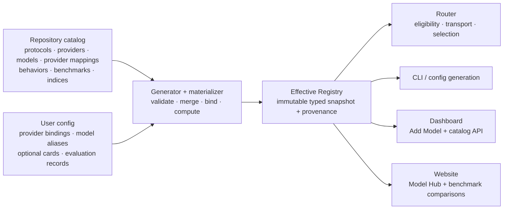

> **状态：** 已实现 · **创建日期：** 2026-09-04
>
> 本记录中的目录架构仍然现行。其原先的基准集、指数权重、覆盖率阈值和清单计数是历史快照，已被 [Open Intelligence 架构](./open-intelligence-index-and-model-arena) 取代。活动 1.0 契约请使用 [Intelligence Index](../benchmarking/open-intelligence-index)。

## 问题 {#problem}

vLLM Semantic Router 目前在几个独立位置描述模型支持：

- Router 配置拥有逻辑模型卡片、后端绑定、定价、API 格式和运营方编写的推理族；
- `pkg/config/helper.go` 拥有第二份提供商类型表，用于认证和请求路径；
- 控制面板拥有单独的提供商预设列表和提供商徽标；
- CLI 内置目录只拥有打包的 Mixture-of-Models 虚拟模型及其推荐物理池；
- 选择、Looper、训练和 Evaluation 各自以不同方式解释标量 `quality_score`。

结果不是连贯的 Day-0 支持边界。添加提供商或模型可能需要跨 Go、Python、TypeScript、YAML、示例和测试同步编辑，而控制面板可以宣传 Router 并不作为原生提供商类型支持的提供商预设。单个质量数字也会隐藏测量了哪些基准、如何归一化，以及缺失数据是否被悄悄当作差结果。

## 当前基线 {#current-baseline}

以下清单描述实现前的仓库。术语有意精确：UI 预设不会自动成为原生适配器，推荐模型引用也不是完整的内置模型卡片。

| 表面 | 当前内置清单 | 含义 |
| --- | --- | --- |
| Router 提供商类型 | `openai`、`anthropic`、`azure-openai`、`bedrock`、`gemini`、`vertex-ai`、`minimax` | 七种带硬编码认证和路径默认值的运行时类型 |
| 入站/上游协议族 | OpenAI Chat Completions、OpenAI Responses、Anthropic Messages | Router 实现的协议编解码器和请求路径 |
| 控制面板 “从这里开始”预设 | vLLM、SGLang、AMD ATOM、OpenAI Compatible | 四种连接表单预设 |
| 控制面板模型 API 预设 | OpenRouter、OpenAI、Anthropic、Google Gemini、DeepSeek、Groq、Together AI、Fireworks AI、Mistral AI、xAI、Cerebras、NVIDIA NIM、Perplexity、Cohere、DeepInfra、Hugging Face、SambaNova、DashScope、MiniMax、Moonshot AI、Z.ai、Novita AI、Nebius AI Studio、Featherless AI、FriendliAI、Vercel AI Gateway、CometAPI、Sakana AI | 二十八种 UX 预设，大多使用兼容协议 |
| 控制面板私有运行时预设 | Anthropic Compatible、Ollama、LM Studio、Xinference、NVIDIA Riva、NVIDIA Triton、Docker Model Runner、Lemonade | 八种 UX 预设 |
| CLI 内置虚拟模型 | `vllm-sr/mom-v1-blend`、`vllm-sr/mom-v1-lite`、`vllm-sr/mom-v1-flash`、`vllm-sr/mom-v1-ultra`、`vllm-sr/mom-v1-vault` | 五个打包虚拟模型 |
| 推荐物理引用 | `local/qwen3.5-9b`、`local/qwen3.6-35b`、`local/step-3.7-flash`、`local/qwen3.5-122b`、`local/mistral-small-4`、`local/glm-5.2`、`local/gpt-oss-120b` | 七个池推荐，尚不是完整模型卡片 |

因此旧控制面板包含 40 个提供商预设，而 Router 有七种硬编码运行时类型，打包目录没有通用物理模型注册表。已实现快照编译 60 个服务提供商、三个协议定义、84 张物理 Model Card、五张虚拟 Model Card、169 条提供商自有模型映射、64 个基准定义，以及 1,365 条精确评估记录。五个默认基准组件在 265 个模型/力度行上产生 1,325 个显式槽位；目前 125 个槽位已测量，其余每个槽位保持显式缺失。支持层级、生命周期和一致性保持独立，因此目录收录不会被压扁成原生支持或基准主张。

全部 84 张物理卡片通过硬准入规则：至少一个精确模型、推理力度和证据来源桶包含五个不同基准身份。
这并不意味着每个运行时可选择力度都有五条已发布结果。审计将每个可选择力度分类为完整、部分或未测量，并为未来数据工作提供更严格的可选择力度门。生成的审计报告是当前计数的事实来源；目录保持缺口可见，而不是从另一力度复制分数或删除有效运行时控制。为没有 `reasoning_family` 的模型记录的条件是证据标签，不是可配置的控制面板控件。

### 已实现的物理模型目录 {#implemented-physical-model-catalog}

初始物理目录按**模型创建者**策展，而不是从任何排名或端点清单中取前 20 个单独模型。它聚焦大约二十家主流创建者公司（本快照中为 22 家），并代表其大约最近三代或产品线。密切相关的规模或推理变体仅在可单独选择且对运营方有实质用处时收录。GPT-6 Astra 作为聚焦的模型接入示例单独添加，而不是折入基线变更。

| 模型创建者（`publisher`） | 近期世代与代表产品线 | 模型数 |
| --- | --- | ---: |
| AI21 Labs | Jamba2 Mini、Jamba Reasoning 3B、Jamba Large 1.7 | 3 |
| Alibaba / Qwen | Qwen3.8 Max/27B/2.4T、Qwen3.7 Max、Qwen3.6 27B/35B | 6 |
| Amazon | Nova 2 Lite、Nova Premier、Nova Pro | 3 |
| Anthropic | Claude Fable 5.1/5、Opus 5/4.8、Sonnet 5 | 5 |
| Baidu | ERNIE 5.1、ERNIE 5.0、ERNIE 4.5 300B A47B | 3 |
| ByteDance / Seed | Seed2.1 Pro/Turbo、Seed2.0 Pro、Seed OSS 36B | 4 |
| Cohere | North Mini Code、Command A+、Tiny Aya Global | 3 |
| DeepSeek | DeepSeek V4 Pro/Flash、V3.2、R1 | 4 |
| Google | Gemini 3.8/3.7/3.6 Flash、Gemma 4 31B | 4 |
| Meta | Muse Spark 1.3/1.2、Muse Glimmer、Llama 4 Maverick/Scout | 5 |
| Microsoft | MAI-Thinking-1、Phi-4 Reasoning Vision、Phi-4 Mini Flash Reasoning | 3 |
| MiniMax | M3、M2.7、M2.5 | 3 |
| Mistral AI | Small 4、Medium 3.5、Large 3 | 3 |
| Moonshot / Kimi | Kimi K3、K2.7 Code、K2.6、K2.5 | 4 |
| NVIDIA | Nemotron 3.5 Lightning、Nemotron 3 Ultra/Super/Nano Omni、Cascade 2 | 5 |
| OpenAI | GPT-5.6 Sol/Terra/Luna、GPT-5.5、GPT-5.4、GPT-OSS 120B/20B | 7 |
| StepFun | Step 3.7 Flash、Step 3.5 Flash、Step3-VL 10B | 3 |
| Tencent / Hunyuan | Hy4 Preview、Hy3、Hunyuan A13B | 3 |
| Thinking Machines Lab | Inkling、Inkling Small | 2 |
| Xiaomi | MiMo V2.5 Pro/V2.5、MiMo V2 Flash | 3 |
| Z.ai / GLM | GLM-5.3/5.3 Flash、GLM-5.2、GLM-5.1 | 4 |
| xAI | Grok 4.6、4.5、4.3 | 3 |

每个创建者在 `resources/models/single/` 下拥有一个聚焦文件；物理评估记录使用 `resources/evaluations/single/` 下对应的创建者文件。配方支持的逻辑模型留在 `models/virtual/`，其配方运行评估留在 `evaluations/virtual/`，因此物理和虚拟身份从不共享清单文件。

这种创建者策展有意独立于服务提供商覆盖。`ProviderDefinition` 描述运行时端点契约，因此 60 提供商注册表足够宽，即使提供商没有策展的内置 Model Card 映射，也能驱动 Add Model 和自定义模型连接。相反，`ModelCard.publisher` 命名创建模型的公司；它不命名每一个可以服务它的云、网关或自托管运行时。

可单独选择的模型或检查点获得一张规范卡片。带日期的提供商快照、批量 SKU、量化或别名留在提供商映射或评估主体上，除非创建者将其定义为实质不同的模型。基线在已审阅创建者公司内偏向深度和当前相关性，而不是浅长尾的较不知名创建者。未来准入会更新相关创建者文件，并通常保持最近三代或代表产品线，而历史条目可以按生命周期策略移除或弃用。

该边界可执行但是内部的。源清单包含带已审阅创建者允许列表、显式当前代表模型 ID、默认最少三个，以及如 Thinking Machines Lab（目前只有两条公开产品线）等例外的 `inventory.physical` 策略。生成会拒绝未列出的物理创建者、缺失代表 ID 和当前深度不足。该策略从生成的运行时快照中省略，从不出现在用户 YAML 中；由审阅者而不是时间戳启发式决定某条产品线是否近期且有代表性。

## 目标 {#goals}

1. 为协议、提供商、模型、提供商自有模型映射、推理行为、展示元数据、基准和可选内部指数定义一份仓库自有目录。
2. 从同一已校验源生成内置分发、Router 嵌入，以及一份公开网站 / 控制面板视图；仅在构建产物时暂存包本地副本。
3. 保持普通用户配置简短，同时为自托管和私有模型保留显式、手写的模型卡片。
4. 用版本化测量、确定性指数定义、覆盖率、状态和来源替换含糊的 `quality_score` 值。
5. 使一次模型或提供商 Day-0 支持变更以数据为先、可审阅且机械完整。
6. 保留提供商徽标并改进控制面板 Add Model 流程，而不使目录内部成为用户契约的一部分。

## 非目标 {#non-goals}

- 目录不在 Router 启动时发现任意互联网模型。
- 它不把提供商兼容变成原生语义对等的主张。
- 它不把智能、延迟、价格、可用性和负载组合成一个不透明数字。那些仍是分开的路由目标。
- 它不发布总体模型排名。公开比较限定到一个精确基准版本、配置文件和指标；每根条是一条带标签的模型与推理力度记录。
- 它不要求每个新模型在发布日都有综合分数；缺失证据保持显式不可用。
- GPT-6 Astra 有意排除在架构基线之外，由单独的代表模型接入贡献添加。

## 设计原则 {#design-principles}

- **一个来源，多种视图。** 目录数据编写一次，并编译成类型化运行时和展示产物。
- **事实先于默认值。** 协议能力、模型能力和基准测量保持为不同事实；默认值只在它们之中选择。
- **固有模型与提供商自有模型映射。** 上下文、模态和模型行为属于模型卡片。端点路径、提供商原生模型 ID、可用性和价格属于该提供商的 `models[]` 条目。
- **显式身份。** 规范目录身份从不依赖面向请求的别名。
- **证据按身份只追加。** 新评估不会悄悄改写先前测量。
- **未知不是零。** 缺失、失败、不支持和不适用是不同状态。
- **加法配置，定向清理。** 公开契约仍是 `v0.3`。目录支持是加法的；只清理含糊的质量和推理字段，以及 `providers.defaults` 内的冗余名称。
- **更少配置，而不是更少控制。** 内置事实自动物化，而自托管模型仍可以提供手写卡片、推理行为、模型关联评估记录、端点覆盖和定价。

## 架构 {#architecture}



构建时生成器校验并连接仓库资源，形成三项已提交交付物：内置分发快照、Go 嵌入，以及一份公开 JSON 快照。网站发布该公开 JSON，控制面板将同一文件导入为离线回退。CLI 直接从源码检出读取内置分发；wheel/sdist 构建在 `cli.model_assets` 下暂存一份被忽略的副本，而容器构建将同一分发复制进镜像。运行时，Go materializer 将嵌入事实与用户绑定和覆盖合并成不可变的 `EffectiveRegistry`。没有任何产品拥有独立的提供商或模型清单。

覆盖率是查询，不是存储的目录数据。编写的 `evaluations` 只包含存在的证据；生成的 `index_results` 只包含满足指数缺失数据策略的分数。审计推导完整的模型/力度/组件矩阵，并在维护者需要覆盖率视图时报告缺口。因此，缺失意味着证据不足，从不意味着零，成千上万重复的 `status: missing` 行不会复制进每个运行时和 UI 产物。

## 规范目录资源 {#canonical-catalog-resources}

| 资源 | 拥有 | 不拥有 |
| --- | --- | --- |
| `ProtocolDefinition` | 版本化线格式身份、已声明操作和路径，以及协议能力 | 提供商凭证、模型上下文限制、价格 |
| `ProviderDefinition` | 稳定运行时 API 契约、认证、支持的协议操作子集、路径和非密钥头默认值、推理传输、支持层级、一致性、显示名称、徽标元数据，以及其 `models[]` 原生 ID/协议/限制/定价映射 | 创建者身份、凭证、面向请求的别名、固有模型智能 |
| `CatalogModelBinding` | 一条模型到服务通道的映射，包括原生 ID、协议、限制、定价，以及显式 `first_party`、`managed_cloud`、`gateway` 或 `self_hosted` 关系 | 端点凭证、面向请求的别名、固有模型事实 |
| `ModelCard` | 规范模型身份、`publisher` 中的创建者、展示/分发、家族/修订、发布和知识日期、输入/输出限制、模态、能力、推理行为引用、生命周期 | 端点 URL、凭证、服务提供商价格 |
| `ReasoningFamilyDefinition` | 请求投影类型/参数，以及力度词汇和默认值 | 运营方凭证、基准比较 |
| `BenchmarkDefinition` | 基准/版本身份、领域、来源，以及指标方向/范围/单位 | 某模型的结果 |
| `EvaluationRecord` | 精确模型主体、原始测量、测量或观察日期、状态、来源/产物、来源和验证 | 聚合策略 |
| `IndexDefinition` | 版本化组件、权重、归一化、缺失数据策略、标度 | 原始基准输出 |
| `IndexResult` | 计算分数、领域子分数、覆盖率、每组件状态/值，以及源记录谱系 | 可变运营方偏好 |

### 稳定身份 {#stable-identities}

- 提供商 ID 使用稳定 slug，例如 `openai` 或 `vllm`。
- 模型卡片名称使用命名空间 ID，例如 `organization/model-id`。
- `ModelCard.publisher` 标识创建者公司。它有意独立于可以服务该模型的 Provider ID。
- 协议、基准和指数身份包含版本。综合指数版本使用完整语义版本字符串，例如 `vllm-sr/intelligence@1.0.0`。
- 提供商自有模型映射由 Provider ID 加规范 Model Card 身份和提供商原生模型 ID 寻址，从不由显示标签寻址。
- 每条内置映射声明其与模型创建者的关系：创建者自有 API 或创建者云路由为 `first_party`，第三方云托管产品为 `managed_cloud`，中间模型网关为 `gateway`，本地/私有运行时为 `self_hosted`。该仓库自有分类独立于 ProviderDefinition `category` 和 `support_tier`，从不进入用户 YAML。
- 模型修订、量化、运行时和推理力度是评估主体的一部分。实质不同主体的结果不会悄悄合并。
- 虚拟模型角色的 `recommended_pool` 不是外键关系。它可以推荐内置 Model Card，或只存在于部署配置中的运营方定义模型。

## 面向用户的配置 {#user-facing-configuration}

目录版本、摘要、默认综合指数 ID、来源内部、生成默认值和模型绑定关系分类是构建/运行时元数据。它们从不出现在普通用户 YAML 中。公开契约仍是 `version: v0.3`，并保留现有 `providers.defaults`、`providers.models`、`backend_refs` 和 `routing.modelCards` 层级。

### 内置提供商与模型 {#built-in-provider-and-model}

内置模型向现有模型绑定添加一个可选 `catalog` 引用。`backend_refs[].provider` 是稳定 Provider ID。`api_format` 保留其现有值，并在需要时仍是显式覆盖。

```yaml
version: v0.3

providers:
  defaults:
    model: frontier
  models:
    - name: frontier
      catalog: vendor/reasoner-v1
      backend_refs:
        - name: primary
          provider: vendor-cloud
          api_key_env: VENDOR_API_KEY

routing:
  decisions:
    - name: default
      modelRefs:
        - model: frontier
```

`vendor-cloud` 和 `vendor/reasoner-v1` 值是示意，不是支持主张。身份有意分开：

- `providers.models[].name` 是决策使用的面向请求别名；
- `providers.models[].catalog` 是规范内置 Model Card 身份；
- `backend_refs[].name` 只是本地端点名称；
- `backend_refs[].provider` 是仓库 Provider ID；省略则保留现有本地运行时简写，并物化为 `vllm`。

`api_format` 只选择上游线契约，从不从兼容注册表条目集合推断 Provider。当 Router 拥有监听器时，每个物理模型必须声明带显式 Provider ID 的 `backend_refs`（或使用现有本地运行时简写）。带 `listeners: []` 的仅元数据外部网关配置和内置虚拟模型可以保持无后端，因为传输在该物理模型绑定之外解析。
本地 `vllm-sr serve` 工作流始终拥有其 Envoy 传输（并对空列表保留现有默认监听器行为），因此 Envoy 投影拒绝无后端物理模型。仅元数据配置文件通过外部网关部署运行，而不是生成的独立 Envoy 路由。

materializer 连接这些显式引用。它从不因为 `name` 字符串碰巧匹配而连接两个资源。不添加 `deployment`、`routing_overrides`、顶层 `models` 或顶层 `defaults` 块。当省略 `providers.defaults.reasoning_effort` 时，所选模型的推理族默认值胜出；规范导出不会合成或写回用户未配置的全局力度。

同一别名下的多个 `backend_refs` 组成一个 Envoy 负载均衡池，因此它们必须是同质副本。HTTP 副本可以在网络目标和权重上变化；HTTPS 副本可以按端口和权重变化，但共享一个 DNS 主机名。每个副本必须解析到同一 Provider ID、线协议、原生模型 ID、凭证来源、认证约定、有效头、基础/请求路径、推理传输，以及兼容的 DNS/TLS 语义。Envoy 在 Router 选择一个提供商配置文件之后选择物理端点；否则混合这些请求语义会把第一个后端的元数据发送到不同上游。因此物化会清晰失败，而不是悄悄使用第一个后端。真正不同的提供商、凭证、路径或 TLS 源是单独的模型别名，并显式路由。

### 手写覆盖内置卡片 {#handwritten-override-of-a-built-in-card}

内置卡片无需 `routing.modelCards` 即可物化，但用户仍可以覆盖允许字段。卡片的 `name` 等于 `providers.models[].catalog`，因此覆盖目标可见：

```yaml
providers:
  models:
    - name: frontier
      catalog: vendor/reasoner-v1
      backend_refs:
        - name: primary
          provider: vendor-cloud
          api_key_env: VENDOR_API_KEY

routing:
  modelCards:
    - name: vendor/reasoner-v1
      description: Restricted production profile
      context_window_size: 128000
      capabilities: [chat, tools]
      tags: [production, approved]
```

编译器先加载内置，再应用类型化覆盖。存在的标量字段替换，映射按键合并，列表整体替换。规范身份和捆绑的第三方证据不可变。每个有效字段保留 `builtin` 或 `operator` 来源。

### 完全自定义的 vLLM 或 SGLang 模型 {#fully-custom-vllm-or-sglang-model}

`catalog` 可选。没有它时，模型仍是普通自托管模型，别名也是其本地卡片身份。对最小聊天模型，卡片可选；当更丰富的路由元数据有用时可以手写：

```yaml
providers:
  defaults:
    model: private-reasoner
    reasoning_effort: medium
  models:
    - name: private-reasoner
      provider_model_id: qwen3-custom-awq
      reasoning:
        family: qwen3
      backend_refs:
        - name: lab
          provider: vllm
          endpoint: model-gateway.example:8000/v1
          protocol: http
          api_key_env: LAB_VLLM_API_KEY

routing:
  modelCards:
    - name: private-reasoner
      display_name: Private Reasoner AWQ
      publisher: Example Research
      presentation:
        logo: https://models.example/reasoner.svg
        monogram: R
        monochrome: false
      distribution:
        type: open_weights
        source: https://models.example/reasoner
        license: Apache-2.0
      description: Internal AWQ deployment
      context_window_size: 131072
      capabilities: [chat, tools, structured_output, reasoning]
      tags: [private, awq]
```

自定义模型可以如上复用内置推理族，或内联定义其线行为：

```yaml
reasoning:
  type: reasoning_mode
  parameter: thinking_mode
  modes: [disabled, adaptive, enabled]
  default_mode: adaptive
```

内置模型不需要这两种形式；组合 `catalog` 与每模型 `reasoning` 块会被拒绝，以免仓库自有推理契约按别名悄悄分歧。旧的全局 `providers.defaults.reasoning_families` 注册表和每模型 `reasoning_family` 标量已移除。

上面的 publisher、presentation 和 distribution 块可选。它们用于仓库目录中没有身份和徽标的私有或新发布模型；最小自定义聊天模型仍只需要提供商绑定。这些字段仍是元数据，从不携带凭证。

名称是已绑定模型声明的 LoRA 的仅元数据卡片仍然有效。它继承该基础模型的提供商绑定，不被解释为内置目录覆盖。完整运行时配置中的任何其他卡片必须匹配模型的 `catalog` 身份，或对自定义模型匹配其请求别名。

### 可选自定义评估 {#optional-custom-evaluations}

定义和测量共享一个顶层 `evaluation` 所有者。记录引用规范 Model Card 身份，而不是嵌入路由元数据：

```yaml
evaluation:
  records:
    - model: private-reasoner
      benchmark: idavidrein/gpqa-diamond@1.0.0
      benchmark_profile: published-standard
      reasoning_effort: high
      metrics:
        accuracy: 0.72
    - model: private-reasoner
      benchmark: acme/support-bench@1
      metrics:
        resolution_rate: 0.82
      source: https://evals.example/runs/42
      measured_at: 2026-09-01
      metadata:
        runtime: vllm
        quantization: awq
```

`model`、`benchmark` 和 `metrics` 是必需的。`model` 是自定义模型名称或内置 `catalog` 身份。开放数值指标映射支持多指标基准，而无需另一次 schema 修订。
`benchmark_profile` 选择精确基准配置文件，`reasoning_effort` 将测量限定到产生它的力度；两者都可选。已知基准在省略配置文件时使用其仓库默认配置文件，而缺失力度保留在基准的 `default` 证据桶中，而不是推断。`source`、`measured_at` 和标量 `metadata` 也可选。用户从不配置嵌套证据/来源对象。

基准身份命名空间化并版本化（`owner/benchmark@1` 或完整语义版本）。指标名称必须非空，值必须有限；`measured_at` 存在时是 ISO 日历日期。元数据保持标量，以免公开表面再长出第二套证据 schema。

已知基准定义提供范围、方向、语义标签，以及可选的原始到百分比展示归一化；指数定义独立选择指标并提供聚合归一化。命名空间未知基准被保留并展示，但在向仓库目录添加定义之前不进入仓库定义的指数。自定义模型不要求任何评估。

Model Hub 将原始评估值作为证据保留，并以百分比标度展示每个内置基准。比例和分数单位已经归一化；其他单位必须声明可审计的指标归一化。对基于 Elo 的 GDPval-AA v2 和 Briefcase 测量，展示映射为 `clamp((elo - 500) / 2000, 0, 1) * 100`。这不改变存储的 Elo，也不隐式把它加入综合指数。

基准画廊从其目录自有 `tags` 推导过滤器。`All` 仍是默认未过滤视图；`Core` 是第一个语义过滤器，恰好包含 MMLU-Pro、GPQA Diamond、Humanity's Last Exam、LiveCodeBench、SciCode 和 Terminal-Bench 2.1。领域过滤器跟在其后，UI 不维护第二份基准列表。

不可用分数保持不可用。路由显式选择排除缺失所选指数的候选，或对整个池禁用质量。它从不发明零、中性分数或参数规模估计，也从不只为一个候选更改因子权重。

## 协议与后端 API 所有权 {#protocol-and-backend-api-ownership}

后端 API 规格位于协议注册表中，而不是模型卡片徽标、提供商表单或分散的路径常量中。初始定义覆盖：

| 协议 | 定义拥有的操作 | 协议语义示例 |
| --- | --- | --- |
| `openai/chat-completions@1` | `POST /v1/chat/completions`；`GET /v1/models` | 聊天消息、流式增量、工具、用量、结束原因 |
| `openai/responses@1` | `POST /v1/responses`；`GET /v1/models` | 类型化输入/输出项、工具、推理和流式事件 |
| `anthropic/messages@1` | `POST /v1/messages`；`GET /v1/models` | 消息/内容块、工具使用、用量、停止原因 |

协议定义其默认 API 基础路径，每个操作定义规范方法、完整路径和线契约。配置的提供商 `base_url` 是完整 API 根：其路径在追加操作后缀之前替换协议默认基础路径。这防止像 `/v1beta/openai` 这样的网关重复版本段。定义不主张每个实现该协议的提供商都暴露每个操作。因此每个提供商声明显式、完全限定的 `supported_operations` 子集，例如 `openai/chat-completions@1#create`。提供商特定路径仅对已声明操作合法。提供商定义还选择认证策略和可复用请求语义，例如推理传输。提供商自有 `models[]` 条目缩小特定模型支持的协议，并记录模型特定参数限制。其必需的 `relationship` 说明服务通道与模型创建者的关系，而不改变提供商类别或支持层级语义。
仅在真正语义差异（如云签名、部署范围 URL 构造、事件翻译或不兼容错误行为）时才需要代码适配器。

`reasoning_transport` 是内部目录数据，不是用户 YAML。其可复用模式为 `chat_template_kwargs`、`top_level_effort`、`top_level_boolean`、`top_level_effort_template_switch`、`top_level_effort_boolean_switch`、`reasoning_object`、`thinking_object`、`thinking_object_effort`、`output_config_effort` 和 `deepseek_thinking`。
`reasoning_object` 将力度投影到 OpenRouter 风格的 `reasoning.effort` 对象。通用 `thinking_object` 模式将模型的推理开关投影到 `thinking.type`；`deepseek_thinking` 在该形态上添加提供商的力度字段，而 `thinking_object_effort` 是对象开关与顶层力度相互独立的提供商的可复用形式。
`output_config_effort` 将所选级别投影到 Anthropic Messages 的 `output_config.effort`，同时保留兄弟输出配置。运行时分派从 Provider ID 选择这些模式；它从不从端点主机名推断提供商行为。
两种 `top_level_effort_*_switch` 模式覆盖带独立力度阶梯和激活开关的混合推理 API。它们把 `reasoning_effort` 保持在 Chat 请求顶层，然后把 `enable_thinking` 放在本地 `chat_template_kwargs` 内或第一方 API 顶层。Responses 请求继续使用协议原生的 `reasoning.effort` 对象。

提供商-模型映射可以进一步声明 `reasoning_modes` 或 `reasoning_efforts`。这些是模型族的内部类型化子集，不是新的用户配置。它们防止 API 特定表面接受对自托管运行时有效但对该提供商无效的模式；当任何所选后端不能携带其请求的控制时，materializer 在启动前拒绝已配置决策。当一个提供商通过多种协议暴露同一模型时，`reasoning_efforts_by_protocol` 只能为命名的已绑定协议缩小该公共集。例如，仅 Responses 的力度会在启动期间对 Chat 绑定被拒绝，而不是作为已知无效请求发送到上游。

公开决策契约仍只有 `use_reasoning`、可选 `reasoning_mode` 和可选 `reasoning_effort`。在最终分派边界，协议编解码器和提供商传输共同渲染该状态：

| 目标 | 精确推理投影 |
| --- | --- |
| vLLM/SGLang 模型模板 | `chat_template_kwargs` 开关和/或力度 |
| OpenAI 兼容 Chat | 按绑定的顶层力度或布尔值 |
| OpenAI Responses | 标准 `reasoning.effort` |
| Thinking-object API | `thinking.type`，可选带单独顶层力度 |
| DeepSeek Chat | 启用时为 `thinking.type` 加顶层力度 |
| Anthropic Messages | `thinking.type` 加 `output_config.effort` |
| 归一化网关 | 一个 `reasoning` 对象 |

这些投影互斥。适配器先移除属于其他方言的控制，但保留无关兄弟，例如 `output_config` 内的结构化输出格式。这使编码后的提供商请求——而不是中间 Router 结构——成为一致性边界。`adaptive` 仍是面向运营方的语义模式：当 API 暴露自适应枚举时原样发送，当同一模型的 API 只暴露启用开关时映射到该启用线值，当归一化网关通过省略定义自适应行为时适配器省略开关。

当激活和力度确实是分开控制时，家族可以声明可选 `activation_parameter`。这使 Qwen3.8 的 `enable_thinking=false` 区别于其 `low|medium|xhigh` `reasoning_effort` 阶梯，而不是发明一维 `none` 力度。当模板通过互斥布尔值表达力度时，其可选 `effort_flags` 将逻辑级别映射到那些精确参数名。未映射的活动级别通过省略编码。例如，Nemotron Super 将 `low` 映射到 `low_effort: true`，并通过省略 `low_effort` 表示 `high`；Ultra 将 `medium` 映射到 `medium_effort: true`，同样用省略表示 `high`。校验拒绝含糊或重叠映射。

这将当前混在一起的三个问题分开：

1. Router 能否解码和编码该协议？
2. 提供商能否正确传输该协议？
3. 该提供商映射是否支持该模型、操作和参数集？

## 替换提供商粘合 {#replacing-provider-glue}

`pkg/config/helper.go` 中当前的提供商类型注册表是迁移证据，不是目标架构。最终实现用四条窄接缝替换它：

1. **已编译提供商数据**，用于基础 URL、认证策略 ID、默认协议、非密钥请求头、推理传输、展示和支持层级。
2. **传输解析器**，用于通用 URL/路径/头解析。
3. **认证策略解析器**，用于首个目录发布支持的数据支持 `none`、bearer 和 API-key 头策略。
4. **协议/提供商适配器**，仅在线语义确实不同处使用，包括未来云签名和工作负载身份的扩展接缝。

添加仅数据兼容提供商时，中央开关不会增长。新适配器注册在其实现和一致性夹具旁边，而不是通用配置帮助器中的另一个 case。提供商校验和运行时默认值通过嵌入目录解析。一小套导出的 Go 常量仅作为现有调用方的源兼容便利；那些常量不是注册表，也不会为兼容提供商增长。

同一切割移除这些稳态重复：

- 作为独立维护清单的控制面板 `modelProviderCatalog.ts`；
- 提供商展示元数据之外手维护的提供商徽标；
- 运营方编写的内置推理族；
- 分散在配置帮助器中的模型 API 格式和请求路径默认值；
- 基于参数数量的标量模型质量回退。

## 物化流水线 {#materialization-pipeline}

编译器执行以下确定性阶段：

1. 构建生成器加载仓库自有协议、提供商、模型、提供商映射、推理、基准、评估和指数资源。
2. 它校验 JSON Schema 加规范 ID、版本、必需引用、唯一性、URL 安全、指数权重、归一化参数和环。虚拟模型池推荐有意不解析，因为它们可能命名运营方定义的模型。
3. 它计算内置指数结果，并在生成差异检查保护下发出字节相同的 Go、CLI、控制面板和网站投影。
4. Router 加载嵌入快照，然后读取 `providers.models` 别名/后端引用、可选 `routing.modelCards` 覆盖/自定义卡片，以及顶层 `evaluation` 中的可选基准定义、指数 DAG 和模型关联记录。
5. materializer 应用感知存在的字段覆盖，同时保留 `builtin`/`operator` 字段来源。
6. 它将每个别名连接到一张卡片，将每个后端绑定连接到一个 Provider ID、协议、可选提供商映射、认证策略和推理行为。
7. 它校验用户测量范围，并计算满足其缺失数据策略的仓库定义指数。
8. 它向 Router 运行时消费者发布一个不可变 `EffectiveRegistry`；生成的产品投影继续使用同一已校验快照。

失败是路径特定的。未知必需引用、重复 ID、环、无效权重/归一化、超出范围的指标、不支持的协议绑定和无效内置覆盖，会在流量开始前使生成或启动失败。

## 评估数据模型 {#evaluation-data-model}

### 基准定义 {#benchmark-definitions}

每个指标独立声明其单位、有效范围和方向：

```yaml
- id: harbor/terminal-bench@2.1.0
  display_name: Terminal-Bench 2.1
  domain: agentic_systems
  source: https://github.com/harbor-framework/terminal-bench-2-1
  metrics:
    - id: resolved
      unit: proportion
      range: [0, 1]
      direction: higher_is_better
```

指标 ID 仅在基准版本内稳定。更改数据集、评分器、提示词协议、聚合规则或实质工具链行为需要新的基准版本。

### 评估记录 {#evaluation-records}

评估记录冻结规范模型、显式 `reasoning_effort`、原始版本化指标 ID 和值、状态、日历锚点和证据。`measured_at` 是已知时的实际运行日期；`observed_at` 是审阅已发布值的日期，从不表述为运行日期。其类型化主体可以额外记录模型修订、提供商映射、运行时/版本、量化、精度、张量并行、协议、工具策略、工具链和其他实质参数。证据记录来源、验证和可选来源/产物。

来源是 `vendor_claimed`、`third_party`、`vllm_sr_reproduced` 或 `operator` 之一。验证单独记录为 `claimed`、`imported` 或 `reproduced`。同一模型和指标的冲突可用值会被拒绝，而不是通过隐藏偏好规则解决。源记录 ID 仍附着到计算结果。

生成器为每张 Model Card 和每个可选择推理力度物化完整的五槽覆盖矩阵。每个槽位要么链接到一条可用评估，要么显式 `missing`；缺失从不编码为零。力度特定结果只用于该精确力度。例如，供应商的 `high` 分数不能填充 `medium`、`xhigh` 或 `max`。运行时设置未知的已发布结果留在单独的 `unspecified` 证据行中，而不是被猜进可选择行。同一契约适用于虚拟模型，它们可以从其打包配方的执行获得分数。

初始填充审计使覆盖率和缺口都可见。64 个基准定义将所有精确测量保留为源记录，而公开 Hub 表面移除在少于十个不同模型上测量的每一个精确基准/配置文件/指标元组。默认五组件矩阵在 265 个模型/力度行上物化 1,325 个槽位。在本快照中，其中 125 个槽位有精确测量。其他行保持显式 `missing`、`failed`、`not_applicable` 或 `withheld`；没有一个被伪造为零。

因此“每个模型五个基准”是 schema 和覆盖率保证，不是伪造五个数字的承诺。每个物理或虚拟模型及其每个可独立选择的推理力度，对每个默认基准都有一个槽位。例如，Qwen3.8 27B 对 `xhigh` 的可用结果不能填充其 `low` 或 `medium` 行。同样，工具配置文件不同于默认无工具配置文件的结果，在其精确配置文件下保持可见，而不填充该默认组件。

`model-catalog-check` 还要求每个内置物理模型在一个精确 `(model, reasoning_effort, evidence.provenance)` 桶内至少有五个可用基准。它从不通过合并不兼容力度或来源类别来满足该门。要求每个可选择运行时力度会迫使为尚未发布该矩阵的发布者发明值，因此那些行保持显式缺失且可审计。

### 指数定义 {#index-definitions}

指数是对指标或其他指数的纯版本化计算：

```yaml
- id: example/index@1.0.0
  display_name: Example Index
  description: Example auditable composite.
  scale: [0, 100]
  aggregation: weighted_mean
  missing:
    policy: require_coverage
    minimum: 0.80
  components:
    - metric: benchmark-a@1.0.0#accuracy
      weight: 0.60
      normalization:
        type: identity
    - metric: benchmark-b@2.0.0#error_rate
      weight: 0.40
      normalization:
        type: one_minus
```

支持的归一化原语有意小且可审计：`identity`、`one_minus`、`linear_clamp`、`piecewise_linear`、`logistic` 和 `lookup`。编译器验证组件权重、指标范围、方向、引用和环。

支持的缺失数据策略为：

- `require_all`：除非每个组件都存在，否则不可用；
- `require_coverage`：仅在显式权重阈值之上可用；
- `reported_only`：对已报告组件的描述性结果，从不合格进入严格内部比较。

对显式允许的部分结果：

```text
coverage = sum(weight of present components)
score = 100 * sum(weight * normalized value) / coverage
```

每个 `IndexResult` 包含 `score`、`status`、`coverage`、领域子分数、组件状态/值/归一化值，以及源记录 ID。因此零分可以与不可用分数区分。

## 内部参考指数 {#internal-reference-index}

默认算法是仓库自有、完全指定的 `vllm-sr/intelligence@1.0.0`。它是路由代码的内部模型智能参考，不是效率分数、面向用户的配置字段，或公开总体排名。归一化加权平均算法保持精确基准版本、权重和覆盖率阈值版本化且可替换，同时保留每个组件测量。

| 领域 | 组件 | 权重 | 归一化 |
| --- | --- | ---: | --- |
| General reasoning | MMLU-Pro | 20% | 已校验 0–1 准确率上的 Identity |
| Scientific reasoning | GPQA Diamond | 20% | 已校验 0–1 准确率上的 Identity |
| Frontier reasoning | Humanity's Last Exam | 20% | 已校验 0–1 准确率上的 Identity |
| Software engineering | SWE-bench Verified | 20% | 已校验 0–1 解决率上的 Identity |
| Agentic systems | Terminal-Bench 2.1 | 20% | 已校验 0–1 解决率上的 Identity |

基准集有意小、可识别且版本固定。它平衡知识/推理与真实软件和终端工作，而不是把所有能力藏在一个供应商分数后面。`claimed` 或 `imported` 记录仍可追溯到来源，但不表述为独立复现运行。

内部结果在 60% 使用 `require_coverage`。因此模型需要五个等权测量中至少三个，才会获得内部分数。可用权重被重归一化，精确覆盖率留在该分数旁边：

```text
coverage = 0.20 * count(available components)
intelligence = 100 * sum(0.20 * available value) / coverage
```

记录保留精确报告的模型变体、推理力度、工具模式、基准配置文件和工具链元数据，以免不同主体被合并。复现记录额外标识其冻结基准协议和产物。低于 60% 的模型保留缺失的内部结果；组件可用性和来源谱系保持可见。替代指数定义是仓库扩展，而不是普通用户配置旋钮。

未来的多语言和多模态指数保持分开，因为其任务和覆盖率定义不同于默认文本智能指数。价格、延迟、吞吐、首 token 时间和可用性仍是分开的路由信号，从不折入智能。

## 替换 `quality_score` {#replacing-quality_score}

迁移移除裸标量，而不是给它赋予新含义：

| 当前行为 | 替换 |
| --- | --- |
| `routing.modelCards[].quality_score` | `evaluation.records[]`，然后是计算得到的内置 `IndexResult` |
| 直接写入 `quality_score` 的 MMLU-Pro 平均值 | 版本化 MMLU-Pro `EvaluationRecord` |
| 多因子选择读取一个静态标量 | `ScoreResolver(model, index)` 返回值、覆盖率、状态和来源 |
| Looper 从参数数量估计质量 | 已移除；缺失证据遵循路由策略 |
| 会话感知硬编码回退 | 已移除；缺失证据是显式的 |
| 在线学习质量共享同一名称 | 带窗口和样本数的单独 `ObservedQuality` 运行时信号 |
| 评估报告选择一个可用数字作为质量 | 显式 `primary_metric {id, value, unit, confidence_interval}` |

该发布的默认指数是内部目录策略，不序列化进用户 YAML。仅当候选有可比较结果时，选择才使用它。对缺失结果，质量因子被省略，其余可用因子被重归一化。运营方评分可以显式表示为 `vllm-sr/operator-rating@1.0.0`，但不表述为公开基准证据。后来的 [Open Intelligence Index 1.0 与 Unified Model Arena](./open-intelligence-index-and-model-arena) 取代本文档的初始基准池、覆盖率阈值和无总体排名决策。

## 控制面板体验 {#dashboard-experience}

控制面板在现有模型配置页旁获得专用 **Model Hub**。Model Hub 和公开网站共享生成的目录快照和信息层级：创建者徽标、模型身份、分发、生命周期、能力、上下文、服务提供商映射、基准测量和来源支持的详情。它是带卡片和表格视图的分页、可搜索目录，不是总体排行榜。虚拟模型详情页还暴露其推荐后端池。控制面板仍是交互表面；网站是静态构建投影，不是第二数据集。

Add Model 工作流保留提供商卡片和徽标。其数据源变更：

1. 提供商卡片、类别、描述、认证字段、默认 URL、徽标和协议徽章来自提供商目录展示元数据。
 初始选择器只显示仓库策展的主流云、网关和自托管运行时条目。**更多提供商**展开完整注册表，而搜索始终覆盖每个 Provider ID。
 `presentation.featured` 标志是仓库自有发现元数据，不是运行时能力或用户 YAML 字段。
 浏览器只提交 Provider ID 和连接输入；后端从同一注册表解析模型清单路径、认证头/前缀和安全默认头。没有 UI 自有的 `authMode` 开关。
 仅当提供商显式声明默认协议的 `list_models` 操作时才出现 **列出模型** 动作；每个提供商仍可手动输入模型 ID。云 Model API 的发现固定到内置方案、主机和有效端口。自托管运行时可以使用私有或回环地址，而链路本地、元数据、组播、未指定、运营商级 NAT、基准和文档网络仍被阻断。后端禁用代理继承和重定向，在拨号时解析并校验每个 DNS 答案，然后才附加提供商特定凭证头。
2. 选择提供商会过滤其兼容模型映射，并显示支持是原生、兼容、运行时托管、实验性还是已弃用。
3. 选择内置模型会保存 `providers.models[].catalog`，在提供商映射提供时预填提供商模型 ID，并且不发出生成的 Model Card 默认值。
4. 选择 Custom 会省略 `catalog`，并暴露手写 `routing.modelCards` 元数据和自定义推理。评估记录在顶层 `evaluation.records[]` 下独立管理。
5. 模型清单标注内置与 Custom 身份，并让运营方有意编辑生成的卡片覆盖。
6. 保存的 YAML 只包含现有提供商/模型绑定、凭证引用、选中时的 `catalog`，以及有意覆盖。它不包含目录摘要、指数身份或生成默认值。

徽标元数据包括仓库/包资产或批准的外部来源、字母组合回退和单色行为。UI 始终回退到字母组合，因此缺失图像从不阻塞模型配置。

## 网站 Model Hub 与基准比较 {#website-model-hub-and-benchmark-comparisons}

添加从控制面板 Model Hub 使用的同一目录快照生成的公开 **Models** 页。它有三个相连视图：

### 提供商支持矩阵 {#provider-support-matrix}

列包括提供商身份、支持层级、类别、认证策略、支持的协议操作、一致性状态和上次验证日期。兼容预设按此标注，而不是表述为原生适配器。展示元数据驱动两个表面，当打包或批准的远程徽标无法加载时，目录字母组合是可靠回退。

### 内置模型表 {#built-in-model-table}

列包括规范模型名称、种类、上下文限制、能力、推理族、创建者和服务提供商映射计数。虚拟和物理模型可搜索、可过滤、可分页，并在视觉上区分。详情视图显示精确基准记录，对虚拟模型还显示推荐后端池。

### 基准特定比较 {#benchmark-specific-comparisons}

该初始实现不暴露综合模型排名。后来的 [Open Intelligence Index 1.0 与 Unified Model Arena](./open-intelligence-index-and-model-arena) 添加完整案例 Arena，同时保留此处描述的基准画廊。画廊默认显示每个已准入基准。目录自有领域标签缩小画廊，而不发明第二套 UI 分类法；模型搜索和创建者过滤器应用于所有可见面板。每个基准固定一个确定性、最广覆盖的版本/配置文件/指标元组，以免不同运行被混合。

每条精确模型与推理力度记录作为单独着色条出现，带其创建者徽标和力度标签；没有该测量的模型被省略，而不是被赋零。面板显示基准身份、指标、方向、配置文件、来源和结果计数。它从不分页：匹配固定元组和当前过滤器的每条精确结果都在一个水平可滚动图表中渲染。桌面每行布置两个基准面板；较窄屏幕折叠为一个面板，同时保留触摸滚动。

画廊仅在至少十个不同目录模型有可用结果时才准入精确基准/配置文件/指标元组；同一模型的多个推理力度行不会夸大该覆盖率。较低覆盖率记录留在源目录中供审计和路由，但从每个公开 Model Hub 视图（包括每模型详情）中移除。

UI 按层级过滤提供商，按种类、创建者、服务提供商、能力和分发过滤模型，两个表都带搜索和分页。生成器在未解析的必需引用、重复评估元组、无效分数或归一化、不安全 URL 或过期生成输出上失败。

网站和控制面板消费同一生成快照；两者都不拥有并行提供商或模型列表。

## Day-0 模型支持工作流 {#day-0-model-support-workflow}

仅模型支持变更遵循一个有界序列：

1. **来源包：** 链接主要模型/API 文档，并记录发布、模型修订、限制、模态、能力、协议、参数限制、定价日期和生命周期。
2. **模型卡片：** 添加或更新一张规范卡片。不要把端点、价格或仅提供商事实复制进去。
3. **提供商映射：** 在提供商的 `models[]` 下添加每个已验证原生模型 ID、协议集、参数约束、可选定价和证据。
4. **推理行为：** 引用现有内置族，或添加带每协议请求整形夹具的新族。用户不重新声明它。
5. **适配器：** 仅在真正线语义差异时添加代码。兼容提供商映射保持仅数据。
6. **一致性夹具：** 覆盖接受和拒绝的参数、工具、流式、用量、错误翻译、模型 ID 投影，以及每个声称的协议操作。
7. **评估：** 添加带完整主体和来源的精确原始测量。缺失基准元组保持不可用，公开比较视图只包含精确测量元组。
8. **生成表面：** 重新生成内置分发、嵌入 Go 注册表和共享公开快照。包资产仅在 wheel/sdist 构建时暂存。不添加手动前端行或重复控制面板 JSON。
9. **示例与文档：** 添加最小提供商/模型配置，并更新生成的支持矩阵。
10. **校验：** 运行 harness 选择的 schema/编译器、生成差异、单元、协议、控制面板、网站和受影响 E2E 门。

Day-0 PR 仅在运行时主张、UI 展示、文档和测试都从同一条目派生时才完整。分数可选；伪造一个则不行。

## 新提供商支持工作流 {#new-provider-support-workflow}

提供商工作是模型工作的超集：

1. 添加提供商身份、展示、支持层级、认证策略、传输和非密钥头默认值，以及来源证据；
2. 绑定支持的协议及其精确操作子集，然后仅在兼容不足时实现适配器；
3. 添加认证、URL 构造、错误、流式和协议一致性夹具；
4. 添加已验证的提供商自有模型映射；
5. 重新生成内置分发、运行时注册表和共享公开 UI 投影；
6. 验证提供商移除或弃用可见且安全失败。

该单一 schema 替换当前在提供商端点支持矩阵、提供商注册表、Add Model 创建字段和公开 Provider API 之间的分裂。运行时 materializer、控制面板发现端点、生成的网站表和 CLI 分发都消费同一提供商身份和协议操作图。

## 落地后数据面贡献队列 {#post-land-data-plane-contribution-queue}

在该架构变更和单独的 GPT-6 Astra 示例落地后，后续工作拆成小议题，每个恰好一个主要主体：现有提供商接缝上的一个模型，或一个提供商契约加其一致性表面。模型议题记录其创建者、规范/原生 ID、协议和推理传输、来源包、精确评估缺口、生成差异和在线验证目标。提供商议题记录认证、URL/路径语义、支持的操作、发现策略、一致性，以及该变更中可验证的模型映射。议题不得悄悄扩大到另一创建者或不相关提供商。

当前第一批产品线候选是 Qwen3.8 Flash、NVIDIA Nemotron 3 Nano text 和 Claude Haiku 4.5。Nova 2 Pro Preview、Cohere North Micro Vision、MAI-Code 1.1 Flash 和 Jamba2 3B 在其运行时绑定、公开端点或第五个不同精确基准可验证之前，仍是受阻候选。Baidu/ERNIE 5.1、5.0 和 4.5，以及 StepFun 3.7、3.5 和 Step3-VL，已在本快照中作为连贯的三线创建者包审阅。该队列从已审阅主流创建者基线演进；它不是邀请把长尾提供商名称加入 Model Hub。

## 支持与证据状态 {#support-and-evidence-states}

生成表面使用独立字段，而不是一个过载的“supported”布尔值：

| 维度 | 值 |
| --- | --- |
| 提供商集成 | `native`、`compatible`、`runtime` |
| 生命周期 | `experimental`、`active`、`deprecated`、`removed` |
| 一致性 | `unverified`、`fixture_verified`、`live_verified` |
| 评估来源 | `vendor_claimed`、`third_party`、`vllm_sr_reproduced`、`operator` |
| 评估状态 | `available`、`missing`、`failed`、`not_applicable`、`withheld` |

“内置模型”意味着发布包含已校验 `ModelCard` 以及至少一条提供商映射或打包虚拟模型绑定。推荐池中提到的字符串在满足该契约之前不是内置。

## 配置迁移 {#configuration-migration}

目标仍是 `version: v0.3`；没有新的层级，也没有双 v0.3/v0.4 运行时解析器。目录是加法的，带四项有意字段清理：

| 先前 v0.3 字段 | 最终 v0.3 字段或行为 |
| --- | --- |
| `providers.defaults.default_model` | `providers.defaults.model` |
| `providers.defaults.default_reasoning_effort` | `providers.defaults.reasoning_effort` |
| `providers.defaults.reasoning_families` + `providers.models[].reasoning_family` | 来自 `catalog` 的内置族，或本地 `providers.models[].reasoning` |
| `routing.modelCards[].quality_score` | `evaluation.records[]` |
| `backend_refs[].type` / 自由形式提供商拼写 | 使用目录 Provider ID 的 `backend_refs[].provider` |
| 带遗留隐式公开端点的 Router 自有 `api_format: anthropic` 模型 | 显式 `backend_refs[].provider: anthropic`；`api_format` 仍只是线格式 |

`api_format: openai|responses|anthropic`、`provider_model_id`、定价、可靠性、端点字段、决策模型别名和周围层级仍然有效。显式迁移命令只改写上面的字段。遗留自定义推理族定义被完整复制进每个引用模型的内联 `reasoning` 块；没有运营方定义的族引用仍是内置族引用。遗留标量变成 `vllm-sr/operator-rating@1.0.0` 的顶层 `evaluation.records[]` 项，因此不会被误述为公开基准结果。Anthropic 端点改写仅在 Router 拥有（或历史上合成）监听器时在显式迁移路径中运行；显式 `listeners: []` 外部网关配置保持无传输。稳态加载在迁移后拒绝已退役字段。

## 仓库布局与所有权 {#repository-layout-and-ownership}

实现应使用窄源模块，而不是扩展现有热点：

```text
config/catalog/
  manifest.yaml     # versioned source manifest and resource file list
  schemas/          # source, resource, and generated-snapshot schemas
  resources/
    models/single/  # physical Model Cards, one file per creator
    models/virtual/ # recipe-backed logical Model Cards
    evaluations/single/  # physical-model results, one file per creator
    evaluations/virtual/ # recipe evaluation results
    providers/         # one provider plus its models[] mappings per file
    protocols.yaml, reasoning-families.yaml
    benchmarks.yaml, indices.yaml

src/semantic-router/pkg/catalog/
  compiler.go       # merge, binding, and field provenance
  registry.go       # immutable built-in/effective lookup views
  scoring.go        # validation, normalization, and index computation
  zz_generated_catalog.go

tools/catalog/
  generate_model_catalog.py  # graph validation and distributable projections

src/vllm-sr/cli/model_assets/
  __init__.py       # package boundary; version trees are ignored build staging

dashboard/backend/handlers/
  model_catalog.go + model_catalog_contract.go

dashboard/frontend/src/pages/ModelHubPage.tsx

website/
  static/model-catalog/catalog.json  # one public snapshot shared with Dashboard
  src/pages/models.tsx
```

`pkg/config` 消费编译结果；它不拥有目录。协议和提供商适配器留在窄运行时包中。

## 交付阶段 {#delivery-phases}

| 阶段 | 已实现交付物 | 完成标准 |
| --- | --- | --- |
| 1 | 资源 schema、源布局、生成器、嵌入注册表、稀疏证据投影和生成差异门 | 无效目录确定失败；一张图发出每个分发视图，而无需检入的包/UI 镜像 |
| 2 | v0.3 配置 materializer 和定向迁移命令 | 内置和手写卡片产生一个 `EffectiveRegistry` |
| 3 | 目录支持的协议/提供商/认证/路径解析 | 仅数据提供商不需要配置帮助器开关或控制面板行 |
| 4 | 评估记录、默认智能指数、分数解析器和类型化运行时主指标 | 裸静态/运行时 `quality_score` 和参数规模回退被移除 |
| 5 | 控制面板目录 API/Add Model 迁移和网站 Models 页 | 徽标、表单、Model Hub 和基准比较消费生成数据 |
| 6 | 模型/提供商贡献者指南和仓库门 | 兼容模型/提供商变更有一条编写源路径 |

架构变更确立初始物理模型基线。聚焦的 GPT-6 Astra 后续演示完整、可审阅的模型接入路径。

## 验收标准 {#acceptance-criteria}

- 一张规范资源图产生内置分发、Router 嵌入和共享网站/控制面板公开视图；Python 包副本仅为构建暂存。
- 单个和虚拟 Model Card 及其评估记录留在分开的聚焦目录中。
- `providers.models[].catalog` 解析到内置 Model Card；带同一规范身份的可选手写 `routing.modelCards[].name` 是其类型化覆盖。请求别名从不充当内置卡片身份。
- 用户可以覆盖内置卡片，或完整定义自定义 vLLM/SGLang 卡片。
- 内置推理行为和提供商 API 操作不需要重复用户配置。
- 目录版本和摘要留在普通 YAML 之外。
- 提供商徽标保持可见，并由目录管理。
- 控制面板 Model Hub 和网站 Models 渲染同一生成数据。
- 公开支持矩阵区分原生、兼容和运行时集成。
- 默认智能指数计算版本化，从其记录组件确定，并在内部暴露全部组件、覆盖率、状态和评估记录来源；它不表述为公开总体模型排名。
- 公开比较仅在一个基准/版本/配置文件/指标选择内对精确模型与力度记录排名，并省略缺失记录。
- 缺失评估数据从不转换成零。
- 智能、成本、延迟、吞吐、负载和可用性仍是可分开选择的路由目标。
- 模型支持 PR 更新一个目录源和生成视图，添加与其主张相称的证据，并通过受影响的门。
- 旧提供商注册表、独立控制面板预设列表、静态质量回退和重复推理族配置被移除，而不改变 v0.3 文档层级。

## 已决议决策 {#resolved-decisions}

- 字段名为 `catalog`，不是 `catalog_ref`。
- `providers.models[].name` 是面向请求的别名；`providers.models[].catalog` 是规范 Model Card 身份。
- `routing.modelCards[].name` 对内置覆盖是同一规范身份，或对没有 `catalog` 的模型是本地别名。
- 模型卡片对内置仍可选，对自定义模型受支持。
- 不添加 `deployment` 和 `routing_overrides`。
- 内置推理族是自动的；自定义运行时可以在自己的模型绑定下选择或定义推理。
- 后端 API 规格是协议定义加提供商映射约束，不是提供商表单条件。
- 控制面板 Add Model 体验和徽标保留，由生成的目录数据支持。
- 可选质量指数由证据支持并在内部版本化；它和通用标量 `quality_score` 都不出现在普通用户 YAML 中，也不作为总体 Hub 排名。
- 网站从控制面板使用的同一目录快照发布内置支持和基准特定比较。
- 虚拟推荐池可以包含内置目录之外的运营方定义模型。

## 参考资料 {#references}

- [MMLU-Pro](https://github.com/TIGER-AI-Lab/MMLU-Pro)
- [GPQA](https://arxiv.org/abs/2311.12022)
- [Humanity's Last Exam](https://agi.safe.ai/)
- [SWE-bench](https://github.com/SWE-bench/SWE-bench)
- [Terminal-Bench 2.1](https://github.com/harbor-framework/terminal-bench-2-1)
- [统一配置契约 v0.3](./unified-config-contract-v0-3)
- [多协议适配器架构](./multi-protocol-adaptor)
- [sr-bench 1.0](../benchmarking/sr-bench)
