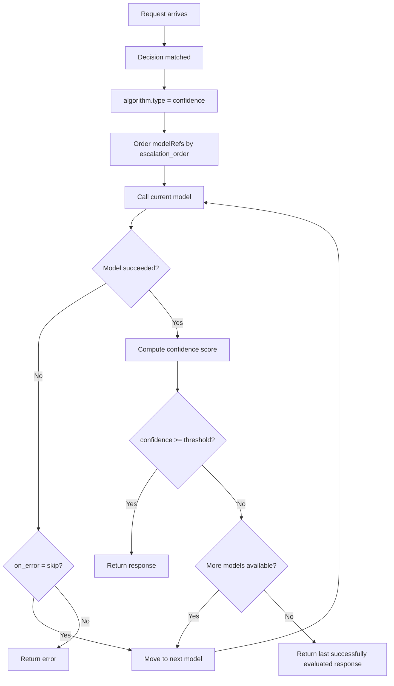

---
translation:
  source_commit: "bef43a20a96e7b329d314473083be6aa4bad0f03"
  source_file: "docs/tutorials/algorithm/looper/confidence.md"
  outdated: false
---

# 置信度

## 概览

`confidence` 按顺序尝试候选模型，当响应置信度达到配置阈值时停止。它可以先用较小或更便宜的模型，仅在结果不确定时再升级。

## 主要优势

- 支持由小到大升级，而不是固定胜者。
- 停止条件显式且可配置。
- 多种置信度评估方法：`avg_logprob`、`margin`、`hybrid`、`self_verify`、`automix_entailment`。
- 仅在需要时，用额外延迟换取更高置信度。

## 算法原理

置信度算法用 token 级 logprob 或外部验证来评估模型响应：

1. **排序候选**：应用 `escalation_order`（`size`、`small_to_large`、`declared`、`cost` 或 `automix`）。
2. **生成**：按该顺序调用当前模型。
3. **评估置信度**：
   - `avg_logprob`：所有输出 token 的平均对数概率。越高（越接近 0）表示越自信。
   - `margin`：每个 token 的 top-1 与 top-2 logprob 平均间隔。越高表示越自信。
   - `hybrid`：两种方法的加权组合。
   - `self_verify`：提示同一模型为自己的答案打分（返回 JSON `{confidence, reason}`）。
   - `automix_entailment`：按 arXiv:2310.12963 §3.2，将验证委托给外部 few-shot 蕴含服务器。置信度为 `verified_samples / total_samples`。
4. **决策**：
   - 置信度 >= 阈值 → 返回响应。
   - 置信度 < 阈值 → 升级到下一个模型。
   - 出错 → 跳过或失败（可配置）。

## 执行流程



## 解决什么问题？

部分路由应先试更便宜的候选，仅当当前答案置信度不够时再付升级成本。`confidence` 把这种“低置信度才升级”的串行策略写进路由器配置，而不是埋在应用代码里。

## 何时使用

- 路由需要在多个候选模型间逐级升级。
- 应由置信度决定是否继续到下一个模型。
- 路由应在某次响应足够好时立即停止。
- 希望先试更便宜的模型以降低成本。

## 已知限制

- 每次升级都会增加延迟（串行模型调用）。
- 置信度阈值可能需要按路由类型调优。
- 基于 logprob 的置信度不一定总与事实正确性相关。
- `hybrid` 方法需要调优 `hybrid_weights` 才能达到最佳效果。
- `automix_entailment` 需要单独运行验证服务器（见 [`automix_verifier.py`](https://github.com/vllm-project/semantic-router/blob/main/src/training/model_selection/rl_model_selection/automix_verifier.py)），并且每次模型调用都会多一次 HTTP 往返。

## 配置

```yaml
algorithm:
  type: confidence
  confidence:
    confidence_method: hybrid        # avg_logprob, margin, hybrid, self_verify, automix_entailment
    threshold: 0.72                  # Normalized escalation threshold
    escalation_order: small_to_large # size, small_to_large, declared, cost, or automix
    cost_quality_tradeoff: 0.3       # Cost vs quality balance in (0, 1]
    token_filter: tool_call_args     # all or tool_call_args
    on_error: skip                   # skip or fail
    hybrid_weights:
      logprob_weight: 0.5            # Weight for avg_logprob in hybrid
      margin_weight: 0.5             # Weight for margin in hybrid
    # Required when confidence_method = automix_entailment
    verifier_server_url: ""          # AutoMix entailment verifier HTTP URL
    verifier_timeout_seconds: 0      # 0 = default (60s)
    max_response_bytes: 0            # 0 = default (32 MiB)
```

### 参数

| 参数 | 类型 | 默认值 | 说明 |
|-----------|------|---------|-------------|
| `confidence_method` | string | `avg_logprob` | 评估方法：`avg_logprob`、`margin`、`hybrid`、`self_verify` 或 `automix_entailment` |
| `threshold` | float | 依方法而定 | 配置的非零阈值是 `(0, 1]` 内的归一化值。`0` 与省略无法区分，会选用该方法的默认值。 |
| `escalation_order` | string | `size` | 取值为 `size`、`small_to_large`、`declared`、`cost` 或 `automix`。 |
| `cost_quality_tradeoff` | float | `0.3` | 成本与质量的平衡，范围 `(0, 1]`。`0` 是未设置哨兵，因此也会选用 `0.3`。 |
| `token_filter` | string | `all` | `all` 使用全部生成 token；`tool_call_args` 在可能时排除结构性 tool-call JSON。 |
| `on_error` | string | `skip` | 模型调用失败时的行为：`skip` 或 `fail` |
| `hybrid_weights.logprob_weight` | float | `0.5` | hybrid 模式下 avg_logprob 的权重。零是未设置哨兵；两个有效权重之和必须为 `1`。 |
| `hybrid_weights.margin_weight` | float | `0.5` | hybrid 模式下 margin 的权重。零是未设置哨兵；两个有效权重之和必须为 `1`。 |
| `verifier_server_url` | string | — | 仅在 `confidence_method = automix_entailment` 时必填。必须是不含凭据、查询或片段的绝对 HTTP(S) URL（见 [`automix_verifier.py`](https://github.com/vllm-project/semantic-router/blob/main/src/training/model_selection/rl_model_selection/automix_verifier.py)）。 |
| `verifier_timeout_seconds` | int | `60` | `automix_entailment` 的正数 HTTP 超时；`0` 是未设置哨兵，选用 60 秒。 |
| `max_response_bytes` | int | `33554432` | AutoMix 验证器响应的最大字节数。 |

省略 `threshold`（或显式设为 `0`）时，各方法的默认值是：`avg_logprob` 为 `-1`（宽松的“已有证据即通过”默认值），`margin` 和 `hybrid` 为 `0.5`，`self_verify` 和 `automix_entailment` 为 `0.7`。显式配置的阈值始终归一化到 `(0, 1]`；负阈值会被拒绝。

### `self_verify` 与 `automix_entailment`

两者都实现 AutoMix 论文的级联思路，但验证信号的产生方式不同：

| 方面 | `self_verify` | `automix_entailment` |
|---|---|---|
| 验证器 | 同一个生成模型 | 独立 HTTP 服务器上的单独 few-shot 蕴含模型 |
| 每次请求成本 | 对生成模型多一次提示 | 1 次 HTTP 往返；验证器内 `k` 次采样补全 |
| 对 arXiv:2310.12963 的忠实度 | 宽松（提示打分的 JSON） | 严格（论文 §3.2 蕴含） |
| 额外基础设施 | 无 | 需要运行 [`automix_verifier.py`](https://github.com/vllm-project/semantic-router/blob/main/src/training/model_selection/rl_model_selection/automix_verifier.py) |
| 何时选择 | 单部署环境；无需额外服务器 | 生产路由，且验证模型可以更小或更专项 |

## 尝试可观测性

置信度执行会创建一个 `looper.execute` 追踪 span，并为每次派发的候选或验证器调用创建一个 `looper.attempt` 子 span。路由回放在 `route_diagnostics.looper` 下存储对应的有界、不含内容的尝试记录，包括状态、阈值结果、token 用量、延迟、最终尝试序号，以及每次尝试的有效补全 token 上限。提示词、响应、推理、端点 URL、凭据和原始错误从不写入该结构。

当候选应使用不同补全上限时，设置 `routing.decisions[].modelRefs[].max_completion_tokens`。Provider 派发会把该可选 ModelRef 上限与客户端请求、`request_params.max_tokens_limit`、任何算法/阶段上限以及自动渲染后的剩余容量按最严格值合成。Confidence 没有单独的 token 或推理改写路径；每个内部 hop 复用共享派发缝，并在该次尝试上记录自己的有效上限。

首个详细尝试实现覆盖 Confidence。其他 Looper 算法在采用共享尝试生命周期之前，仍暴露现有的聚合诊断。

每次升级都会把请求和累计答案上下文发送给下一个候选模型。请确保路由的数据策略允许每个候选，并为最坏情况下的链路限制延迟和成本。完整示例见：
[`config/fragments/algorithm/looper/confidence.yaml`](https://github.com/vllm-project/semantic-router/blob/main/config/fragments/algorithm/looper/confidence.yaml)。
