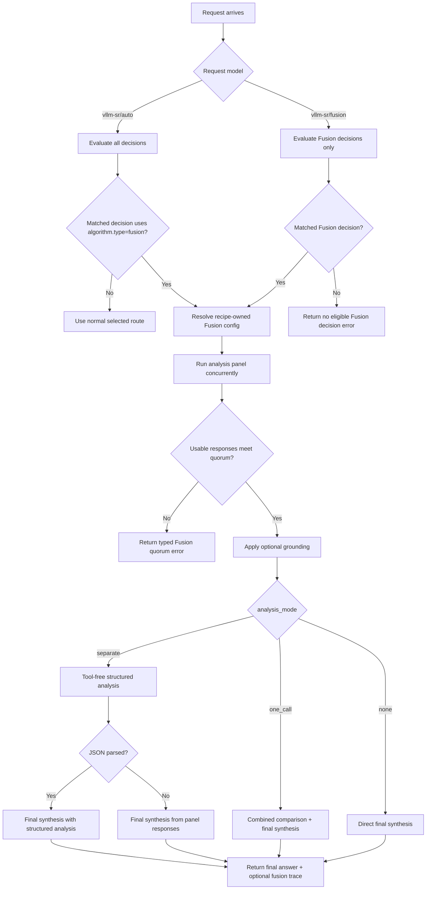

---
translation:
  source_commit: "f538b1e52efaa172923a6764c8ad9ab18e0188af"
  source_file: "docs/tutorials/algorithm/looper/fusion.md"
  outdated: true
---

# 融合

## 概览

`fusion` 让多个模型回答同一请求，再由裁判模型合成一个最终答案。配方拥有的 `analysis_mode` 决定裁判是使用单独的结构化分析调用、在一次调用中同时完成分析与合成，还是直接合成。兼容性默认值是 `separate`。

同一运行时也支持通过 `global.integrations.looper.fusion.model_names` 使用直接 Fusion 模型 slug。内置默认值是 `vllm-sr/fusion`；仅在你有意需要 OpenRouter 兼容别名时，才把 `openrouter/fusion` 加进去。直接 Fusion 仍由信号驱动：vLLM-SR 用可执行 Fusion 的决策评估请求，然后执行匹配决策的裁判与面板策略。

## 主要优势

- 并发运行分析模型，而不是只选一个模型。
- 支持显式的 `separate`、`one_call` 和 `none` 裁判执行模式。
- 将 Fusion 策略保留在 vLLM-SR 决策内：`vllm-sr/auto` 可以选择任意路由，而 `vllm-sr/fusion` 只在 Fusion 路由中智能选择。
- 将裁判、面板、预算、提示词、追踪、回退和依据策略都放在配方所有权下。
- 仅当剩余可用响应仍满足法定人数时，才在部分面板失败后继续，同时保留失败模型的元数据。

## 算法原理

Fusion 始终先执行面板，再遵循决策显式的分析模式：

| 模式 | 面板之后的裁判阶段 | 裁判调用次数 |
|------|------------------------------|-------------|
| `separate` | 无工具的结构化 JSON 分析，然后是可使用工具的最终合成 | 2 |
| `one_call` | 一次可使用工具的调用：比较面板、解决矛盾并返回最终答案 | 1 |
| `none` | 一次可使用工具的调用：直接从面板合成，不要求单独的分析产物 | 1 |

`include_analysis` 只控制是否把可用的结构化分析写入 Fusion 追踪。它从不选择模式，也不改变模型调用次数。

面板响应只有在裁剪空白后，其助手 `content` 或 `reasoning_content` 非空时才可用。Fusion 在依据处理、裁判分析或最终合成之前，用这些可用响应检查 `min_successful_responses`。`on_error: skip` 会跳过单个失败或不可用的响应；它不允许在低于法定人数时合成。

启用路由回放时，低于法定人数的失败会把面板 token 用量的聚合写入回放记录，并在 `route_diagnostics.fusion_quorum` 下存储要求数量、可用数量，以及按顺序的每次尝试模型、状态和上报 token 用量。这些诊断不存储面板答案内容、推理、提示数据、原始响应体或错误文本。

## 执行流程



## 解决什么问题？

有些提示词更适合多次独立尝试再加一次裁判，而不是单次路由决策。`fusion` 把这种编排放在 Router 策略里，因此客户端可以通过同一个 chat completions 端点使用它。与固定的提供商侧 Fusion 端点不同，`vllm-sr/fusion` 会先用 vLLM-SR 信号和决策优先级，为请求选出正确的 Fusion 路由。

## 何时使用

- 希望由一组模型检查同一提示词。
- 矛盾或盲点比最低延迟更重要。
- 路由应返回一个最终答案，同时保留面板证据供调试。

## 已知限制

- Fusion 每次请求会消耗多次模型调用。
- 流式输出在面板和裁判阶段完成后才发出。
- 当前 Fusion 路径不包含 OpenRouter 网页搜索或抓取。
- 最终质量取决于配置的裁判/调用模型。

## 配置

决策级 Fusion：

```yaml
routing:
  decisions:
    - name: deliberation
      description: Compare candidate answers and synthesize one response.
      priority: 100
      output_contract: Preserve any explicit output format exactly.
      modelRefs:
        - model: qwen3-32b
        - model: deepseek-worker
      algorithm:
        type: fusion
        fusion:
          model: qwen3-32b
          analysis_models:
            - qwen3-32b
            - deepseek-worker
          analysis_mode: separate
          analysis_overrides:
            - model: qwen3-32b
              temperature: 0.15
              max_completion_tokens: 512
            - model: deepseek-worker
              temperature: 0.2
              max_completion_tokens: 384
```

`output_contract` 是决策范围的提示词文本。把它用于应同时作用于 Fusion、Flow 和 ReMoM 的基准或应用格式要求，而不是把任务特定提示词硬编码进算法。
使用 `output_contract_spec` 做类型化的路由器可执行归一化和后处理，例如 choice 提取、终端动作 JSON 归一化或引用解引用。提取默认精确匹配 `content`；仅当决策明确允许更宽的解析器时，才使用 `extract.sources` 或 `extract.mode: json_object`。

最小算法配置：

```yaml
algorithm:
  type: fusion
  fusion:
    model: qwen3-32b
    analysis_models:
      - qwen3-8b
      - qwen3-32b
    analysis_mode: separate
    analysis_overrides:
      - model: qwen3-8b
        temperature: 0.2
        max_completion_tokens: 384
      - model: qwen3-32b
        temperature: 0.15
        max_completion_tokens: 512
    max_concurrent: 2
    max_completion_tokens: 512
    round_timeout_seconds: 90
    min_successful_responses: 1
    temperature: 0.2
    include_analysis: true
    include_intermediate_responses: true
    on_error: skip
    judge_prompt_version: fusion-v1
```

自动路由别名：

```yaml
global:
  router:
    auto_model_names:
      - vllm-sr/auto
      - auto
      - MoM
```

`vllm-sr/auto` 评估所有决策。如果匹配的决策使用 `algorithm.type=fusion`，请求进入 Fusion；否则走匹配的非 Fusion 路由。

直接 Fusion slug 注册：

```yaml
global:
  integrations:
    looper:
      endpoint: http://localhost:8899/v1/chat/completions
      max_response_bytes_mb: 32 # optional; caps a single upstream response body (default 32 MiB)
      fusion:
        model_names:
          - vllm-sr/fusion
```

`global.integrations.looper.fusion` 只注册直接请求模型名。它不拥有路由策略、默认路由、裁判选择、面板选择、并发、模板或错误处理。

裁判模型、分析面板、分析模式、采样设置、并发、token 与时间预算、法定人数、模板、提示词版本、追踪可见性、错误策略和依据策略都属于
`routing.decisions[].algorithm.fusion`。直接 slug 调用只评估可执行 Fusion 的决策，因此 `vllm-sr/fusion` 不会静默回退到普通单模型路由。公开 HTTP 路径执行所选配方策略，不会通过
`plugins[].id = fusion` 暴露 Fusion 执行覆盖。

若要暴露 OpenRouter 兼容别名，请显式选择加入：

```yaml
global:
  integrations:
    looper:
      fusion:
        model_names:
          - vllm-sr/fusion
          - openrouter/fusion
```

### 参数

| 参数 | 类型 | 默认值 | 说明 |
|-----------|------|---------|-------------|
| `model_names` | list[string] | `["vllm-sr/fusion"]` | 触发 Fusion 决策匹配的直接请求模型 slug |
| `model` | string | 第一个分析模型 | 配方拥有的裁判/调用模型，用于分析和最终合成 |
| `analysis_models` | list[string] | `modelRefs` | 配方拥有的并行分析面板模型 |
| `analysis_mode` | string | `separate` | 配方拥有的裁判执行：`separate`、`one_call` 或 `none` |
| `minimum_candidates` | int | 未设置 | 配方物化和上下文资格过滤后，决策 `modelRefs` 所需的最少不同模型数 |
| `analysis_overrides` | list[object] | 无 | 配方拥有的按面板模型 `temperature` 和 `max_completion_tokens`，以 `model` 为键 |
| `max_concurrent` | int | 面板大小 | 配方拥有的最大并发面板调用数 |
| `max_completion_tokens` | int | 请求默认值 | 配方拥有的、应用到 Fusion 子请求的最大补全 token 数 |
| `round_timeout_seconds` | int | 等待全部 | 配方拥有的面板轮次超时（秒） |
| `min_successful_responses` | int | 面板大小 | 配方拥有的法定人数：裁剪空白后助手内容或推理非空的响应数 |
| `temperature` | float | 请求默认值 | 配方拥有的、应用到 Fusion 子请求的温度 |
| `include_analysis` | bool | `true` | 配方拥有的、对可用结构化裁判分析的可见性；这不控制执行 |
| `include_intermediate_responses` | bool | `true` | 配方拥有的、对原始面板响应的可见性 |
| `on_error` | string | `skip` | 配方拥有的处理：在强制法定人数的同时 `skip` 单个失败或不可用的面板响应，或在第一个此类响应上 `fail` |
| `analysis_template` | string | 内置 | 配方拥有的单独分析提示，含 `{{original}}` 和 `{{responses}}`；在 `separate` 之外会被拒绝 |
| `synthesis_template` | string | 内置 | 配方拥有的各模式终端提示，含 `{{original}}`、`{{responses}}` 和 `{{analysis}}`；在 `separate` 之外分析为空 |
| `judge_prompt_version` | string | `fusion-v1` | 配方拥有的版本标记，会写入 Fusion 响应追踪 |
| `grounding` | object | 禁用 | 配方拥有的可选依据感知合成（见下文） |

最佳实践：

- 在匹配预算评估支持有意选择加入少调用模式之前，保持 `analysis_mode: separate`。
- 让每个决策的 `analysis_models` 保持稳定，并用决策的 `analysis_overrides` 做模型特定调优。
- 把所有 Fusion 执行策略和追踪可见性变更放在配方中。
- 让 `min_successful_responses` 不超过有效面板大小。无效法定人数会被拒绝；Router 不会自动降低它们。
- 仅当可用响应仍满足 `min_successful_responses` 时，部分面板才会继续；否则 Fusion 返回错误，且不运行依据处理或任一裁判调用。

## 模式契约

内置提示词和阶段边界是刻意区分的：

- `separate` 要求紧凑的结构化 JSON，且不使用工具。分析传输失败会被记录，最终合成仍从面板继续。当启用 `include_analysis` 时，解析失败可以作为原始 `parse_failed` 追踪证据出现。最终合成仍是终端的，并可以使用请求工具。
- `one_call` 不产生结构化分析产物。它的单个终端提示要求裁判比较面板、解决矛盾，并在一次调用中合成客户端答案。失败是终端的。
- `none` 不产生结构化分析产物。它的单个终端提示要求裁判直接从面板合成，不要求单独或合并的分析。失败是终端的。

对每种模式，`synthesis_template` 都会替换完整的内置终端提示。在 `one_call` 和 `none` 中，`{{analysis}}` 渲染为空字符串。配置校验会拒绝这些模式下的非空 `analysis_template`，而不是静默忽略。

Fusion 用量会聚合完整面板成本和每次成功的裁判响应。上报的迭代次数是配置的面板尝试次数，加上 `separate` 的两次裁判调用，或加上 `one_call` 和 `none` 的一次裁判调用。

有效的 `analysis_mode` 记录在 Fusion 内部追踪中，由 `looper.Response.IntermediateResponses` 携带。仅有模式值并不会在公开响应中增加顶层 `fusion` 成员。公开追踪信封保持现有谓词：仅当启用了分析或中间响应、某个面板模型失败，或存在依据证据时才发出。公开模式追踪传输仍推迟到
[issue #3378](https://github.com/vllm-project/semantic-router/issues/3378)。

## 依据感知合成

默认情况下，裁判阅读原始面板文本，没有依据预言机。依据感知合成在裁判运行**之前**为每个面板响应打 **faithfulness** 分数，然后用这些分数引导合成偏向依据更好的响应。它**不额外调用 LLM** — 它使用本地编码器模型（幻觉/依据检测器和 NLI 蕴含模型）。

参考选择（每个答案对照什么打分）：

- `context` — 通过检测器对照提供的 RAG/工具上下文给答案打分（最强，但仅当请求携带系统/工具消息等上下文时）。
- `panel` — 通过跨模型 NLI 让答案互相打分；面板作为自身的相互参考（无外部依赖，适用于任意查询）。
- `hybrid`（默认） — 请求携带上下文时使用 `context`，否则使用 `panel`。

策略（如何使用这些分数）：

- `weight`（默认） — 保留每个响应，并指示裁判按分数加权各面板答案，同时显式保护正确的单独异议者。
- `annotate` — 保留每个响应，并把分数作为备注传给裁判，不带加权指令。
- `filter` — 硬丢弃分数低于 `min_score` 的响应（始终保留 `min_keep`）；只有该策略使用 `min_score`/`min_keep`。

可用响应法定人数在依据处理之前，对原始面板检查。
如果 `filter` 策略随后移除了响应，Fusion 不会对缩减后的裁判输入再做第二次法定人数检查。

> 依据衡量的是忠实度/一致性，不是真值。在没有权威来源时，它可以下调支持最少的响应权重，但不能证明正确性。**硬丢弃**相互一致性最低的响应（`filter` 策略）在有争议的事实问题上会明显*损害*效果 — 三个模型可能一起自信地出错，而单独异议者是对的 — 因此默认是 `weight`。该默认背后的评测见 `bench/grounded_fusion/FINDINGS.md`。

需要在 `global` 幻觉缓解下配置幻觉检测器（以及 `panel`/跨模型路径所需的 NLI 模型）。如果后端不可用，`on_error: skip` 会回退到普通 Fusion。

```yaml
algorithm:
  type: fusion
  fusion:
    model: qwen3-32b
    analysis_models: [qwen3-8b, qwen3-32b]
    grounding:
      enabled: true
      reference: hybrid          # hybrid | context | panel
      policy: weight             # weight | annotate | filter
      min_score: 0.0             # filter policy only: drop below this (0-1)
      min_keep: 1                # filter policy only: keep at least this many
      nli_contradiction_penalty: 1.0
      on_error: skip             # skip (fall back to plain fusion) | fail
```

启用后，Fusion 响应的 `trace.grounding` 会记录参考模式、`policy`，以及每个响应的 `score`、`flagged_spans` 和是否被 `dropped`（仅在 `filter` 策略下）。

### 依据参数

| 参数 | 类型 | 默认值 | 说明 |
|-----------|------|---------|-------------|
| `enabled` | bool | `false` | 启用依据感知合成 |
| `reference` | string | `hybrid` | `hybrid`、`context` 或 `panel` |
| `policy` | string | `weight` | `weight`（软加权，全部保留）、`annotate`（备注，全部保留）或 `filter`（硬丢弃） |
| `min_score` | float | `0.0` | 仅 `filter` 策略：丢弃分数低于该值的响应（0–1） |
| `min_keep` | int | `1` | 仅 `filter` 策略：至少保留这么多最高分响应 |
| `nli_contradiction_penalty` | float | `1.0` | `panel` 参考中同伴矛盾的权重 |
| `on_error` | string | `skip` | `skip`（回退到普通 Fusion）或 `fail` |

面板响应和原始请求会发送给裁判模型。把所有面板和裁判提供商视为同一数据边界，并在中间追踪会暴露敏感内容时将其关闭。完整示例见：
[`config/fragments/algorithm/looper/fusion.yaml`](https://github.com/vllm-project/semantic-router/blob/main/config/fragments/algorithm/looper/fusion.yaml)。
