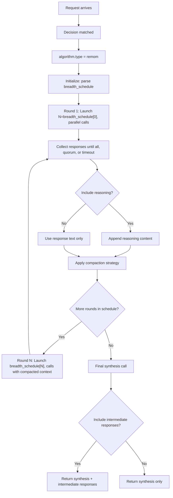

---
translation:
  source_commit: "7c874be29871f6d00b36b2e21b3e549e846b98c5"
  source_file: "docs/tutorials/algorithm/looper/remom.md"
  outdated: true
---

# ReMoM 推理编排

## 概览

`remom` 在有界轮次中运行多个候选模型，并将它们的响应合成一个答案。

运行时也支持通过 `global.integrations.looper.remom.model_names` 使用直接 ReMoM 模型 slug。内置默认值是 `vllm-sr/remom`。直接 ReMoM 调用只评估 `algorithm.type=remom` 的决策，这与直接 Fusion 和 Flow 模型表面一致。

**灵感来源**：[PaCoRe](https://arxiv.org/abs/2601.05593) — 扩展为支持模型混合。

## 主要优势

- 多轮并行推理，带宽调度可配置。
- 从多个模型响应中智能合成。
- 模型分配策略：`weighted`、`equal`、`round_robin` 或 `first_only`。
- 用压缩策略管理跨轮 token 预算。
- 可选的法定人数和轮次超时控制，避免等待提供商长尾。
- 可自定义合成模板。

## 算法原理

ReMoM 编排多轮并行模型调用：

1. **第 1 轮**：按 `breadth_schedule[0]` 在候选模型上发起并行调用。
2. **压缩**：可选地压缩中间响应（full 或 last_n_tokens）。
3. **第 2 轮**：按 `breadth_schedule[1]` 发起调用，并把压缩后的响应作为上下文。
4. **最终合成**：最后一次调用将所有中间结果合成连贯答案。

ReMoM 后端子请求是非流式的，以便每轮收到完整输出。仅在最终合成之后，才向流式客户端发出响应。

带宽调度控制每轮调用次数。例如 `[32, 4]` 表示第 1 轮 32 次调用、第 2 轮 4 次调用，然后是 1 次最终合成调用。

## 执行流程



## 模型分配策略

| 策略 | 说明 |
|----------|-------------|
| `weighted` | 按 `modelRefs` 中的模型权重按比例分配调用 |
| `equal` | 在所有候选模型间均分调用 |
| `round_robin` | 按配置顺序轮询候选模型 |
| `first_only` | 全部调用发给第一个声明的模型 |

## 解决什么问题？

有些任务更适合并行探索再合成，而不是一次性选出单个模型。`remom` 为路由器提供一种受带宽控制的方式，探索多条推理路径并合并成一个最终答案。

## 何时使用

- 一条路由应在多轮中协调多个模型。
- 需要可配置的带宽调度，而不是一步升级。
- 中间响应应显式包含或排除。
- 多轮推理再合成比单次调用效果更好。

## 已知限制

- token 消耗高：每轮都会生成多个响应。
- 合成质量取决于合成模板和模型能力。
- 轮次串行执行，延迟更长。
- 需要仔细调优 breadth_schedule，以平衡质量与成本。

## 配置

注册直接模型 slug：

```yaml
global:
  integrations:
    looper:
      endpoint: http://localhost:8899/v1/chat/completions
      max_response_bytes_mb: 32 # optional; caps a single upstream response body (default 32 MiB)
      remom:
        model_names:
          - vllm-sr/remom
```

配置一条 ReMoM 决策：

```yaml
routing:
  decisions:
    - name: reasoning_panel
      description: Combine a bounded reasoning panel into one answer.
      priority: 100
      output_contract: Preserve any explicit output format exactly.
      output_contract_spec:
        type: reference_selection
        reference:
          source: candidate_responses
          id_format: index
        extract:
          mode: exact
          sources: [content]
        postprocess:
          - type: dereference_selected_reference
      modelRefs:
        - model: qwen3-32b
        - model: deepseek-worker
      algorithm:
        type: remom
        remom:
          breadth_schedule: [3, 2]
          model_distribution: weighted
```

`output_contract` 是决策范围的提示词文本。把它用于应同时作用于 ReMoM、Fusion 和 Flow 的基准或应用格式要求，而不是把任务特定提示词硬编码进算法。`output_contract_spec` 是路由器可执行的类型化契约，用于后处理与归一化；把运行时行为放在这里，而不是编码成提示词启发式。提取默认精确匹配 `content`；仅当决策明确允许更宽的解析器时，才使用 `extract.sources` 或 `extract.mode: json_object`。

最小算法配置：

```yaml
algorithm:
  type: remom
  remom:
    breadth_schedule: [3, 2]            # Parallel calls before final synthesis
    model_distribution: weighted         # weighted, equal, round_robin, or first_only
    temperature: 0.7                     # Temperature for model calls
    include_reasoning: false             # Include reasoning in synthesis
    compaction_strategy: full            # full or last_n_tokens
    compaction_tokens: 1000              # Tokens to keep for last_n_tokens
    synthesis_template: ""               # Custom synthesis template (optional)
    max_concurrent: 3                    # Max concurrent calls per round
    max_completion_tokens: 1024          # Completion limit for each subrequest
    round_timeout_seconds: 120           # Optional round-level wait cap
    min_successful_responses: 2          # Optional early-success quorum
    shuffle_seed: 42                     # Seed for response shuffling
    include_intermediate_responses: false # Include intermediate responses in output
    max_responses_per_round: null        # Limit responses per round
    on_error: skip                       # skip or fail
```

### 参数

| 参数 | 类型 | 默认值 | 说明 |
|-----------|------|---------|-------------|
| `breadth_schedule` | list[int] | **必填** | 最终合成调用之前的并行调用次数（例如 `[3, 2]`） |
| `model_distribution` | string | `weighted` | 策略：`weighted`、`equal`、`round_robin`、`first_only` |
| `temperature` | float | `1.0` | 模型调用的温度 |
| `include_reasoning` | bool | `false` | 在合成提示中包含推理内容 |
| `compaction_strategy` | string | `full` | 策略：`full` 或 `last_n_tokens` |
| `compaction_tokens` | int | `1000` | `last_n_tokens` 压缩时保留的 token 数 |
| `synthesis_template` | string | — | 自定义合成提示模板 |
| `max_concurrent` | int | — | 每轮最大并发模型调用数 |
| `max_completion_tokens` | int | 请求默认值 | 应用到每个 ReMoM 子请求的最大补全 token 数 |
| `round_timeout_seconds` | int | — | 在 `on_error: skip` 时，一轮最多等待的秒数，超时后使用部分响应 |
| `min_successful_responses` | int | — | 并行轮次在达到该成功响应数后即可返回 |
| `shuffle_seed` | int | `42` | 响应打乱的随机种子 |
| `include_intermediate_responses` | bool | `true` | 在输出中包含中间响应 |
| `max_responses_per_round` | int | — | 每轮最多保留的响应数 |
| `on_error` | string | `skip` | 失败时的行为：`skip` 或 `fail` |

每轮会与分配到的模型共享请求派生文本和中间文本，合成模型会收到收集到的结果。投产前请限制带宽、补全 token、并发和超时。完整示例见：
[`config/fragments/algorithm/looper/remom.yaml`](https://github.com/vllm-project/semantic-router/blob/main/config/fragments/algorithm/looper/remom.yaml)。
