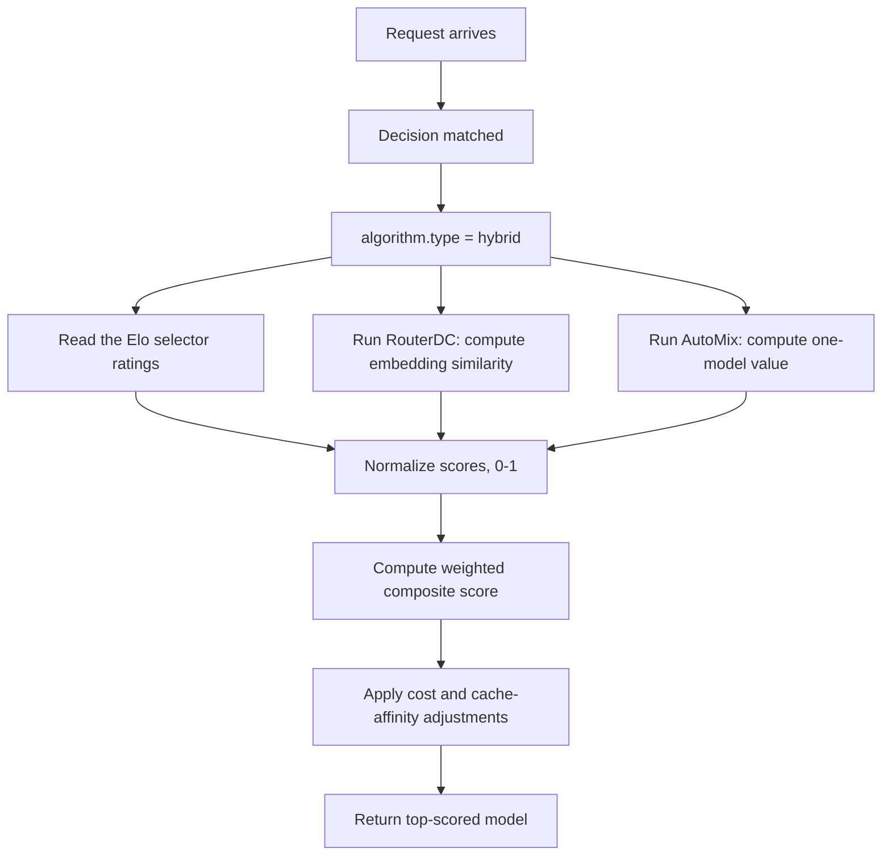

---
translation:
  source_commit: "7c874be29871f6d00b36b2e21b3e549e846b98c5"
  source_file: "docs/tutorials/algorithm/selection/hybrid.md"
  outdated: false
---

# 混合选择

## 概览

`hybrid` 将 Elo 评分、Router-DC 描述相似度、AutoMix 的单模型价值估计和成本，组合成一个加权候选分数。

**论文**：[Hybrid LLM: Cost-Efficient Quality-Aware Query Routing](https://arxiv.org/abs/2404.14618)

## 主要优势

- 混合多个选择器，而不是只承诺其中一个。
- 权重显式，易于审计。
- 可以通过改变权重，逐步引入某个组件。
- 成本感知打分，平衡质量与运维开销。

## 算法原理

当启用 `normalize_scores` 时，Hybrid 先对可用的 Elo、Router-DC 和 AutoMix 分数做 min-max 归一化。它用相对权重组合这些组件，并在返回了数据的组件上重新归一化。启用成本调整时，再对更便宜的模型施加乘法加成。因此成本是第二阶段调整，而不是组件平均中的另一个线性项。

## 选择流程



## 组件选择器

Hybrid 选择器在内部实例化三个子选择器：

| 组件 | 来源 | 提供什么 |
|-----------|--------|-----------------|
| `EloSelector` | 自己的内存评分 | 相对模型评分 |
| `RouterDCSelector` | 模型描述 | 语义查询-模型相似度 |
| `AutoMixSelector` | 单次请求路径 | 成本-质量价值估计 |

每个组件共享同一个 `SelectionContext`，并独立运行。

## 解决什么问题？

没有任何单一排序信号对每种工作负载都可靠：纯成本、纯相似度或纯反馈都会漏掉路由图景的一部分。`hybrid` 把多个选择器组合成一个可审计分数，让路由能平衡语义契合、历史质量和运维成本。

## 何时使用

- 一条路由应组合多个排序信号。
- 希望在较旧和较新的选择器之间做加权过渡。
- 没有单个选择器能覆盖全部相关信息。
- 最终选择应同时反映质量和运维成本。

## 已知限制

- 计算成本高于任一单个选择器（每次请求运行 3 个子选择器）。
- 权重调优需要领域知识 — 次优权重会降低性能。

## 配置

```yaml
algorithm:
  type: hybrid
  hybrid:
    experience_weight: 0.3       # Elo component weight
    router_dc_weight: 0.3        # Weight for embedding similarity
    automix_weight: 0.2          # Weight for AutoMix's one-model value
    cost_weight: 0.2             # Weight for cost consideration
    normalize_scores: true       # Normalize component scores to [0,1]
```

### 参数

| 参数 | 类型 | 默认值 | 说明 |
|-----------|------|---------|-------------|
| `experience_weight` | float | `0.3` | Elo 选择器分数的权重（0–1） |
| `router_dc_weight` | float | `0.3` | RouterDC 嵌入相似度的权重（0–1） |
| `automix_weight` | float | `0.2` | AutoMix 单模型价值估计的权重（0–1） |
| `cost_weight` | float | `0.2` | 成本考量的权重（0–1） |
| `quality_gap_threshold` | float | `0.1` | 为兼容性而接受；在当前在线选择器中没有效果 |
| `normalize_scores` | bool | `true` | 组合前归一化组件分数 |

## 反馈

Hybrid 不读取路由学习快照或 `global.router.learning.adaptation`。它的 Elo、Router-DC 和 AutoMix 组件各自拥有独立的内存状态，当前路由学习 outcome 端点不会自动喂给该状态。

请求文本会为 Router-DC 和 AutoMix 组件做嵌入。缺少模型描述、定价或已初始化的组件状态，会让对应组件信息量下降，因此请按实际可用数据调优权重。完整示例见
[`config/fragments/algorithm/selection/hybrid.yaml`](https://github.com/vllm-project/semantic-router/blob/main/config/fragments/algorithm/selection/hybrid.yaml)。
