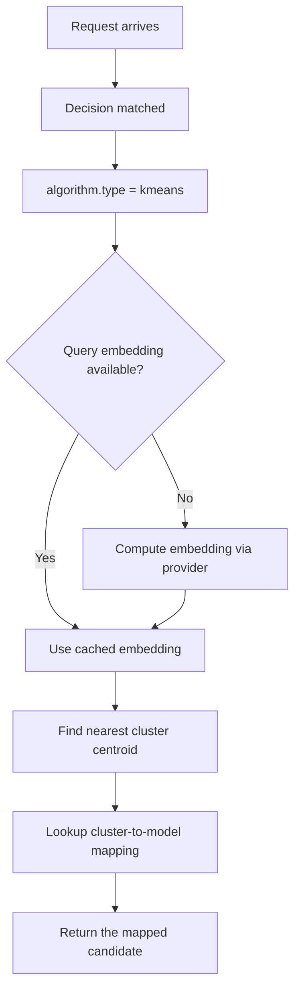

---
translation:
  source_commit: "7c874be29871f6d00b36b2e21b3e549e846b98c5"
  source_file: "docs/tutorials/algorithm/selection/kmeans.md"
  outdated: false
---

# K-means 聚类选择

## 概览

`kmeans` 把请求发送给其最近已学习簇所分配的模型。

**实现**：通过 [Linfa](https://github.com/rust-ml/linfa)（`linfa-clustering`）用 Rust 实现。

## 主要优势

- 高效推理：每次查询 O(k×d)（k = 簇数，d = 嵌入维度）。
- 将查询模式自然分组到簇中。
- 当提示词流量自然落入重复类别时效果好。
- 请求时路径是直接质心查找，没有在线学习。

## 算法原理

1. **训练**：K-Means 用 Lloyd 算法把训练查询划分到 `num_clusters` 个簇。
2. **簇-模型分配**：根据历史结果质量，把每个簇映射到表现最好的模型。
3. **推理**：新查询被嵌入并分配到最近的簇质心。选择该簇映射的模型。

$$m^* = \arg\min_{c} \| \text{embed}(q) - \mu_c \|^2 \implies \text{model}(c^*)$$

## 选择流程



## 解决什么问题？

有些提示词流量自然落入重复区域，同一模型往往胜出，但按请求做已学习排序会是不必要的开销。`kmeans` 把这些重复区域变成簇到模型的分配，以实现快速、稳定的路由。

## 何时使用

- 提示词流量自然分组到可重复类别（例如数学、编码、创意写作）。
- 你有基于簇的候选模型选择器。
- 需要每次请求高效的 O(k×d) 推理。
- 按质量加权的簇分配已足够（相对于非线性 MLP 边界）。

## 已知限制

- 需要预训练：簇必须从历史数据中学习。
- 簇数量固定 — 太少会丢失粒度，太多会过拟合。
- 不重新训练就无法适应新的查询模式。
- 基于质心的分配会忽略簇的形状/大小。

## 配置

```yaml
algorithm:
  type: kmeans
```

### 全局 ML 设置

```yaml
global:
  router:
    model_selection:
      ml:
        models_path: ".cache/ml-models"
        embedding_dim: 768
        kmeans:
          num_clusters: 8
          efficiency_weight: 0.0
          pretrained_path: .cache/ml-models/kmeans_model.json
```

### 参数

| 参数 | 类型 | 默认值 | 说明 |
|-----------|------|---------|-------------|
| `num_clusters` | int | `8` | K-Means 簇数量 |
| `efficiency_weight` | float | `0.0` | 选择器配置和产物中保留的兼容字段；当前请求时选择器不读取它 |
| `pretrained_path` | string | — | 预训练 KMeans 模型路径（JSON 格式） |

## 训练

训练流水线见 [ML Model Selection README](https://github.com/vllm-project/semantic-router/blob/main/src/semantic-router/pkg/modelselection/README.md)。KMeans 模型用 Lloyd 算法在历史查询嵌入上训练。

历史提示词和结果标签可能包含敏感数据；在生成选择器产物之前，请最小化并治理训练集。完整示例见：
[`config/fragments/algorithm/selection/kmeans.yaml`](https://github.com/vllm-project/semantic-router/blob/main/config/fragments/algorithm/selection/kmeans.yaml)。
