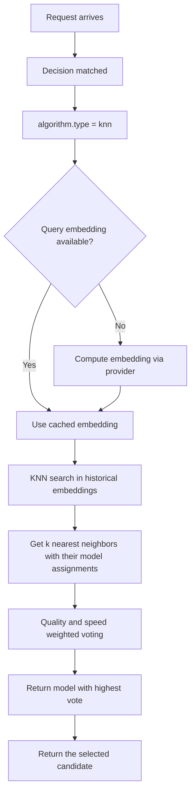

---
translation:
  source_commit: "7c874be29871f6d00b36b2e21b3e549e846b98c5"
  source_file: "docs/tutorials/algorithm/selection/knn.md"
  outdated: false
---

# K 近邻选择

## 概览

`knn` 从在最相似的已记录请求上表现良好的模型中，选择一个候选。

**实现**：通过 [Linfa](https://github.com/rust-ml/linfa)（`linfa-nn`）用 Rust 实现高性能最近邻搜索。

## 主要优势

- 可解释：路由决策可以追溯到相似的历史示例。
- 没有在线训练步骤；Router 加载由历史示例构建的产物。
- 当相似提示词应选择相似模型时效果好。
- 投票把每个邻居权重的 90% 给结果质量，10% 给相对速度。

## 算法原理

1. **嵌入**：每个查询被嵌入成稠密向量。
2. **搜索**：在历史查询嵌入空间中找到 k 个最近邻。
3. **投票**：每个邻居为当时使用的模型投票。距离决定哪些示例进入邻居集；它不改变它们的投票权重。投票把记录的质量与产物内归一化的延迟结合起来。
4. **选择**：加权投票最高的模型被选中。

$$\text{score}(m) = \sum_{i \in \text{KNN}(q)} w_i \cdot \mathbb{1}[m_i = m]$$

其中 $w_i = 0.9 \cdot \text{quality}_i + 0.1 \cdot
\text{speed\_factor}_i$。记录中最快延迟的速度因子为 `1`；最慢为 `0`。

## 选择流程



## 解决什么问题？

当路由应遵循相似历史提示词的先例时，手写规则或固定优先级会丢失有用的局部上下文。`knn` 按最近示例及其观测结果选择模型，从而解决这个问题。

## 何时使用

- 你有历史提示词到模型的分配数据。
- 相似提示词通常应映射到同一候选模型。
- 路由应使用检索式选择，而不是固定排序。
- 你需要可解释的路由决策。

## 已知限制

- 每次选择都会从已加载示例重建 BallTree，因此更大的产物会增加搜索和分配成本。
- 性能取决于嵌入质量 — 差的嵌入会导致差的匹配。
- 无法捕获复杂非线性模式（不像 MLP 或带非线性核的 SVM）。
- 需要为所有历史查询预先计算嵌入。

## 配置

```yaml
algorithm:
  type: knn
```

### 全局 ML 设置

```yaml
global:
  router:
    model_selection:
      ml:
        models_path: ".cache/ml-models"
        embedding_dim: 768
        knn:
          k: 5
          pretrained_path: .cache/ml-models/knn_model.json
```

### 参数

| 参数 | 类型 | 默认值 | 说明 |
|-----------|------|---------|-------------|
| `k` | int | `5` | 考虑的最近邻数量 |
| `pretrained_path` | string | — | 预训练 KNN 模型路径（JSON 格式） |

## 训练

训练流水线见 [ML Model Selection README](https://github.com/vllm-project/semantic-router/blob/main/src/semantic-router/pkg/modelselection/README.md)。KNN 产物由查询嵌入、模型分配、结果质量和延迟构建，然后序列化为 JSON。

KNN 产物保留从历史提示词和结果派生的信息。请对其应用与源评测数据相同的访问和保留策略。完整示例见：
[`config/fragments/algorithm/selection/knn.yaml`](https://github.com/vllm-project/semantic-router/blob/main/config/fragments/algorithm/selection/knn.yaml)。
