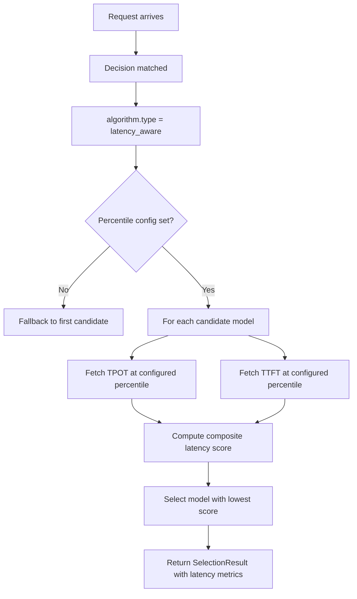

---
translation:
  source_commit: "7c874be29871f6d00b36b2e21b3e549e846b98c5"
  source_file: "docs/tutorials/algorithm/selection/latency-aware.md"
  outdated: false
---

# 延迟感知选择

## 概览

`latency_aware` 用观测到的 TTFT 和 TPOT 百分位对合格候选排序，并选择相对延迟分数最低的那个。

## 主要优势

- 用对该路由重要的延迟百分位比较候选。
- 平衡 **TPOT**（Time Per Output Token）和 **TTFT**（Time To First Token）。
- 没有需要管理的模型状态 — 完全由运行时指标驱动。
- 适合响应性比绝对质量更重要的路由。

## 算法原理

延迟感知选择使用从运行时指标收集的**基于百分位的延迟统计**，为每个候选模型打分：

1. **指标查找**：对每个候选模型，从指标存储中按配置百分位获取 TPOT 和 TTFT 值。
2. **打分**：计算综合延迟分数。越低越好（更快）。
3. **选择**：返回综合延迟分数最低的候选。

对每个启用的指标，选择器把候选的百分位值除以拥有完整数据的候选中的最佳值，然后对这些比值取平均：

$$\text{score}(m) = \operatorname{mean}_{x \in M}
\frac{x(m)}{\min_j x(j)}$$

这里 $M$ 包含配置的 TTFT 和/或 TPOT 测量。分数越低越好。这些是相对排序，不是 SLO 上限。

## 选择流程



## 解决什么问题？

有些路由更关心响应性，而不是绝对模型质量。
`latency_aware` 用观测到的 TTFT 和 TPOT 统计比较已经合格的候选，而不是静态假设。当策略需要在其他因素之外再设显式延迟上限时，使用 `multi_factor`。

## 何时使用

- 路由有多个可行候选，应由延迟决定胜者。
- TTFT 和 TPOT 都应影响胜者。
- 路由匹配后，延迟应是主要平局打破者。
- 你有可靠的延迟指标流入指标存储。

## 已知限制

- **需要运行时指标**：如果所有候选都缺少百分位数据，会带警告回退到第一个候选。
- **忽略质量**：纯基于延迟 — 可能选中质量较低但更快的模型。
- **冷启动**：没有历史延迟数据的新模型会被跳过。
- 无法考虑查询复杂度 — 使用聚合百分位。

## 配置

```yaml
algorithm:
  type: latency_aware
  latency_aware:
    tpot_percentile: 90        # Compare each model's observed P90 TPOT
    ttft_percentile: 95        # Compare each model's observed P95 TTFT
    description: "Prefer the lowest relative P90 TPOT and P95 TTFT"
```

### 参数

| 参数 | 类型 | 默认值 | 说明 |
|-----------|------|---------|-------------|
| `tpot_percentile` | int | 未设置（`0`） | 要比较的 TPOT 百分位（`1`–`100`） |
| `ttft_percentile` | int | 未设置（`0`） | 要比较的 TTFT 百分位（`1`–`100`） |
| `description` | string | — | 延迟策略的可读描述 |

至少配置一个百分位。同时使用两者，可以让选择器同时考虑生成速度和首 token 时间。

延迟观测由每个 Router 进程持有，因此副本可能做出不同选择，新启动的进程在缺少数据时会回退。该选择器不强制延迟上限，也不考虑模型质量或价格。完整示例见：
[`config/fragments/algorithm/selection/latency-aware.yaml`](https://github.com/vllm-project/semantic-router/blob/main/config/fragments/algorithm/selection/latency-aware.yaml)。
