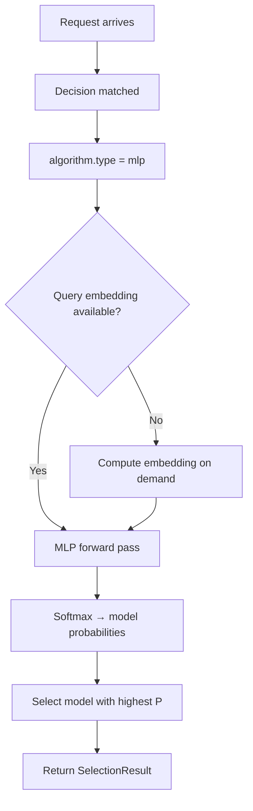

---
translation:
  source_commit: "7c874be29871f6d00b36b2e21b3e549e846b98c5"
  source_file: "docs/tutorials/algorithm/selection/mlp.md"
  outdated: false
---

# 多层感知机选择

## 概览

`mlp` 在 CPU 上运行已训练的神经分类器，把请求映射到候选模型。

**参考**：它与 KNN、KMeans 和 SVM 同属基于 ML 的模型选择家族。

## 主要优势

- 学习线性方法（KNN、线性核 SVM）无法捕获的复杂非线性决策边界。
- 使用 [Candle](https://github.com/huggingface/candle) 推理绑定。
- 支持自定义隐藏层大小，以平衡模型容量和推理速度。
- 与其他选择算法接入同一 `decision.algorithm` 表面。

## 算法原理

MLP 使用带可配置隐藏层的前馈神经网络，把查询分类到候选模型：

1. **特征工程**：查询嵌入（预计算或按需）与可选的类别 one-hot 编码拼接，形成输入特征向量。
2. **前向传播**：特征向量经过带 ReLU 激活的隐藏层，产出候选模型上的概率分布。
3. **选择**：输出概率最高的模型被选中。

```
Input: query_embedding (dim) + category_one_hot (num_categories)
  ↓
Hidden Layer 1: Linear(dim, h1) → ReLU
  ↓
Hidden Layer 2: Linear(h1, h2) → ReLU
  ↓
Output Layer: Linear(h2, num_models) → Softmax
  ↓
Output: P(model_i | query) for each candidate
```

## 选择流程



## 解决什么问题？

有些路由边界是非线性的，静态排序或更简单的线性规则无法很好捕获。`mlp` 从历史数据中学习这些更复杂的查询到模型边界，同时把推理保持在选择层内。

## 何时使用

- 需要捕获查询到模型映射中的复杂非线性模式。
- 你有代表性的已标注查询到模型数据集。
- 该路由可以接受 CPU 推理成本。
- KNN/KMeans/SVM 决策边界不足以覆盖你的工作负载。

## 已知限制

- 需要预训练模型权重；没有训练数据无法从零开始。
- 当前决策工厂始终构造 CPU 选择器。已接受的 `device` 字段未接到请求时选择。
- 与 KNN 不同，MLP 是“黑盒” — 更难解释为何选中特定模型。
- 训练需要单独的 `modelselection` 训练流水线；见 [ML Model Selection](https://github.com/vllm-project/semantic-router/blob/main/src/semantic-router/pkg/modelselection/README.md)。

## 配置

在 `routing.decisions[].algorithm` 下配置：

```yaml
algorithm:
  type: mlp
```

### 全局 ML 设置

```yaml
global:
  router:
    model_selection:
      ml:
        models_path: ".cache/ml-models"
        embedding_dim: 768
        mlp:
          pretrained_path: .cache/ml-models/mlp_model.json
```

### 参数

| 参数 | 类型 | 默认值 | 说明 |
|-----------|------|---------|-------------|
| `device` | string | `cpu` | 兼容字段；当前决策工厂无论该值如何都使用 CPU |
| `pretrained_path` | string | — | 预训练 MLP 模型权重路径（JSON 格式） |

## 反馈

MLP 不支持在线 `UpdateFeedback()`。要提高选择质量，请用新的查询到模型分配数据，通过训练流水线重新训练模型。

## 实验状态

该算法标记为**实验性**。API 可能在未来版本中变化。

训练示例和标签可能包含敏感请求数据；请相应地治理它们及派生产物。完整示例见：
[`config/fragments/algorithm/selection/mlp.yaml`](https://github.com/vllm-project/semantic-router/blob/main/config/fragments/algorithm/selection/mlp.yaml)。
