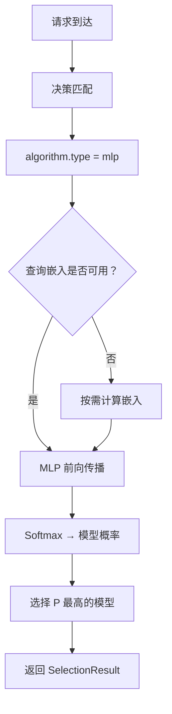

---
translation:
  source_commit: "8fc0fb9c"
  source_file: "docs/tutorials/algorithm/selection/mlp.md"
  outdated: false
---

# MLP（Multi-Layer Perceptron，多层感知机）

## 概述

`mlp` 是一种 GPU 加速的神经网络选择算法。它使用 Multi-Layer Perceptron（多层感知机）学习用于模型选择的非线性决策边界，并通过历史查询到模型的分配数据进行训练。

它与 `config/fragments/algorithm/selection/mlp.yaml` 对应。

**参考**：它与 KNN、KMeans 和 SVM 一样，属于基于 ML 的模型选择系列。

## 主要优势

- 学习线性方法（KNN、使用线性核的 SVM）无法捕获的复杂非线性决策边界。
- 通过 [Candle](https://github.com/huggingface/candle) 进行 GPU 加速推理，实现低延迟选择。
- 支持自定义隐藏层大小，以平衡模型容量和推理速度。
- 与其他选择算法一样，集成到同一 `decision.algorithm` 配置入口中。

## 算法原理

MLP 使用具有可配置隐藏层的前馈神经网络，将查询分类到候选模型：

1. **特征工程**：将查询嵌入（预计算或按需计算）与可选的类别 one-hot 编码拼接，形成输入特征向量。
2. **前向传播**：特征向量经过采用 ReLU 激活函数的隐藏层，生成候选模型的概率分布。
3. **选择**：选择输出概率最高的模型。

```
输入: query_embedding (dim) + category_one_hot (num_categories)
  ↓
隐藏层 1: Linear(dim, h1) → ReLU
  ↓
隐藏层 2: Linear(h1, h2) → ReLU
  ↓
输出层: Linear(h2, num_models) → Softmax
  ↓
输出: 每个候选模型的 P(model_i | query)
```

## 选择流程



## 它解决什么问题？

有些路由边界是非线性的，静态排序或较简单的线性规则无法很好地捕获它们。`mlp` 从历史数据中学习这些更复杂的查询到模型边界，同时将推理保留在选择层内。

## 何时使用

- 需要捕获查询到模型映射中的复杂非线性模式。
- 拥有充足的训练数据（>1000 条带标签的查询-模型分配数据）。
- 有可用于加速推理的 GPU 资源。
- KNN/KMeans/SVM 的决策边界不足以满足工作负载需求。

## 已知限制

- 需要预训练模型权重；没有训练数据就无法从头开始。
- 为获得最佳性能需要 GPU（可回退到 CPU，但速度较慢）。
- 与 KNN 不同，MLP 是一个“黑盒”，因此更难解释为何选择了某个特定模型。
- 训练需要单独的 `modelselection` 训练流水线；请参阅 [ML 模型选择](https://github.com/vllm-project/semantic-router/blob/main/src/semantic-router/pkg/modelselection/README.md)。

## 配置

在 `routing.decisions[].algorithm` 中使用此片段：

```yaml
algorithm:
  type: mlp
```

### 全局 ML 设置

```yaml
global:
  router:
    model_selection:
      ml:
        models_path: ".cache/ml-models"
        embedding_dim: 768
        mlp:
          device: cuda
          pretrained_path: .cache/ml-models/mlp_model.json
```

### 参数

| 参数 | 类型 | 默认值 | 说明 |
| ----------- | ------ | --------- | ------------- |
| `device` | string | `cpu` | 计算设备：`cpu`、`cuda` 或 `metal`（Apple Silicon） |
| `pretrained_path` | string | — | 预训练 MLP 模型权重的路径（JSON 格式） |

## 反馈

MLP 不支持在线 `UpdateFeedback()`。要提高选择质量，请使用训练流水线，以新的查询到模型分配数据重新训练模型。

## 实验状态

此算法被标记为**实验性**。API 可能在未来版本中发生变化。
