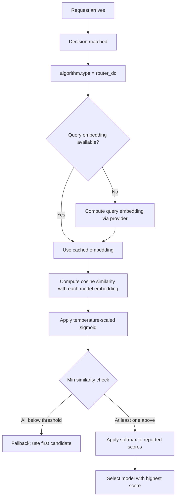

---
translation:
  source_commit: "e56591a9cb24f073bf159927e87116ba6d278741"
  source_file: "docs/tutorials/algorithm/selection/router-dc.md"
  outdated: false
---

# Router-DC 选择

## 概览

`router_dc` 嵌入请求和每个模型描述，然后选择语义相似度最高的候选。

**论文**：[Query-Based Router by Dual Contrastive Learning](https://arxiv.org/abs/2409.19886)

## 主要优势

- 对请求和模型画像使用配置的嵌入运行时。
- 不需要显式排序规则 — 选择由描述相似度驱动。
- 当提示词语义比静态优先级或成本更重要时很有用。

## 算法原理

该选择器受 RouterDC 启发，但请求路径不训练双编码器。它对请求和模型描述使用同一个已配置的嵌入函数：

1. **查询嵌入**：每个用户查询通过配置的嵌入提供商编码成稠密向量。
2. **模型嵌入**：每个模型由其描述和可选能力标签派生的嵌入表示。
3. **相似度**：计算余弦相似度，除以 `temperature`，再应用 sigmoid。
4. **选择**：选择高于 `min_similarity` 的最高分数，然后对返回的分数图再做一次温度缩放的 softmax。

$$
s_i = \sigma(\cos(q,m_i)/\tau), \qquad
P_i = \frac{\exp((s_i-\max_j s_j)/\tau)}{\sum_j
\exp((s_j-\max_k s_k)/\tau)}
$$

其中 $\tau$ 是温度（`temperature`，默认 0.07）。

## 选择流程



## 模型嵌入初始化

模型需要描述才能做基于嵌入的匹配。在 `modelCards` 中配置描述：

```yaml
routing:
  modelCards:
    - name: llama-3.2-1b
      description: "Fast small model for simple tasks, low cost"
      capabilities: ["summarization", "simple_qa"]
    - name: codellama-7b
      description: "Code generation specialist, good at programming tasks"
      capabilities: ["code_generation", "debugging"]
```

当 `use_capabilities: true` 时，能力标签会与描述拼接，以丰富嵌入。

## 解决什么问题？

有些工作负载主要是语义匹配问题，最佳模型取决于请求含义，而不是显式启发式。`router_dc` 把该请求匹配到运维人员撰写的模型描述，而不是只依赖静态优先级或成本规则。

## 何时使用

- 最佳候选取决于提示词与模型画像之间的语义相似度。
- 希望使用已学习选择器，但不做完整在线探索。
- 一条路由应按语义契合路由，而不是只按成本或延迟。
- 模型有描述性画像或能力标签。

## 已知限制

- **需要模型描述**：如果模型缺少描述，嵌入质量会下降。
- **冷查询问题**：罕见查询类型可能与任何模型嵌入都匹配不好。
- **温度敏感**：温度过低会让选择器接近贪心；温度过高会接近均匀。

## 配置

```yaml
algorithm:
  type: router_dc
  router_dc:
    temperature: 0.07           # Softmax temperature (lower = sharper)
    min_similarity: 0.3         # Minimum similarity threshold
    require_descriptions: false # Fail if models lack descriptions
    use_capabilities: true      # Include capability tags in embeddings
```

### 参数

| 参数 | 类型 | 默认值 | 说明 |
|-----------|------|---------|-------------|
| `temperature` | float | `0.07` | Softmax 温度（越低表示选择越自信） |
| `dimension_size` | int | `768` | 已接受的兼容字段；当前选择器使用嵌入函数返回的向量 |
| `min_similarity` | float | `0.3` | 有效匹配的最低相似度阈值（0–1） |
| `use_query_contrastive` | bool | `true` | 已接受的兼容字段；它不会启用请求时训练 |
| `use_model_contrastive` | bool | `true` | 已接受的兼容字段；它不会启用请求时训练 |
| `require_descriptions` | bool | `false` | 要求所有模型都有描述 |
| `use_capabilities` | bool | `true` | 在嵌入文本中包含能力标签 |

## 结果反馈

使用路由学习 outcome 端点记录与回放关联的反馈，供离线分析和学习诊断。路由器响应包含 `x-vsr-replay-id`；把该值连同模型结果一起发回：

```bash
curl -sS -X POST http://localhost:8080/api/v1/observability/outcomes \
  -H "Authorization: Bearer ${VSR_MGMT_TOKEN}" \
  -H "Content-Type: application/json" \
  -H "Idempotency-Key: router-dc-feedback-001" \
  -d '{
    "replay_id": "replay_01J...",
    "source": "user",
    "target": "model",
    "target_ref": "codellama-7b",
    "verdict": "good_fit",
    "reason": "good_code_response",
    "score": 1.0,
    "metadata": {
      "decision": "coding"
    }
  }'
```

该端点为回放和离线分析记录数据。它不会改变 RouterDC 的请求时相似度分数。

Router DC 通过配置的嵌入运行时发送请求文本。使用远程嵌入提供商时，该文本会越过提供商边界。模型卡片描述和嵌入阈值必须一起评估。完整示例见：
[`config/fragments/algorithm/selection/router-dc.yaml`](https://github.com/vllm-project/semantic-router/blob/main/config/fragments/algorithm/selection/router-dc.yaml)。
