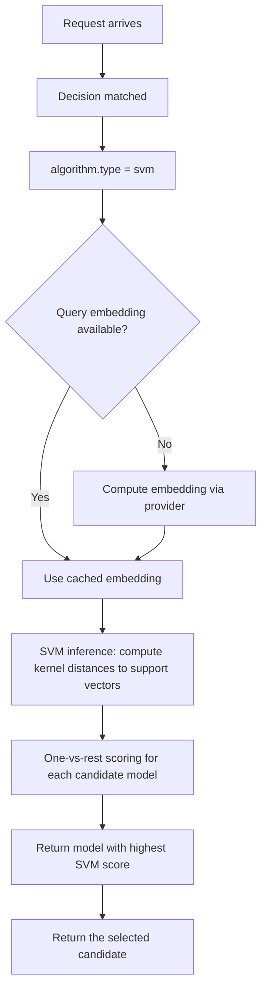

---
translation:
  source_commit: "7c874be29871f6d00b36b2e21b3e549e846b98c5"
  source_file: "docs/tutorials/algorithm/selection/svm.md"
  outdated: false
---

# 支持向量机选择

## 概览

`svm` 使用已训练的线性或 RBF 支持向量分类器，把请求特征映射到候选模型。

**实现**：通过 [Linfa](https://github.com/rust-ml/linfa)（`linfa-svm`）用 Rust 实现。

## 主要优势

- 学习显式决策边界 — 可通过支持向量解释。
- **RBF 核**捕获查询到模型映射中的非线性模式。
- 与神经网络方法相比，推理更轻量。
- 有充分理解的理论保证（最大间隔）。

## 算法原理

SVM 寻找在不同模型类别之间最大化间隔的超平面：

$$\min_{w, b} \frac{1}{2} \|w\|^2 + C \sum_{i} \xi_i$$

$$\text{s.t. } y_i(w^T \phi(x_i) + b) \geq 1 - \xi_i, \quad \xi_i \geq 0$$

使用 **RBF（Radial Basis Function）核**：

$$K(x_i, x_j) = \exp(-\gamma \|x_i - x_j\|^2)$$

加载的 RBF 产物包含其分类器使用的 gamma。训练还会确定支持向量、系数和正则化。

多类选择（超过 2 个候选）使用 one-vs-rest 分类。

## 选择流程



## 解决什么问题？

有些工作负载需要轻量的已学习分类器，其决策边界比启发式路由更清晰，运维成本又低于更深的神经选择器。`svm` 通过在路由特征上学习最大化间隔的查询到模型边界来解决这个问题。

## 何时使用

- 你有该路由的基于 SVM 的选择器产物。
- 轻量的已学习分类已足以做模型选择。
- 希望已学习选择带有可解释的决策边界。
- 查询到模型映射有清晰的非线性模式。

## 已知限制

- 需要从历史查询到模型分配数据预训练。
- RBF 超参数必须在构建产物时调优；Router 不会在请求时重新调优。
- 多类 SVM 使用 one-vs-rest，对很多候选可能次优。
- 不支持在线学习 — 必须为新模式重新训练。

## 配置

```yaml
algorithm:
  type: svm
```

### 全局 ML 设置

```yaml
global:
  router:
    model_selection:
      ml:
        models_path: ".cache/ml-models"
        embedding_dim: 768
        svm:
          kernel: rbf
          pretrained_path: .cache/ml-models/svm_model.json
```

### 参数

| 参数 | 类型 | 默认值 | 说明 |
|-----------|------|---------|-------------|
| `kernel` | string | `rbf` | 空选择器核：支持 `rbf`（或 `gaussian`）和 `linear`；其他值回退到线性 |
| `gamma` | float | `1.0` | 已接受的兼容字段；加载产物时使用产物中存储的 gamma，而不是该值 |
| `pretrained_path` | string | — | 预训练 SVM 模型路径（JSON 格式） |

## 训练

训练流水线见 [ML Model Selection README](https://github.com/vllm-project/semantic-router/blob/main/src/semantic-router/pkg/modelselection/README.md)。SVM 模型用 Linfa 的 SVM 实现，在已标注的查询到模型分配数据上训练。

训练示例和标签可能包含敏感请求数据；请相应地治理它们及派生产物。完整示例见：
[`config/fragments/algorithm/selection/svm.yaml`](https://github.com/vllm-project/semantic-router/blob/main/config/fragments/algorithm/selection/svm.yaml)。
