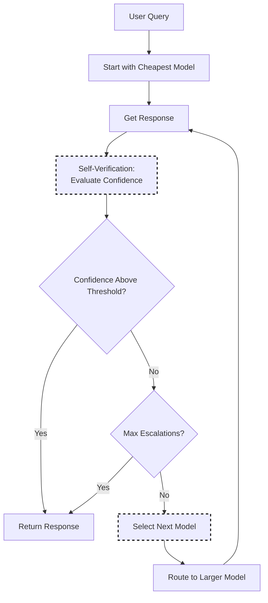

# AutoMix Selection

AutoMix optimizes the trade-off between response quality and cost using a cascading approach with self-verification. It starts with cheaper models and escalates to more expensive ones only when confidence is low.

This approach can achieve **>50% cost reduction** while maintaining comparable performance ([AutoMix](https://arxiv.org/abs/2310.12963), Madaan et al., NeurIPS 2024).

## Algorithm Flow



## How It Works

1. Query is first sent to the cheapest model in the escalation order
2. Response is evaluated using **few-shot self-verification** to estimate reliability
3. If confidence is below threshold, a **POMDP-based meta-verifier** decides whether to escalate
4. Process repeats until confidence threshold is met or max escalations reached

### Key Components

- **Few-Shot Self-Verification**: Estimates output reliability without requiring extensive training, using the model's own capabilities to assess answer quality
- **POMDP Meta-Verifier**: Handles noisy verification signals using a Partially Observable Markov Decision Process to make robust escalation decisions

## Configuration

```yaml
decision:
  algorithm:
    type: automix
    automix:
      cost_quality_tradeoff: 0.3   # 0=quality only, 1=cost only
      confidence_threshold: 0.7    # Escalation threshold
      escalation_order:            # Optional explicit order
        - gpt-3.5-turbo
        - gpt-4
        - gpt-4-turbo

models:
  - name: gpt-4-turbo
    backend: openai
    quality_score: 0.95
    pricing:
      input_cost_per_1k: 0.01
      output_cost_per_1k: 0.03

  - name: gpt-4
    backend: openai
    quality_score: 0.90
    pricing:
      input_cost_per_1k: 0.03
      output_cost_per_1k: 0.06

  - name: gpt-3.5-turbo
    backend: openai
    quality_score: 0.75
    pricing:
      input_cost_per_1k: 0.0015
      output_cost_per_1k: 0.002
```

## Cost-Quality Trade-off

The `cost_quality_tradeoff` parameter controls the balance:

| Value | Behavior |
|-------|----------|
| 0.0 | Always select highest quality model |
| 0.3 | Prefer quality, consider cost (default) |
| 0.5 | Balance quality and cost equally |
| 0.7 | Prefer cheaper models, accept quality trade-off |
| 1.0 | Always select cheapest model |

## Quality Scores

Quality scores should reflect relative model performance (0.0 to 1.0):

```yaml
models:
  - name: gpt-4
    quality_score: 0.95   # Excellent
  - name: gpt-3.5-turbo
    quality_score: 0.75   # Good
  - name: local-llama
    quality_score: 0.60   # Acceptable
```

### Determining Quality Scores

1. **Benchmark results**: Use standard benchmarks (MMLU, HumanEval, etc.)
2. **Internal evaluation**: Run on your specific use cases
3. **User feedback**: Aggregate satisfaction ratings
4. **Start conservative**: Underestimate, then adjust upward

## Confidence Cascading

With confidence cascading, AutoMix can start with cheaper models and escalate:

```yaml
automix:
  confidence_method: cascade
  confidence_threshold: 0.7
  escalation_order:
    - gpt-3.5-turbo   # Try first (cheapest)
    - gpt-4           # Escalate if confidence low
    - gpt-4-turbo     # Final escalation
```

The router tries the first model; if response confidence is below threshold, it escalates to the next.

## Best Practices

1. **Accurate pricing**: Keep pricing data up-to-date
2. **Calibrate quality scores**: Base on actual performance metrics
3. **Start conservative**: Begin with lower trade-off (prefer quality)
4. **Monitor costs**: Track actual cost savings vs. quality impact
5. **A/B test**: Compare AutoMix against static routing
