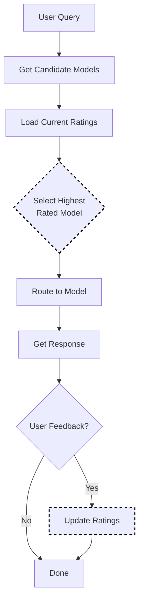

# Elo Rating Selection

Elo Rating selection uses a **runtime rating system** to rank models based on user feedback. Models that receive positive feedback gain rating points; those with negative feedback lose points. Over time, better-performing models rise to the top and get selected more often.

This approach uses the Bradley-Terry model (pairwise comparison framework) to continuously improve model selection through online learning.

> **Note on RouteLLM**: The [RouteLLM paper](https://arxiv.org/abs/2406.18665) (Ong et al.) trains **static router models** on preference data and achieves ~50% cost reduction (2x savings). Our implementation takes a different approach: a **runtime Elo rating system** that updates dynamically based on live feedback rather than pre-trained static routing.

## Algorithm Flow



## Mathematical Foundation

### Expected Score (Bradley-Terry Model)

The expected probability that model A beats model B:

```text
E_A = 1 / (1 + 10^((R_B - R_A) / 400))
```

Where:

- `R_A` = Rating of model A
- `R_B` = Rating of model B
- `E_A` = Expected score (probability A wins)

### Rating Update

After feedback, ratings update as:

```text
R'_A = R_A + K × (S_A - E_A)
```

Where:

- `K` = K-factor (controls volatility, default: 32)
- `S_A` = Actual outcome (1 = win, 0.5 = tie, 0 = loss)
- `E_A` = Expected score

### Example Calculation

```text
Model A: Rating 1500, Model B: Rating 1400
Expected score for A: 1 / (1 + 10^((1400-1500)/400)) = 0.64

If A wins (S_A = 1):
  New rating = 1500 + 32 × (1 - 0.64) = 1500 + 11.5 = 1511.5

If A loses (S_A = 0):
  New rating = 1500 + 32 × (0 - 0.64) = 1500 - 20.5 = 1479.5
```

## Core Algorithm (Go)

```go
// Select returns the model with highest Elo rating
func (s *EloSelector) Select(ctx context.Context, selCtx *SelectionContext) (*SelectionResult, error) {
    var bestModel string
    var bestRating float64 = math.Inf(-1)
    
    for _, candidate := range selCtx.CandidateModels {
        rating := s.getRating(candidate.Model, selCtx.DecisionName)
        if rating > bestRating {
            bestRating = rating
            bestModel = candidate.Model
        }
    }
    
    return &SelectionResult{
        SelectedModel: bestModel,
        Score:         bestRating,
        Method:        MethodElo,
    }, nil
}

// UpdateFeedback adjusts ratings based on user feedback
func (s *EloSelector) UpdateFeedback(winner, loser string, tie bool) {
    ratingA := s.getRating(winner)
    ratingB := s.getRating(loser)
    
    // Calculate expected scores
    expectedA := 1.0 / (1.0 + math.Pow(10, (ratingB-ratingA)/400.0))
    expectedB := 1.0 - expectedA
    
    // Actual scores
    var actualA, actualB float64
    if tie {
        actualA, actualB = 0.5, 0.5
    } else {
        actualA, actualB = 1.0, 0.0
    }
    
    // Update ratings
    s.setRating(winner, ratingA + s.kFactor*(actualA-expectedA))
    s.setRating(loser, ratingB + s.kFactor*(actualB-expectedB))
}
```

## How It Works

1. All models start with an initial rating (default: 1500)
2. Users provide feedback (thumbs up/down) after responses
3. Ratings adjust based on the feedback and the "expected" outcome
4. Higher-rated models are selected more often

## Configuration

```yaml
decision:
  algorithm:
    type: elo
    elo:
      k_factor: 32              # How quickly ratings change (16-64 typical)
      initial_rating: 1500      # Starting rating for new models
      storage_path: /data/elo-ratings.json  # Persist ratings
      auto_save_interval: 1m    # Save frequency

models:
  - name: gpt-4
    backend: openai
  - name: gpt-3.5-turbo
    backend: openai
  - name: claude-3-opus
    backend: anthropic
```

## Submitting Feedback

Use the feedback API to update model ratings:

```bash
# Positive feedback (model performed well)
curl -X POST http://localhost:8080/api/v1/feedback \
  -H "Content-Type: application/json" \
  -d '{
    "request_id": "req-123",
    "model": "gpt-4",
    "rating": 1
  }'

# Negative feedback (model performed poorly)
curl -X POST http://localhost:8080/api/v1/feedback \
  -H "Content-Type: application/json" \
  -d '{
    "request_id": "req-456",
    "model": "gpt-3.5-turbo",
    "rating": -1
  }'
```

## Viewing Current Ratings

```bash
curl http://localhost:8080/api/v1/ratings
```

Response:

```json
{
  "ratings": {
    "gpt-4": 1632,
    "gpt-3.5-turbo": 1485,
    "claude-3-opus": 1558
  },
  "last_updated": "2024-01-15T10:30:00Z"
}
```

## K-Factor Tuning

| K-Factor | Behavior | Use Case |
|----------|----------|----------|
| 16 | Slow, stable changes | Mature systems with consistent feedback |
| 32 | Balanced (default) | Most production use cases |
| 64 | Fast, volatile changes | Rapid experimentation, new deployments |

## Persistent Storage

Enable `storage_path` to persist ratings across restarts:

```yaml
elo:
  storage_path: /data/elo-ratings.json
  auto_save_interval: 1m
```

The file is atomic-write safe and includes backup rotation.

## Best Practices

1. **Collect consistent feedback**: Ensure feedback reflects actual quality
2. **Start with default K-factor**: Adjust only after observing behavior
3. **Enable persistence**: Avoid losing ratings on restarts
4. **Monitor rating drift**: Watch for models dominating unfairly
5. **Bootstrap with priors**: Set initial ratings based on known quality if available
