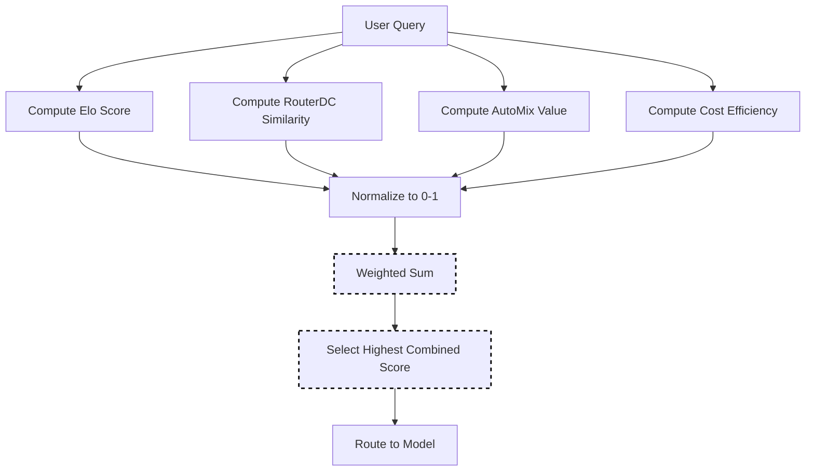

# Hybrid Selection

Hybrid selection combines multiple selection methods (Elo, RouterDC, AutoMix, Cost) with configurable weights. This allows you to balance different factors like user feedback history, semantic matching, cost efficiency, and quality scores for optimal model selection.

> **Note on Hybrid LLM paper**: The [Hybrid LLM paper](https://arxiv.org/abs/2404.14618) (Ding et al.) trains a **BERT-based quality-gap predictor** for binary routing between two models, achieving up to **40% fewer expensive model calls**. Our implementation takes a different approach: a **weighted ensemble** that combines multiple signals (Elo ratings, semantic similarity, POMDP values, cost) rather than a trained binary classifier.

## Algorithm Flow



## Mathematical Foundation

### Combined Score Formula

```text
score(m, q) = w_elo × E(m) + w_dc × S(q,m) + w_mix × V(m,q) + w_cost × C(m)
```

Where:

- `E(m)` = Normalized Elo rating
- `S(q, m)` = Normalized RouterDC similarity
- `V(m, q)` = Normalized AutoMix value
- `C(m)` = Normalized cost efficiency (1 - relative_cost)
- `Σw_i = 1` (weights must sum to 1)

### Score Normalization

Each component is normalized to [0, 1]:

| Component | Normalization |
|-----------|---------------|
| Elo | `E = (R - 1000) / 1000` (clamped) |
| RouterDC | Already in [0, 1] (cosine similarity) |
| AutoMix | `V = (V - V_min) / (V_max - V_min)` |
| Cost | `C = 1 - (cost / max_cost)` |

## Core Algorithm (Go)

```go
// Select using weighted combination of methods
func (s *HybridSelector) Select(ctx context.Context, selCtx *SelectionContext) (*SelectionResult, error) {
    var bestModel string
    var bestScore float64 = -1
    
    for _, candidate := range selCtx.CandidateModels {
        eloScore := s.normalizeElo(s.eloSelector.GetRating(candidate.Model))
        dcScore := s.routerDCSelector.GetSimilarity(selCtx.Query, candidate.Model)
        mixScore := s.normalizePOMDP(s.autoMixSelector.GetValue(candidate.Model, selCtx.Query))
        costScore := s.normalizeCost(s.getCost(candidate.Model))
        
        combined := s.eloWeight*eloScore +
                    s.routerDCWeight*dcScore +
                    s.autoMixWeight*mixScore +
                    s.costWeight*costScore
        
        if combined > bestScore {
            bestScore = combined
            bestModel = candidate.Model
        }
    }
    
    return &SelectionResult{
        SelectedModel: bestModel,
        Score:         bestScore,
        Method:        MethodHybrid,
    }, nil
}
```

## How It Works

The combined score is calculated as:

```text
combined = w1 × elo + w2 × similarity + w3 × pomdp + w4 × cost_efficiency
```

## Configuration

```yaml
decision:
  algorithm:
    type: hybrid
    hybrid:
      elo_weight: 0.3
      router_dc_weight: 0.3
      automix_weight: 0.2
      cost_weight: 0.2
      normalize_scores: true
      
      # Underlying method configs
      elo:
        k_factor: 32
        initial_rating: 1500
      router_dc:
        require_descriptions: true
      automix:
        cost_quality_tradeoff: 0.3

models:
  - name: gpt-4
    description: "Advanced reasoning and analysis"
    capabilities: ["reasoning", "code", "analysis"]
    quality_score: 0.95
    pricing:
      input_cost_per_1k: 0.03
      output_cost_per_1k: 0.06
  - name: gpt-3.5-turbo
    description: "Fast general-purpose responses"
    capabilities: ["general", "chat"]
    quality_score: 0.75
    pricing:
      input_cost_per_1k: 0.0015
      output_cost_per_1k: 0.002
```

## Weight Presets

| Preset | Elo | RouterDC | AutoMix | Cost | Use Case |
|--------|-----|----------|---------|------|----------|
| Balanced | 0.25 | 0.25 | 0.25 | 0.25 | General purpose |
| Quality-focused | 0.4 | 0.3 | 0.2 | 0.1 | High-stakes tasks |
| Cost-focused | 0.1 | 0.2 | 0.2 | 0.5 | Budget-conscious |
| Learning-focused | 0.5 | 0.2 | 0.2 | 0.1 | Rapid adaptation |

## Requirements

For hybrid selection to work optimally:

1. **Elo component**: Collect user feedback via `/api/v1/feedback`
2. **RouterDC component**: Provide model descriptions and capabilities
3. **AutoMix component**: Configure pricing and quality scores
4. **Weights must sum to 1.0** (±0.01 tolerance)

## Score Normalization

When `normalize_scores: true` (default), all component scores are normalized to [0, 1] before weighting:

- **Elo**: `(rating - 1000) / 1000` (clamped)
- **RouterDC**: Cosine similarity already in [0, 1]
- **AutoMix**: POMDP value normalized by max possible value
- **Cost**: `1 - (cost / max_cost)` (inverted so lower cost = higher score)

## Best Practices

1. **Start balanced**: Begin with equal weights, then adjust based on observed behavior
2. **Monitor components**: Track which component contributes most to final selections
3. **Gradual tuning**: Adjust weights by 0.05-0.1 increments
4. **Validate weights**: Ensure weights sum to 1.0 to avoid validation errors
