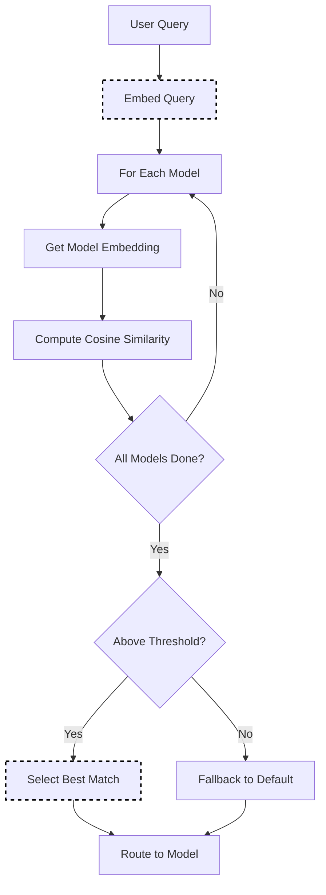

# RouterDC Selection

RouterDC uses semantic embeddings and contrastive learning to match user queries with the most suitable model. It embeds both queries and model descriptions into a shared vector space, then selects the model with highest similarity to the query.

This approach can improve routing accuracy by **+2.76%** on in-distribution tasks and **+1.90%** on out-of-distribution tasks compared to baselines ([RouterDC, NeurIPS 2024](https://arxiv.org/abs/2409.19886)).

## Algorithm Flow



## Mathematical Foundation

### Cosine Similarity

RouterDC uses cosine similarity to compare query and model embeddings:

```text
sim(q, m) = (q · m) / (||q|| × ||m||)
          = Σ(q_i × m_i) / (√Σq_i² × √Σm_i²)
```

Where:

- `q` = Query embedding vector (e.g., 768 dimensions)
- `m` = Model description embedding vector
- Result is in range [-1, 1], higher = more similar

### Contrastive Learning

The embedding space is trained using dual contrastive losses:

- **Sample-LLM Loss**: Pulls query embeddings toward well-performing models and away from poor-performing ones
- **Sample-Sample Loss**: Groups similar queries together to ensure consistent routing

## Core Algorithm (Go)

```go
// Select using embedding similarity
func (s *RouterDCSelector) Select(ctx context.Context, selCtx *SelectionContext) (*SelectionResult, error) {
    queryEmbedding, err := s.embedFunc(selCtx.Query)
    if err != nil {
        return nil, err
    }
    
    var bestModel string
    var bestSim float64 = -1
    
    for _, candidate := range selCtx.CandidateModels {
        modelEmbedding := s.modelEmbeddings[candidate.Model]
        sim := cosineSimilarity(queryEmbedding, modelEmbedding)
        
        if sim > bestSim {
            bestSim = sim
            bestModel = candidate.Model
        }
    }
    
    if bestSim < s.config.SimilarityThreshold {
        return s.fallbackToDefault(selCtx)
    }
    
    return &SelectionResult{
        SelectedModel: bestModel,
        Score:         bestSim,
        Method:        MethodRouterDC,
    }, nil
}
```

## How It Works

1. Each model has a description and optional capabilities list
2. Incoming queries are embedded into a vector representation
3. Query embeddings are compared against model description embeddings
4. The model with highest similarity score is selected

## Configuration

```yaml
decision:
  algorithm:
    type: router_dc
    router_dc:
      require_descriptions: true   # Fail if models lack descriptions
      use_capabilities: true       # Include capabilities in matching
      similarity_threshold: 0.3    # Minimum similarity to consider

models:
  - name: gpt-4
    backend: openai
    description: "Advanced reasoning, complex analysis, mathematical proofs, and detailed explanations"
    capabilities:
      - reasoning
      - mathematics
      - code-review
      - analysis

  - name: gpt-3.5-turbo
    backend: openai
    description: "Fast responses for simple questions, casual conversation, and quick tasks"
    capabilities:
      - general
      - chat
      - summarization

  - name: code-llama
    backend: local
    description: "Code generation, debugging, refactoring, and programming assistance"
    capabilities:
      - code-generation
      - debugging
      - refactoring
```

## Writing Effective Descriptions

Good descriptions are specific and differentiate models:

**Good:**

```yaml
description: "Mathematical reasoning, theorem proving, step-by-step problem solving"
```

**Bad:**

```yaml
description: "A good AI model"  # Too vague
```

### Description Tips

1. **Be specific**: Mention concrete tasks the model excels at
2. **Use keywords**: Include terms users might use in queries
3. **Differentiate**: Highlight what makes this model unique
4. **Keep concise**: 1-2 sentences, focused on strengths

## Capabilities List

Capabilities provide structured metadata for matching:

```yaml
capabilities:
  - code-generation    # Primary strength
  - python             # Language specialization
  - debugging          # Related task
```

When `use_capabilities: true`, capabilities are combined with the description for richer matching.

## Validation

Enable strict validation to catch configuration issues:

```yaml
router_dc:
  require_descriptions: true
```

With this enabled, the router will fail to start if any model lacks a description.

## Best Practices

1. **Invest in descriptions**: Quality descriptions dramatically improve routing
2. **Test with real queries**: Verify routing matches expectations
3. **Update descriptions**: Refine based on observed misroutes
4. **Use capabilities sparingly**: 3-5 focused capabilities per model
5. **Enable require_descriptions**: Catch missing descriptions at startup
