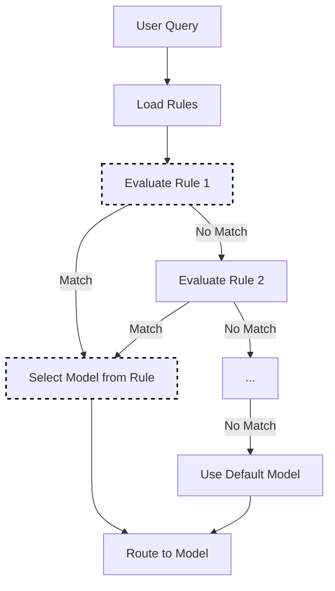

# Static Selection

Static selection routes requests to a fixed model based on predefined rules. This is the simplest selection method, ideal for deterministic routing needs.

## Algorithm Flow



## Core Algorithm (Go)

```go
// Select using rule-based matching
func (s *StaticSelector) Select(ctx context.Context, selCtx *SelectionContext) (*SelectionResult, error) {
    for _, rule := range s.rules {
        if s.matchesRule(rule, selCtx) {
            return &SelectionResult{
                SelectedModel: rule.Model,
                Method:        MethodStatic,
                Reason:        fmt.Sprintf("matched rule: %s", rule.Name),
            }, nil
        }
    }
    
    // No rule matched, use default
    return &SelectionResult{
        SelectedModel: s.defaultModel,
        Method:        MethodStatic,
        Reason:        "default model (no rules matched)",
    }, nil
}

func (s *StaticSelector) matchesRule(rule Rule, selCtx *SelectionContext) bool {
    if rule.Match.Category != "" && selCtx.Category != rule.Match.Category {
        return false
    }
    if len(rule.Match.Keywords) > 0 && !containsAny(selCtx.Query, rule.Match.Keywords) {
        return false
    }
    if rule.Match.MaxTokensGT > 0 && selCtx.MaxTokens <= rule.Match.MaxTokensGT {
        return false
    }
    return true
}
```

## How It Works

Static selection uses explicit rules to match requests to models:

1. Evaluate request against configured rules (in order)
2. First matching rule determines the model
3. If no rules match, use the default model

## Configuration

```yaml
decision:
  algorithm:
    type: static
    static:
      default_model: gpt-3.5-turbo
      rules:
        - match:
            category: coding
          model: gpt-4
        - match:
            category: simple
          model: gpt-3.5-turbo
        - match:
            keywords: ["analyze", "complex", "detailed"]
          model: gpt-4
        - match:
            max_tokens_gt: 2000
          model: gpt-4

models:
  - name: gpt-4
    backend: openai
  - name: gpt-3.5-turbo
    backend: openai
```

## Rule Matching

### Category-based

```yaml
rules:
  - match:
      category: coding
    model: gpt-4
```

### Keyword-based

```yaml
rules:
  - match:
      keywords: ["urgent", "important", "critical"]
    model: gpt-4
```

### Token-based

```yaml
rules:
  - match:
      max_tokens_gt: 4000
    model: gpt-4-32k
```

### Combined Conditions

```yaml
rules:
  - match:
      category: coding
      keywords: ["debug", "fix"]
    model: gpt-4  # Both conditions must match
```

## Rule Priority

Rules are evaluated in order. Place more specific rules first:

```yaml
rules:
  # Specific rule first
  - match:
      category: coding
      keywords: ["security"]
    model: gpt-4-security-tuned
    
  # General rule second
  - match:
      category: coding
    model: gpt-4
    
  # Catch-all last (or use default_model)
  - match: {}
    model: gpt-3.5-turbo
```

## When to Use Static Selection

**Good for:**

- Deterministic, predictable routing
- Compliance requirements (certain data must use specific models)
- Simple use cases with clear categorization
- Development and testing

**Consider alternatives when:**

- Query types are diverse and hard to categorize
- You want to optimize cost vs. quality dynamically
- You need adaptive behavior based on feedback

## Best Practices

1. **Order matters**: Place specific rules before general ones
2. **Always set default**: Ensure `default_model` is configured for unmatched requests
3. **Test rules**: Verify rule matching with representative queries
4. **Keep rules simple**: Complex rule sets become hard to maintain
