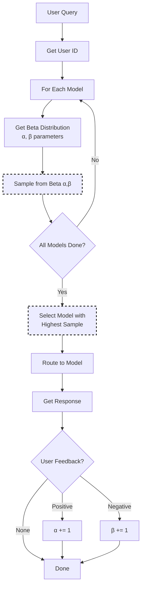

# Thompson Sampling Selection

Thompson Sampling is a Bayesian approach to the exploration-exploitation tradeoff. It naturally balances trying new models (exploration) with using known good models (exploitation).

Based on classical [Thompson Sampling theory](https://arxiv.org/abs/1707.02038) - "Analysis of Thompson Sampling for the Multi-armed Bandit Problem" by Agrawal & Goyal, applied to LLM model selection as a multi-armed bandit.

## Algorithm Flow



## Mathematical Foundation

### Beta Distribution

Each model maintains a Beta distribution representing success probability:

```text
P(θ | α, β) = Beta(α, β)

where:
  α = prior_alpha + successes
  β = prior_beta + failures
  θ = true success probability (unknown)
```

### Sampling Process

For each selection, sample from each model's posterior:

```text
θ_i ~ Beta(α_i, β_i)   for each model i

Select model: argmax_i(θ_i)
```

### Bayesian Update

After feedback, update the selected model's distribution:

```text
If success: α' = α + 1
If failure: β' = β + 1
```

### Expected Value and Variance

```text
E[θ] = α / (α + β)           # Expected success rate
Var[θ] = αβ / ((α+β)²(α+β+1))  # Uncertainty
```

High variance → more exploration (uncertain model)
Low variance → more exploitation (confident about model)

## Core Algorithm (Go)

```go
// Select using Thompson Sampling
func (s *ThompsonSelector) Select(ctx context.Context, selCtx *SelectionContext) (*SelectionResult, error) {
    var bestModel string
    var bestSample float64 = -1
    
    userID := s.getUserID(selCtx)
    
    for _, candidate := range selCtx.CandidateModels {
        alpha, beta := s.getParams(userID, candidate.Model)
        
        // Sample from Beta distribution
        sample := s.sampleBeta(alpha, beta)
        
        if sample > bestSample {
            bestSample = sample
            bestModel = candidate.Model
        }
    }
    
    return &SelectionResult{
        SelectedModel: bestModel,
        Score:         bestSample,
        Method:        MethodThompson,
    }, nil
}

// UpdateFeedback adjusts Beta parameters
func (s *ThompsonSelector) UpdateFeedback(userID, model string, success bool) {
    alpha, beta := s.getParams(userID, model)
    
    if success {
        s.setParams(userID, model, alpha+1, beta)
    } else {
        s.setParams(userID, model, alpha, beta+1)
    }
}
```

## How It Works

1. Each model maintains a Beta distribution representing its success probability
2. For each request, sample from each model's distribution
3. Select the model with the highest sampled value
4. Update the distribution based on feedback

This approach automatically explores uncertain options while exploiting known good ones.

## Configuration

```yaml
decision:
  algorithm:
    type: thompson
    thompson:
      prior_alpha: 1.0        # Prior successes (optimistic: higher)
      prior_beta: 1.0         # Prior failures (pessimistic: higher)
      per_user: true          # Per-user personalization
      decay_factor: 0.1       # Decay old observations
      min_samples: 10         # Minimum samples before exploitation

models:
  - name: gpt-4
    backend: openai
  - name: gpt-3.5-turbo
    backend: openai
  - name: claude-3-opus
    backend: anthropic
```

## Key Parameters

| Parameter | Default | Description |
|-----------|---------|-------------|
| `prior_alpha` | 1.0 | Prior successes; higher = more optimistic |
| `prior_beta` | 1.0 | Prior failures; higher = more pessimistic |
| `per_user` | false | Maintain separate distributions per user |
| `decay_factor` | 0.0 | Decay rate for old observations (0 = no decay) |
| `min_samples` | 10 | Minimum samples before full exploitation |

## Prior Settings

The prior (alpha, beta) shapes initial behavior:

| Setting | Behavior |
|---------|----------|
| (1, 1) | Uniform prior - equal exploration |
| (2, 1) | Optimistic - assume models are good |
| (1, 2) | Pessimistic - assume models need proving |
| (10, 10) | Confident prior - slow to change |

## Per-User Personalization

With `per_user: true`, each user gets their own model distributions:

```yaml
thompson:
  per_user: true
```

This allows the system to learn that User A prefers GPT-4 while User B prefers Claude.

## Feedback Integration

Thompson Sampling updates via the feedback API:

```bash
# Positive feedback (success)
curl -X POST http://localhost:8080/api/v1/feedback \
  -d '{"request_id": "req-123", "model": "gpt-4", "rating": 1}'

# Negative feedback (failure)
curl -X POST http://localhost:8080/api/v1/feedback \
  -d '{"request_id": "req-456", "model": "gpt-4", "rating": -1}'
```

## Best Practices

1. **Start with uniform priors**: (1, 1) unless you have prior knowledge
2. **Enable per-user for personalization**: Learn individual preferences
3. **Use decay for non-stationary environments**: When model quality changes
4. **Set min_samples appropriately**: Too low = premature exploitation
